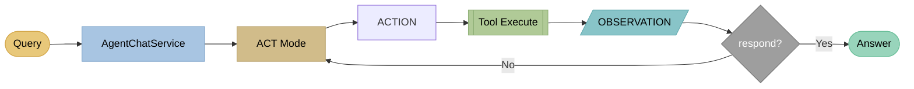
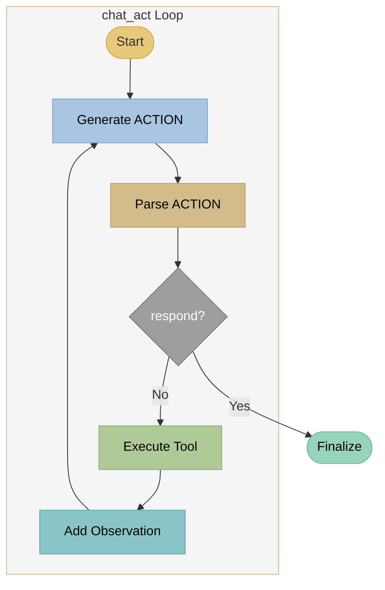

# ACT - Action-Only Agents

## Theory

### Paper

!!! quote "Original paper"
    **Function Calling / Tool Use in LLMs**
    *Based on OpenAI Function Calling (2023) and Anthropic Tool Use*
    ACT agents are the simplest form of tool-using agents and rely on the native function-calling capabilities of modern LLMs such as GPT-4, Claude, and Mistral.

!!! info "Concept"
    **ACT (Action-Only)** executes actions directly without explicit reasoning traces. The LLM immediately selects the appropriate tool based on the request and executes it. Reasoning happens implicitly in the model weights.

### Architecture



**Simple loop:** Query → ACT → Action → Tool → Observation → (repeat or answer)

### Core Concept

**Action → Observation → Action → ... → Response**

Compared to ReACT:

- **No THOUGHT step** - LLM chooses the action directly
- **Implicit reasoning** - hidden inside model weights
- **Faster** - fewer tokens per iteration
- **Less transparent** - no explanation of decisions

### Comparison

| Aspect | ACT | ReACT |
|--------|-----|-------|
| Reasoning | Implicit | Explicit |
| Tokens per iteration | ~50-100 | ~150-300 |
| Interpretability | Low | High |
| Speed | Fast | Medium |
| Complex tasks | Limited | Good |

### When to Use ACT

- **Simple lookup tasks** ("What is the phone number?")
- **Fast response times are important**
- **Transparency is not required**
- **Users do not expect explanations**

---

## Example

### Query
```
"What are the opening hours?"
```

### ACT Trace

```
[Iteration 1]
ACTION: rag_search("opening hours")
OBSERVATION:
  [1] Opening hours: Mon-Fri 9-18, Sat 10-14
  [2] Contact: You can reach us by phone...

[Iteration 2]
ACTION: respond("Opening hours are Monday to Friday
                 from 9 to 18 and Saturday from 10 to 14. [1]")
```

### Response
```
Opening hours are Monday to Friday from 9 to 18
and Saturday from 10 to 14. [1]

Sources:
[1] Opening hours - Contact
```

---

## Implementation in LLARS

!!! success "Status: Production"
    ACT is fully implemented and in production use.

### Architecture



### System Prompt

```python
# DEFAULT_ACT_SYSTEM_PROMPT (db/models/chatbot.py)
"""
Du hast Zugriff auf folgende Tools:
- rag_search(query): Semantische Suche in den Dokumenten
- lexical_search(query): Woertliche Suche in den Dokumenten
- respond(answer): Finale Antwort geben

Nutze web_search nur, wenn es fuer diesen Bot aktiviert ist und in der Tool-Liste angegeben wird.
Nutze Suchbegriffe aus der aktuellen Nutzerfrage oder dem Verlauf.
Wenn die Frage ohne Kontext unklar ist, stelle eine Rueckfrage mit respond.
Schreibe keine [TOOL_CALLS]-Marker oder JSON-Toolcalls, sondern nur das ACTION-Format.

Fuehre die passende Aktion aus, um die Frage zu beantworten.
Format: ACTION: tool_name(parameter)
"""
```

**Additionally:**
- `chatbot.system_prompt` is **prefixed** as base context.
- `build_tool_availability_prompt()` adds the **actually enabled tools** dynamically.
- `{PROJECT_URL}` placeholders are replaced before use.

### Files

| File | Function |
|------|----------|
| `app/services/chatbot/agent_chat_service.py` | Routing to ACT/ReAct/ReflAct |
| `app/services/chatbot/agent_modes/mode_act.py` | `chat_act()` loop + streaming |
| `app/services/chatbot/agent_tools.py` | Tool execution + confidence checks |
| `app/services/chatbot/agent_prompts.py` | Prompt builder (ACT prompt + tool list) |
| `app/services/chatbot/agent_parsers.py` | ACTION parser |
| `app/db/models/chatbot.py` | DEFAULT_ACT_SYSTEM_PROMPT + prompt settings |

### Code Snippet

```python
# mode_act.py - chat_act()
for iteration in range(max_iterations):
    yield {"status": "iteration", "iteration": iteration + 1, "max": max_iterations}

    # Generate ACTION (streaming)
    yield {"status": "getting_action", "iteration": iteration + 1}
    action_text = "..."

    # Parse ACTION
    action, param = parse_action(action_text)
    yield {"status": "action", "action": action, "param": param, "iteration": iteration + 1}

    if action == "respond":
        yield {"status": "final_answer"}
        ...
        return

    # Execute tool
    result, sources = service._tool_executor.execute_tool(action, param, message, enabled_tools)
    yield {"status": "observation", "result_preview": result[:200], "iteration": iteration + 1}
```

### Configuration

```python
# ChatbotPromptSettings
agent_mode: str = "act"
task_type: str = "lookup" | "multihop"
agent_max_iterations: int = 5

tools_enabled: List[str] = ["rag_search", "lexical_search", "respond"]
web_search_enabled: bool = False
web_search_max_results: int = 5

tavily_api_key: Optional[str] = "..."  # only if web_search_enabled
act_system_prompt: str = "..."         # custom prompt (optional)
```

### Tools

| Tool | Function | Return |
|------|----------|--------|
| `rag_search` | Semantic search | Hits + relevance + sources |
| `lexical_search` | Keyword search | Hits + sources |
| `web_search` | Tavily web search (optional) | Web results + URLs |
| `respond` | Final response | Ends loop |

### Adaptive Iteration (High Confidence)

If the search returns **high-confidence** results, ACT exits early and generates a final answer immediately.
Confidence is derived from source relevance scores (`check_high_confidence`).

---

## Events (WebSocket)

```python
# Streaming Events (excerpt)
yield {"status": "starting", "mode": "act"}
yield {"status": "iteration", "iteration": 1, "max": 5}
yield {"status": "getting_action", "iteration": 1}
yield {"status": "action_delta", "delta": "...", "iteration": 1}
yield {"status": "action", "action": "rag_search", "param": "...", "iteration": 1}
yield {"status": "observation_delta", "delta": "...", "iteration": 1}
yield {"status": "observation", "result_preview": "...", "iteration": 1}
yield {"status": "adaptive_iteration", "iteration": 1, "reason": "high_confidence"}
yield {"status": "adaptive_response", "reason": "high_confidence_results"}
yield {"status": "max_iterations_reached"}
yield {"status": "final_answer"}
yield {"delta": "..."}
yield {"done": True, "full_response": "...", "sources": [...]} 
```

### Logs

```
[AgentChatService] ACT adaptive iteration: high confidence on iteration 2
```

### Metrics

Stored in `chatbot_messages.agent_trace`:

- Actions and observations
- Number of iterations
- Adaptive exit (if triggered)

Additionally, `chatbot_messages.stream_metadata` contains:

- `mode`
- `iterations`
- `sources_count`
- `adaptive_exit` (optional)

---

## See Also

- [ReAct Agents](react.md)
- [ReflAct Agents](reflact.md)
- [RAG](rag.md)
