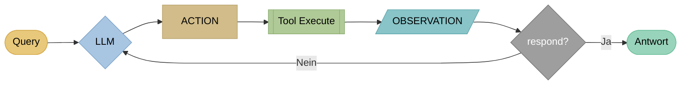
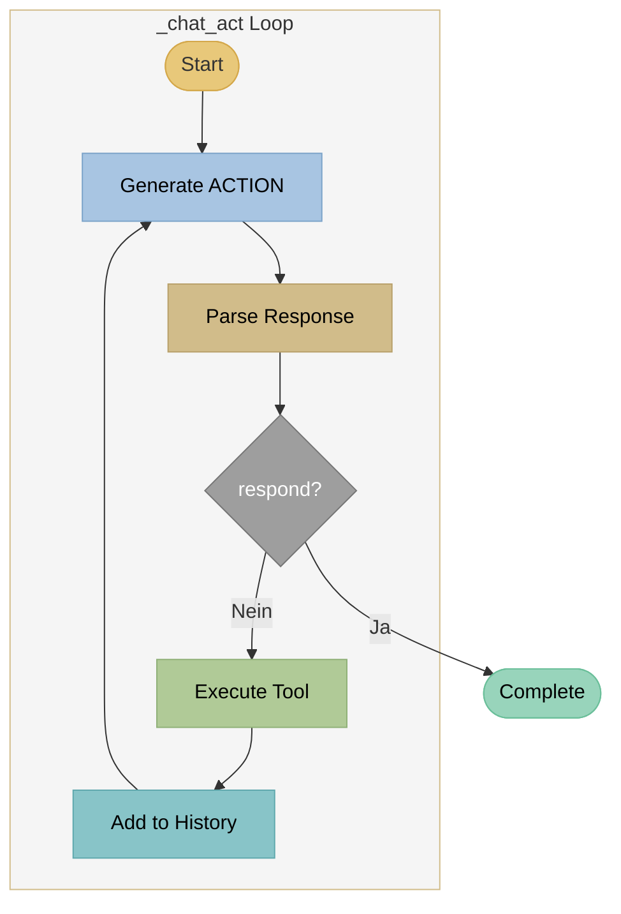

# ACT - Action-Only Agents

## Theorie

### Paper

!!! quote "Originalpaper"
    **Function Calling / Tool Use in LLMs**
    *Basierend auf OpenAI Function Calling (2023) und Anthropic Tool Use*
    ACT-Agents sind die einfachste Form von Tool-Using Agents und nutzen die native Function-Calling-Fähigkeit moderner LLMs wie GPT-4, Claude und Mistral.

!!! info "Konzept"
    **ACT (Action-Only)** führt Aktionen direkt aus, ohne explizite Reasoning-Traces zu generieren. Das LLM wählt basierend auf der Anfrage sofort das passende Tool aus und führt es aus. Das Reasoning findet implizit in den Modellgewichten statt.

### Architektur



**Einfacher Loop:** Query → LLM → Action → Tool → Observation → (Wiederholung oder Antwort)

### Kernkonzept

**Action → Observation → Action → ... → Response**

Im Gegensatz zu ReACT:

- **Kein THOUGHT-Schritt** - LLM wählt direkt Aktion
- **Implizites Reasoning** - in den Modellgewichten versteckt
- **Schneller** - weniger Token pro Iteration
- **Weniger transparent** - keine Erklärung der Entscheidung

### Vergleich

| Aspekt | ACT | ReACT |
|--------|-----|-------|
| Reasoning | Implizit | Explizit |
| Token pro Iteration | ~50-100 | ~150-300 |
| Interpretierbarkeit | Niedrig | Hoch |
| Geschwindigkeit | Schnell | Mittel |
| Komplexe Aufgaben | Begrenzt | Gut |

### Wann ACT verwenden?

- **Einfache Lookup-Aufgaben** ("Wie ist die Telefonnummer?")
- **Schnelle Antwortzeiten wichtig**
- **Transparenz nicht erforderlich**
- **Benutzer erwartet keine Erklärung**

---

## Beispiel

### Query
```
"Was sind die Öffnungszeiten?"
```

### ACT Trace

```
[Iteration 1]
ACTION: rag_search("Öffnungszeiten")
OBSERVATION:
  [1] Öffnungszeiten: Mo-Fr 9-18 Uhr, Sa 10-14 Uhr
  [2] Kontakt: Wir sind telefonisch erreichbar...

[Iteration 2]
ACTION: respond("Die Öffnungszeiten sind Montag bis Freitag
                 von 9 bis 18 Uhr und Samstag von 10 bis 14 Uhr. [1]")
```

### Response
```
Die Öffnungszeiten sind Montag bis Freitag von 9 bis 18 Uhr
und Samstag von 10 bis 14 Uhr. [1]

Quellen:
[1] Öffnungszeiten - Kontakt
```

---

## Implementierung in LLARS

!!! success "Status: Produktiv"
    ACT ist vollständig implementiert und im Produktiveinsatz.

### Architektur



### System Prompt

```python
# DEFAULT_ACT_SYSTEM_PROMPT (chatbot.py)
"""
Du bist ein hilfreicher Assistent mit Zugang zu Werkzeugen.

Verfügbare Werkzeuge:
- rag_search("suchbegriffe"): Semantische Suche in Dokumenten
- lexical_search("suchbegriffe"): Keyword-basierte Suche
- respond("antwort"): Finale Antwort an den Benutzer

Antworte IMMER im Format:
ACTION: werkzeug_name("parameter")

Keine Erklärungen, nur ACTION.
"""
```

### Dateien

| Datei | Funktion |
|-------|----------|
| `app/services/chatbot/agent_chat_service.py` | `_chat_act()` (Zeilen 296-463) |
| `app/db/models/chatbot.py` | `DEFAULT_ACT_SYSTEM_PROMPT` |

### Code-Auszug

```python
# agent_chat_service.py - _chat_act()

def _chat_act(self, message: str, ...) -> Generator[Dict, None, None]:
    """ACT agent loop - Action only, no explicit reasoning."""

    for iteration in range(max_iterations):
        yield {"status": "iteration", "iteration": iteration + 1}

        # Generate ACTION (streaming)
        response = self._generate_action(messages)

        # Parse action
        action, argument = self._parse_act_response(response)

        if action == "respond":
            yield {"status": "complete", "response": argument}
            return

        # Execute tool
        observation = self._execute_tool(action, argument)

        # Add to history
        messages.append({
            "role": "assistant",
            "content": f"ACTION: {action}(\"{argument}\")"
        })
        messages.append({
            "role": "user",
            "content": f"OBSERVATION: {observation}"
        })
```

### Konfiguration

```python
# ChatbotPromptSettings
agent_mode: str = "act"
agent_max_iterations: int = 5
tools_enabled: List[str] = ["rag_search", "lexical_search", "respond"]

# Custom System Prompt (optional)
act_system_prompt: str = "..."
```

### Tools

| Tool | Funktion | Rückgabe |
|------|----------|----------|
| `rag_search` | Semantic Search | Top-K Chunks mit Score |
| `lexical_search` | BM25 Keyword Search | Matching Chunks |
| `web_search` | Tavily API (optional) | Web Results |
| `respond` | Finale Antwort | Beendet Loop |

### Events (WebSocket)

```python
# Streaming Events
yield {"status": "iteration", "iteration": 1, "max": 5}
yield {"status": "action", "action": "rag_search", "argument": "..."}
yield {"status": "observation", "content": "..."}
yield {"status": "complete", "response": "...", "sources": [...]}
```

### Logs

```
[AgentChatService] ACT iteration 1/5
[AgentChatService] ACTION: rag_search("Öffnungszeiten")
[AgentChatService] Tool executed: rag_search (3 results)
[AgentChatService] ACT iteration 2/5
[AgentChatService] ACTION: respond("Die Öffnungszeiten...")
[AgentChatService] ACT completed in 2 iterations
```

### Metriken

Im `agent_trace` werden gespeichert:

- Anzahl Iterationen
- Ausgeführte Tools
- Token-Verbrauch
- Antwortzeit pro Schritt
