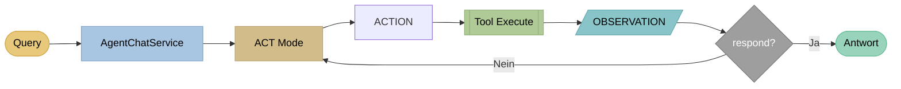
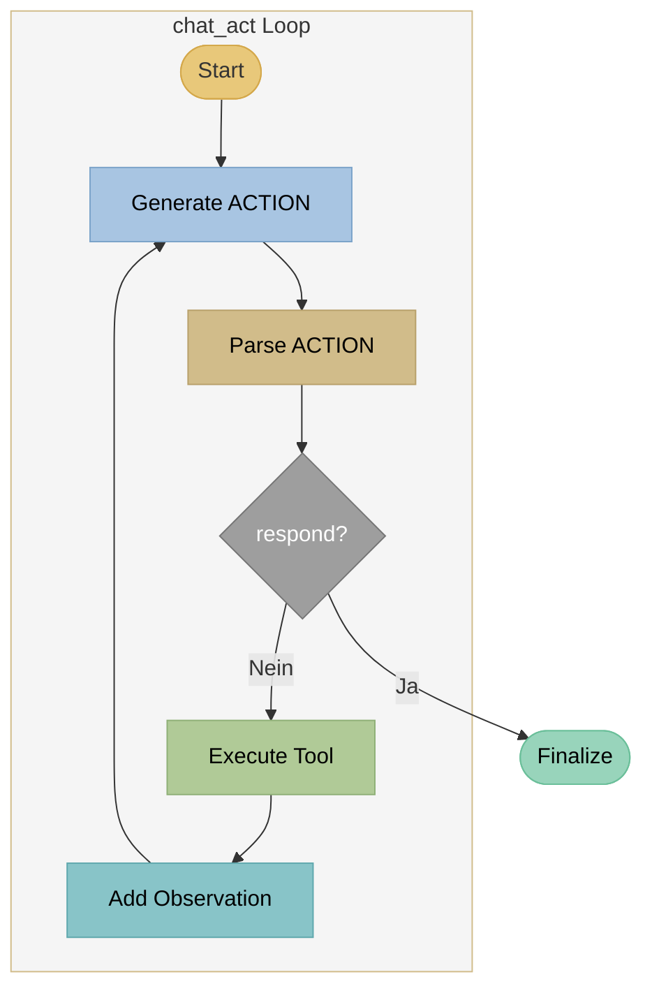

# ACT - Action-Only Agents

## Theorie

### Paper

!!! quote "Originalpaper"
    **Function Calling / Tool Use in LLMs**
    *Basierend auf OpenAI Function Calling (2023) und Anthropic Tool Use*
    ACT-Agents sind die einfachste Form von Tool-Using Agents und nutzen die native Function-Calling-Fähigkeit moderner LLMs wie GPT-4, Claude und Mistral.

!!! info "Konzept"
    **ACT (Action-Only)** führt Aktionen direkt aus, ohne explizite Reasoning-Traces zu generieren. Das LLM wählt basierend auf der Anfrage sofort das passende Tool aus und führt es aus. Das Reasoning findet implizit in den Modellgewichten statt.

### Architektur



**Einfacher Loop:** Query → ACT → Action → Tool → Observation → (Wiederholung oder Antwort)

### Kernkonzept

**Action → Observation → Action → ... → Response**

Im Gegensatz zu ReACT:

- **Kein THOUGHT-Schritt** - LLM wählt direkt Aktion
- **Implizites Reasoning** - in den Modellgewichten versteckt
- **Schneller** - weniger Token pro Iteration
- **Weniger transparent** - keine Erklärung der Entscheidung

### Vergleich

| Aspekt | ACT | ReACT |
|--------|-----|-------|
| Reasoning | Implizit | Explizit |
| Token pro Iteration | ~50-100 | ~150-300 |
| Interpretierbarkeit | Niedrig | Hoch |
| Geschwindigkeit | Schnell | Mittel |
| Komplexe Aufgaben | Begrenzt | Gut |

### Wann ACT verwenden?

- **Einfache Lookup-Aufgaben** ("Wie ist die Telefonnummer?")
- **Schnelle Antwortzeiten wichtig**
- **Transparenz nicht erforderlich**
- **Benutzer erwartet keine Erklärung**

---

## Beispiel

### Query
```
"Was sind die Öffnungszeiten?"
```

### ACT Trace

```
[Iteration 1]
ACTION: rag_search("Öffnungszeiten")
OBSERVATION:
  [1] Öffnungszeiten: Mo-Fr 9-18 Uhr, Sa 10-14 Uhr
  [2] Kontakt: Wir sind telefonisch erreichbar...

[Iteration 2]
ACTION: respond("Die Öffnungszeiten sind Montag bis Freitag
                 von 9 bis 18 Uhr und Samstag von 10 bis 14 Uhr. [1]")
```

### Response
```
Die Öffnungszeiten sind Montag bis Freitag von 9 bis 18 Uhr
und Samstag von 10 bis 14 Uhr. [1]

Quellen:
[1] Öffnungszeiten - Kontakt
```

---

## Implementierung in LLARS

!!! success "Status: Produktiv"
    ACT ist vollständig implementiert und im Produktiveinsatz.

### Architektur



### System Prompt

```python
# DEFAULT_ACT_SYSTEM_PROMPT (db/models/chatbot.py)
"""
Du hast Zugriff auf folgende Tools:
- rag_search(query): Semantische Suche in den Dokumenten
- lexical_search(query): Woertliche Suche in den Dokumenten
- respond(answer): Finale Antwort geben

Nutze web_search nur, wenn es fuer diesen Bot aktiviert ist und in der Tool-Liste angegeben wird.
Nutze Suchbegriffe aus der aktuellen Nutzerfrage oder dem Verlauf.
Wenn die Frage ohne Kontext unklar ist, stelle eine Rueckfrage mit respond.
Schreibe keine [TOOL_CALLS]-Marker oder JSON-Toolcalls, sondern nur das ACTION-Format.

Fuehre die passende Aktion aus, um die Frage zu beantworten.
Format: ACTION: tool_name(parameter)
"""
```

**Zusätzlich:**
- `chatbot.system_prompt` wird **vorangestellt** (Basis-Context).
- `build_tool_availability_prompt()` ergänzt dynamisch die **tatsächlich freigeschalteten Tools**.
- Platzhalter `{PROJECT_URL}` wird vor der Nutzung ersetzt.

### Dateien

| Datei | Funktion |
|-------|----------|
| `app/services/chatbot/agent_chat_service.py` | Routing auf ACT/ReAct/ReflAct |
| `app/services/chatbot/agent_modes/mode_act.py` | `chat_act()` Loop + Streaming |
| `app/services/chatbot/agent_tools.py` | Tool-Ausführung + Confidence-Check |
| `app/services/chatbot/agent_prompts.py` | Prompt Builder (ACT Prompt + Tool-Liste) |
| `app/services/chatbot/agent_parsers.py` | ACTION-Parser |
| `app/db/models/chatbot.py` | DEFAULT_ACT_SYSTEM_PROMPT + Prompt Settings |

### Code-Auszug

```python
# mode_act.py - chat_act()
for iteration in range(max_iterations):
    yield {"status": "iteration", "iteration": iteration + 1, "max": max_iterations}

    # Generate ACTION (streaming)
    yield {"status": "getting_action", "iteration": iteration + 1}
    action_text = "..."

    # Parse ACTION
    action, param = parse_action(action_text)
    yield {"status": "action", "action": action, "param": param, "iteration": iteration + 1}

    if action == "respond":
        yield {"status": "final_answer"}
        ...
        return

    # Execute tool
    result, sources = service._tool_executor.execute_tool(action, param, message, enabled_tools)
    yield {"status": "observation", "result_preview": result[:200], "iteration": iteration + 1}
```

### Konfiguration

```python
# ChatbotPromptSettings
agent_mode: str = "act"
task_type: str = "lookup" | "multihop"
agent_max_iterations: int = 5

tools_enabled: List[str] = ["rag_search", "lexical_search", "respond"]
web_search_enabled: bool = False
web_search_max_results: int = 5

tavily_api_key: Optional[str] = "..."  # nur wenn web_search_enabled
act_system_prompt: str = "..."         # Custom Prompt (optional)
```

### Tools

| Tool | Funktion | Rückgabe |
|------|----------|----------|
| `rag_search` | Semantic Search | Treffer + Relevanz + Quellen |
| `lexical_search` | Keyword Search | Treffer + Quellen |
| `web_search` | Tavily Web Search (optional) | Web‑Ergebnisse + URLs |
| `respond` | Finale Antwort | Beendet Loop |

### Adaptive Iteration (High Confidence)

Wenn die Suche **hohe Konfidenz** liefert, beendet ACT die Iteration frühzeitig und generiert direkt eine finale Antwort.
Dazu werden Relevanz-Scores der Quellen ausgewertet (`check_high_confidence`).

---

## Events (WebSocket)

```python
# Streaming Events (Auszug)
yield {"status": "starting", "mode": "act"}
yield {"status": "iteration", "iteration": 1, "max": 5}
yield {"status": "getting_action", "iteration": 1}
yield {"status": "action_delta", "delta": "...", "iteration": 1}
yield {"status": "action", "action": "rag_search", "param": "...", "iteration": 1}
yield {"status": "observation_delta", "delta": "...", "iteration": 1}
yield {"status": "observation", "result_preview": "...", "iteration": 1}
yield {"status": "adaptive_iteration", "iteration": 1, "reason": "high_confidence"}
yield {"status": "adaptive_response", "reason": "high_confidence_results"}
yield {"status": "max_iterations_reached"}
yield {"status": "final_answer"}
yield {"delta": "..."}
yield {"done": True, "full_response": "...", "sources": [...]} 
```

### Logs

```
[AgentChatService] ACT adaptive iteration: high confidence on iteration 2
```

### Metriken

In `chatbot_messages.agent_trace` wird gespeichert:

- Aktionen und Observations
- Iterationsanzahl
- Adaptive Exit (falls ausgelöst)

Zusätzlich enthält `chatbot_messages.stream_metadata`:

- `mode`
- `iterations`
- `sources_count`
- `adaptive_exit` (optional)

---

## Siehe auch

- [ReAct Agents](react.md)
- [ReflAct Agents](reflact.md)
- [RAG](rag.md)
