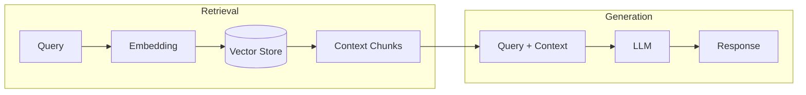
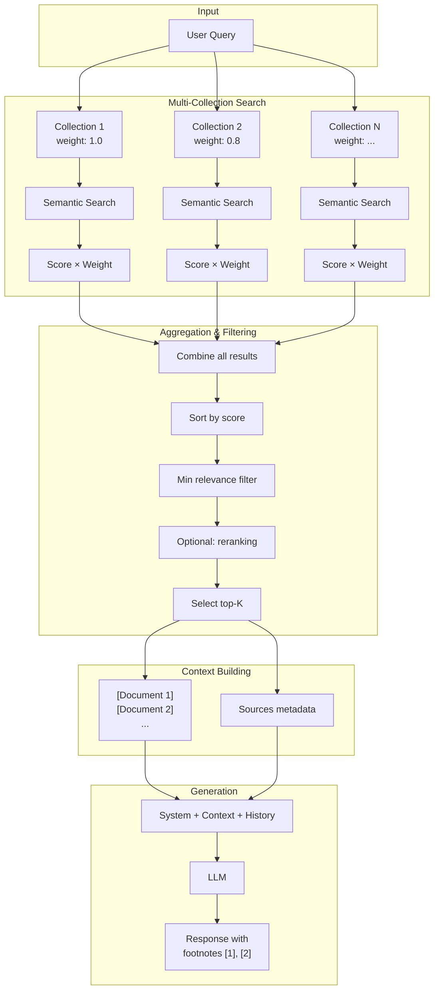

# RAG - Retrieval Augmented Generation

## Theory

### Paper

!!! quote "Original paper"
    **Lewis, P., Perez, E., Piktus, A., et al. (2020)**
    *Retrieval-Augmented Generation for Knowledge-Intensive NLP Tasks*
    **DOI:** [10.48550/arXiv.2005.11401](https://doi.org/10.48550/arXiv.2005.11401)
    **NeurIPS 2020**

### Abstract

Retrieval-Augmented Generation (RAG) combines pretrained parametric language models with non‑parametric knowledge stores. Instead of storing all knowledge in model weights, external knowledge is retrieved at inference time and provided to the LLM as context.



### Core Concepts

**1. Retriever**
- Converts query into an embedding vector
- Searches similar documents in vector space
- Returns top‑K most relevant chunks

**2. Generator**
- Receives query + retrieved context
- Generates an answer based on context
- Can include source citations

### Advantages

| Advantage | Description |
|---------|--------------|
| **Up‑to‑date knowledge** | No retraining needed when knowledge changes |
| **Fact‑based** | Answers are grounded in real documents |
| **Citations** | Transparent and traceable sources |
| **Domain‑specific** | Easy adaptation to specific domains |

### Disadvantages

| Disadvantage | Description |
|----------|--------------|
| **Retrieval quality** | Answer is only as good as retrieved docs |
| **Latency** | Additional search time |
| **Semantic gap** | Short queries may match long docs poorly |

---

## Example

### Query
```
"Who owns DG Agentur?"
```

### Retrieval (Top‑3 Chunks)
```
[Document 1] Legal notice - dg agentur
Dominik Günther
dg agentur
Bahnhofstraße 2
90402 Nürnberg
Telefon: +49 911 97554990

[Document 2] Privacy policy
Responsible: Dominik Günther, Bahnhofstraße 2...

[Document 3] About us
DG Agentur was founded...
```

### Generation (LLM Response)
```
The owner of DG Agentur is Dominik Günther. The agency is
located at Bahnhofstraße 2, 90402 Nürnberg. [1]

Sources:
[1] Legal notice - dg agentur
```

---

## Implementation in LLARS

!!! success "Status: Production"
    RAG is fully implemented and in production use.

### Architecture



!!! info "Semantic search only in standard RAG"
    The standard RAG pipeline uses **semantic search only** (vector similarity).
    Lexical search (FTS5/trigram) is available only in [agent modes](act.md) (ACT, ReAct, ReflAct).

### Components

#### 1. Embedding Models

- Selection is **database‑driven** via `llm_models` (model_type = embedding).
- Primary via **LiteLLM** (e.g., `llamaindex/vdr-2b-multi-v1`), fallback to **HuggingFace** locally.
- If no DB models exist, `LLARS_EMBEDDING_MODEL` is tried first, otherwise `LLARS_FALLBACK_EMBEDDING_MODEL`.

!!! warning "Embedding consistency"
    Query embeddings **must** match document embeddings (same dimensions).
    `embedding_model_service.py` selects the best available model per collection.

#### 2. Vector Store

- **Technology:** ChromaDB
- **Persistence:** `/app/storage/vectorstore/<model_name>/`
- **Metadata:** document_id, chunk_index, has_image, page_number, start_char, end_char, vector_id
- **Distance metric:** Cosine distance (`hnsw:space: cosine`)
- **Score conversion:** `similarity = 1 - cosine_distance`

#### 3. Multi-Collection Aggregation

Chatbots can use multiple RAG collections. Each collection has:

| Parameter | Description | Default |
|-----------|--------------|---------|
| `weight` | Score multiplier for chunks | 1.0 |
| `priority` | Search order (higher = earlier) | 0 |

**Flow:**
- Semantic search per collection
- Scores are multiplied by `weight`
- Results are combined and sorted
- `candidate_k = max(final_k * 8, 32)` and then reduced to `final_k`

#### 4. Relevance Filter

- Threshold: `rag_min_relevance`
- If nothing passes, the top‑K candidates are used

#### 5. Reranking (Optional)

Reranking runs via `services/rag/reranker.py`:

- **Modes:** `lexical` (default), `cross-encoder`, `off`
- **Control:** `RAG_RERANK_MODE` (env)
- **Lexical:** overlap score with `RAG_RERANK_ALPHA` (default 0.15)
- **Cross‑encoder:** Sentence-Transformers, optional via `rag_reranker_model`
- **Fallback:** if cross‑encoder fails → lexical

#### 6. Lexical Search (Agent Modes Only)

- **Technology:** SQLite FTS5 (trigram)
- **Index:** `app/data/rag/indexes/lexical_index.sqlite` (override via `LEXICAL_INDEX_PATH`)
- **Query expansion:** stopwords, synonyms, compound splitting
- **Fallback:** SQL LIKE search

#### 7. Vision Filter

- For **non‑vision** models, image chunks are filtered out.

### Files

| File | Function |
|-------|----------|
| `app/services/chatbot/chat_service.py` | RAG orchestration + prompt builder |
| `app/services/chatbot/chat_rag_retrieval.py` | Semantic search + aggregation + filtering |
| `app/services/rag/embedding_model_service.py` | Model fallback chain |
| `app/services/rag/reranker.py` | Reranking (lexical/cross‑encoder) |
| `app/services/chatbot/lexical_index.py` | FTS5 index (agent modes) |
| `app/rag_pipeline.py` | Legacy RAG pipeline (system docs) |

### Configuration

```python
# Chatbot (db/models/chatbot.py)
rag_enabled: bool = True
rag_retrieval_k: int = 8        # Number of documents in context
rag_min_relevance: float = 0.05 # Minimum score (0-1)
rag_include_sources: bool = True
rag_reranker_model: Optional[str] = None
rag_use_cross_encoder: bool = False

# ChatbotCollection (per collection)
weight: float = 1.0    # Score multiplier
priority: int = 0      # Search order
```

### API

```python
# Multi-collection RAG
context, sources = chat_service._get_multi_collection_context(query)
# → context: "[Document 1]\n...\n---\n\n[Document 2]\n..."
# → sources: [{"footnote_id": 1, "title": "...", "relevance": 0.85, ...}, ...]

# Search a single collection
results = chat_service._search_collection(collection, query, k=12)
# → [{"content": "...", "score": 0.85, "document_id": 1, ...}, ...]
```

### Logs

```
[ChatRAGRetrieval] Semantic search: 24 results for chatbot 5
[ChatRAGRetrieval] Top 24 candidates before relevance filter:
[ChatRAGRetrieval] Reranking 12 results
```
