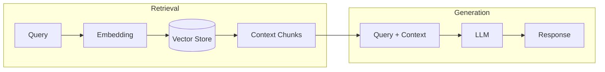
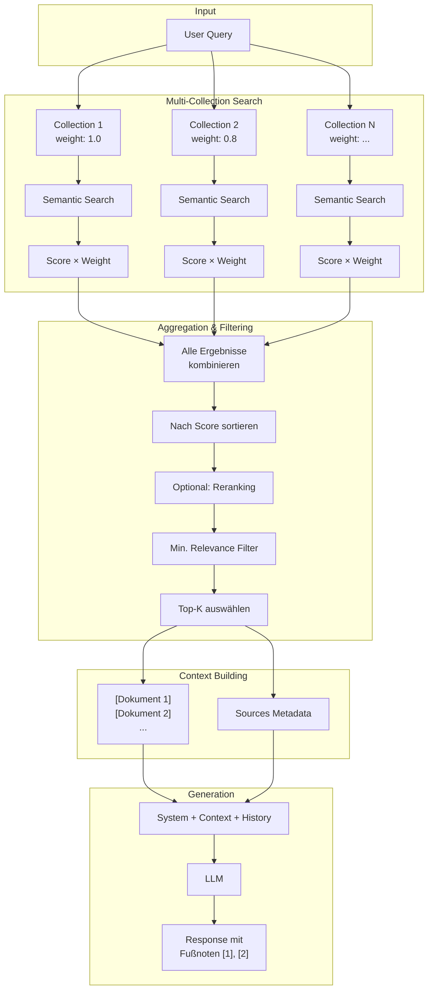
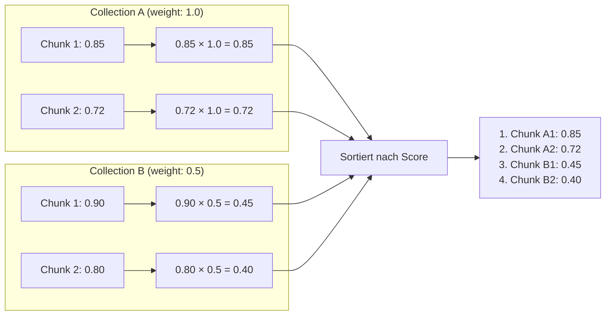

# RAG - Retrieval Augmented Generation

## Theorie

### Paper

!!! quote "Originalpaper"
    **Lewis, P., Perez, E., Piktus, A., et al. (2020)**
    *Retrieval-Augmented Generation for Knowledge-Intensive NLP Tasks*
    **DOI:** [10.48550/arXiv.2005.11401](https://doi.org/10.48550/arXiv.2005.11401)
    **NeurIPS 2020**

### Abstract

Retrieval-Augmented Generation (RAG) kombiniert vortrainierte parametrische Sprachmodelle mit nicht-parametrischen Wissensspeichern. Anstatt alles Wissen in den Modellgewichten zu speichern, wird externes Wissen zur Inferenzzeit abgerufen und dem LLM als Kontext bereitgestellt.



### Kernkonzepte

**1. Retriever (Abruf)**
- Wandelt Query in Embedding-Vektor um
- Sucht ähnliche Dokumente im Vektorraum
- Gibt Top-K relevanteste Chunks zurück

**2. Generator (Generierung)**
- Erhält Query + abgerufenen Kontext
- Generiert Antwort basierend auf Kontext
- Kann auf Quellen verweisen

### Vorteile

| Vorteil | Beschreibung |
|---------|--------------|
| **Aktuelles Wissen** | Keine Neutrainierung bei Wissensänderung |
| **Faktenbasiert** | Antworten basieren auf realen Dokumenten |
| **Quellenangaben** | Transparenz durch Zitierbarkeit |
| **Domänenspezifisch** | Einfache Anpassung an Fachgebiete |

### Nachteile

| Nachteil | Beschreibung |
|----------|--------------|
| **Retrieval-Qualität** | Antwort nur so gut wie gefundene Dokumente |
| **Latenz** | Zusätzliche Suchzeit |
| **Semantic Gap** | Kurze Queries matchen schlecht mit langen Dokumenten |

---

## Beispiel

### Query
```
"Wer ist der Inhaber der DG Agentur?"
```

### Retrieval (Top-3 Chunks)
```
[Dokument 1] Impressum - dg agentur
Dominik Günther
dg agentur
Bahnhofstraße 2
90402 Nürnberg
Telefon: +49 911 97554990

[Dokument 2] Datenschutzerklärung
Verantwortlicher: Dominik Günther, Bahnhofstraße 2...

[Dokument 3] Über uns
Die DG Agentur wurde gegründet...
```

### Generation (LLM Response)
```
Der Inhaber der DG Agentur ist Dominik Günther. Die Agentur
befindet sich in der Bahnhofstraße 2, 90402 Nürnberg. [1]

Quellen:
[1] Impressum - dg agentur
```

---

## Implementierung in LLARS

!!! success "Status: Produktiv"
    RAG ist vollständig implementiert und im Produktiveinsatz.

### Architektur



!!! info "Nur Semantic Search im Standard-RAG"
    Die Standard-RAG-Pipeline verwendet **ausschließlich semantische Suche** (Vektor-Ähnlichkeit).
    Lexical Search (BM25/FTS5) ist nur in den [Agent-Modi](act.md) (ACT, ReAct, ReflAct) als Tool verfügbar.

### Komponenten

#### 1. Embedding Models

| Modell | Dimensionen | Quelle | Priorität |
|--------|-------------|--------|-----------|
| VDR-2B-Multi-V1 | 1024 | LiteLLM (KIZ) | Primär |
| VDR-2B-Multi-V1 | 1024 | HuggingFace (lokal) | Fallback |
| all-MiniLM-L6-v2 | 384 | HuggingFace (lokal) | Notfall |

!!! warning "Embedding-Konsistenz"
    Query-Embedding **muss** zum Document-Embedding passen (gleiche Dimensionen).
    Der Service `embedding_model_service.py` wählt automatisch das beste verfügbare Modell pro Collection.

#### 2. Vector Store

- **Technologie:** ChromaDB
- **Persistenz:** `/app/storage/vectorstore/`
- **Metadaten:** document_id, chunk_index, has_image, page_number
- **Distanzmetrik:** Cosine Distance (`hnsw:space: cosine`)
- **Score-Konvertierung:** `similarity = 1 - cosine_distance`

#### 3. Multi-Collection Aggregation

Chatbots können mehrere RAG-Collections nutzen. Jede Collection hat:

| Parameter | Beschreibung | Default |
|-----------|--------------|---------|
| `weight` | Multiplikator für Chunk-Scores | 1.0 |
| `priority` | Reihenfolge der Suche (höher = zuerst) | 0 |



**Anwendungsfälle:**

- **Primäre Wissensbasis** (weight: 1.0): Hauptdokumente
- **Ergänzende Quellen** (weight: 0.5-0.8): Zusatzmaterial, FAQs
- **Hintergrundwissen** (weight: 0.3): Allgemeine Informationen

#### 4. Reranking (Optional)

Nach der initialen Suche kann optional ein Reranking durchgeführt werden:

| Modus | Beschreibung |
|-------|--------------|
| **Cross-Encoder** | Semantisches Re-Scoring mit Sentence-Transformers |
| **Lexical Blending** | `(1-α) × vector_score + α × lexical_overlap` (α=0.15) |

#### 5. Lexical Search (Nur Agent-Modi)

!!! note "Verfügbarkeit"
    Lexical Search ist **nicht** Teil der Standard-RAG-Pipeline, sondern nur als Tool in [ACT](act.md), [ReAct](react.md) und [ReflAct](reflact.md) verfügbar.

- **Technologie:** SQLite FTS5 mit Trigram-Tokenizer
- **Index:** `app/data/rag/indexes/lexical_index.sqlite`
- **Features:** Stopword-Filtering, Compound-Word-Expansion

### Dateien

| Datei | Funktion |
|-------|----------|
| `app/services/chatbot/chat_service.py` | Multi-Collection Search + Context Building |
| `app/services/rag/embedding_model_service.py` | Model-Fallback-Chain |
| `app/services/rag/reranker.py` | Optional Reranking (Cross-Encoder/Lexical) |
| `app/services/chatbot/lexical_index.py` | FTS5 Index (nur Agent-Modi) |
| `app/rag_pipeline.py` | Legacy RAG für System-Dokumentation |

### Konfiguration

```python
# Chatbot-Einstellungen (db/models/chatbot.py)
rag_enabled: bool = True
rag_retrieval_k: int = 4        # Anzahl Dokumente im Kontext
rag_min_relevance: float = 0.3  # Minimum Score (0-1)
rag_include_sources: bool = True
rag_require_citations: bool = True

# ChatbotCollection (pro Collection)
weight: float = 1.0    # Score-Multiplikator
priority: int = 0      # Suchreihenfolge
```

### API

```python
# ChatService - Multi-Collection RAG
context, sources = chat_service._get_multi_collection_context(query)
# → context: "[Dokument 1]\n...\n---\n\n[Dokument 2]\n..."
# → sources: [{"footnote_id": 1, "title": "...", "relevance": 0.85, ...}, ...]

# Einzelne Collection durchsuchen
results = chat_service._search_collection(collection, query, k=12)
# → [{"content": "...", "score": 0.85, "document_id": 1, ...}, ...]
```

### Logs

```
[ChatService] Semantic search: 24 results for chatbot 5
[ChatService] Vision check: model=mistralai/Magistral-Small-2509, use_vision=True
[ChatService] Results before filter: total=24, images=2
[ChatService] After image filter (non-vision): 22 results
```
