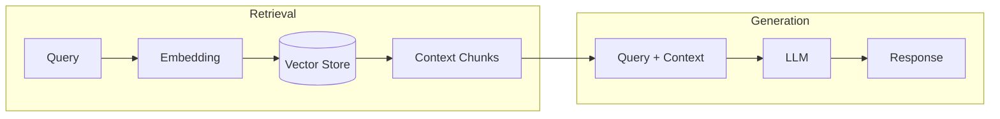
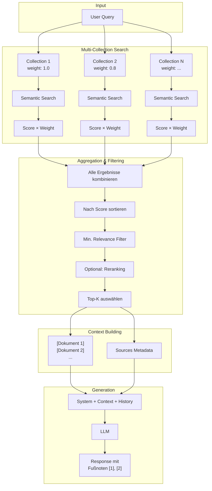

# RAG - Retrieval Augmented Generation

## Theorie

### Paper

!!! quote "Originalpaper"
    **Lewis, P., Perez, E., Piktus, A., et al. (2020)**
    *Retrieval-Augmented Generation for Knowledge-Intensive NLP Tasks*
    **DOI:** [10.48550/arXiv.2005.11401](https://doi.org/10.48550/arXiv.2005.11401)
    **NeurIPS 2020**

### Abstract

Retrieval-Augmented Generation (RAG) kombiniert vortrainierte parametrische Sprachmodelle mit nicht-parametrischen Wissensspeichern. Anstatt alles Wissen in den Modellgewichten zu speichern, wird externes Wissen zur Inferenzzeit abgerufen und dem LLM als Kontext bereitgestellt.



### Kernkonzepte

**1. Retriever (Abruf)**
- Wandelt Query in Embedding-Vektor um
- Sucht ähnliche Dokumente im Vektorraum
- Gibt Top-K relevanteste Chunks zurück

**2. Generator (Generierung)**
- Erhält Query + abgerufenen Kontext
- Generiert Antwort basierend auf Kontext
- Kann auf Quellen verweisen

### Vorteile

| Vorteil | Beschreibung |
|---------|--------------|
| **Aktuelles Wissen** | Keine Neutrainierung bei Wissensänderung |
| **Faktenbasiert** | Antworten basieren auf realen Dokumenten |
| **Quellenangaben** | Transparenz durch Zitierbarkeit |
| **Domänenspezifisch** | Einfache Anpassung an Fachgebiete |

### Nachteile

| Nachteil | Beschreibung |
|----------|--------------|
| **Retrieval-Qualität** | Antwort nur so gut wie gefundene Dokumente |
| **Latenz** | Zusätzliche Suchzeit |
| **Semantic Gap** | Kurze Queries matchen schlecht mit langen Dokumenten |

---

## Beispiel

### Query
```
"Wer ist der Inhaber der DG Agentur?"
```

### Retrieval (Top-3 Chunks)
```
[Dokument 1] Impressum - dg agentur
Dominik Günther
dg agentur
Bahnhofstraße 2
90402 Nürnberg
Telefon: +49 911 97554990

[Dokument 2] Datenschutzerklärung
Verantwortlicher: Dominik Günther, Bahnhofstraße 2...

[Dokument 3] Über uns
Die DG Agentur wurde gegründet...
```

### Generation (LLM Response)
```
Der Inhaber der DG Agentur ist Dominik Günther. Die Agentur
befindet sich in der Bahnhofstraße 2, 90402 Nürnberg. [1]

Quellen:
[1] Impressum - dg agentur
```

---

## Implementierung in LLARS

!!! success "Status: Produktiv"
    RAG ist vollständig implementiert und im Produktiveinsatz.

### Architektur



!!! info "Nur Semantic Search im Standard-RAG"
    Die Standard-RAG-Pipeline verwendet **ausschließlich semantische Suche** (Vektor-Ähnlichkeit).
    Lexical Search (FTS5/Trigram) ist nur in den [Agent-Modi](act.md) (ACT, ReAct, ReflAct) als Tool verfügbar.

### Komponenten

#### 1. Embedding Models

- Auswahl erfolgt **datenbankbasiert** über `llm_models` (model_type = embedding).
- Primär über **LiteLLM** (z.B. `llamaindex/vdr-2b-multi-v1`), Fallback über **HuggingFace** lokal.
- Wenn keine DB-Modelle vorhanden sind, wird `LLARS_EMBEDDING_MODEL` versucht, ansonsten `LLARS_FALLBACK_EMBEDDING_MODEL`.

!!! warning "Embedding-Konsistenz"
    Query-Embedding **muss** zum Document-Embedding passen (gleiche Dimensionen).
    Der Service `embedding_model_service.py` wählt automatisch das beste verfügbare Modell pro Collection.

#### 2. Vector Store

- **Technologie:** ChromaDB
- **Persistenz:** `/app/storage/vectorstore/<model_name>/`
- **Metadaten:** document_id, chunk_index, has_image, page_number, start_char, end_char, vector_id
- **Distanzmetrik:** Cosine Distance (`hnsw:space: cosine`)
- **Score-Konvertierung:** `similarity = 1 - cosine_distance`

#### 3. Multi-Collection Aggregation

Chatbots können mehrere RAG-Collections nutzen. Jede Collection hat:

| Parameter | Beschreibung | Default |
|-----------|--------------|---------|
| `weight` | Multiplikator für Chunk-Scores | 1.0 |
| `priority` | Reihenfolge der Suche (höher = zuerst) | 0 |

**Ablauf:**
- Pro Collection wird semantisch gesucht.
- Scores werden mit `weight` multipliziert.
- Ergebnisse werden kombiniert und sortiert.
- `candidate_k = max(final_k * 8, 32)` und danach auf `final_k` reduziert.

#### 4. Relevance-Filter

- Mindestschwelle: `rag_min_relevance`
- Falls nichts die Schwelle erfüllt, werden die Top-K Kandidaten genutzt.

#### 5. Reranking (Optional)

Das Reranking läuft über `services/rag/reranker.py`:

- **Modi:** `lexical` (Default), `cross-encoder`, `off`
- **Steuerung:** `RAG_RERANK_MODE` (Env)
- **Lexical:** Overlap-Score mit `RAG_RERANK_ALPHA` (Default 0.15)
- **Cross-Encoder:** Sentence-Transformers, optional über `rag_reranker_model`
- **Fallback:** Wenn Cross-Encoder fehlschlägt → lexical

#### 6. Lexical Search (Nur Agent-Modi)

- **Technologie:** SQLite FTS5 (Trigram)
- **Index:** `app/data/rag/indexes/lexical_index.sqlite` (override via `LEXICAL_INDEX_PATH`)
- **Query-Expansion:** Stopword-Filtering, Synonyme, Compound-Splitting
- **Fallback:** SQL LIKE Search

#### 7. Vision-Filter

- Bei **Non‑Vision** Modellen werden Chunks mit Bildern herausgefiltert.

### Dateien

| Datei | Funktion |
|-------|----------|
| `app/services/chatbot/chat_service.py` | RAG Orchestrierung + Prompt Builder |
| `app/services/chatbot/chat_rag_retrieval.py` | Semantic Search + Aggregation + Filter |
| `app/services/rag/embedding_model_service.py` | Model-Fallback-Chain |
| `app/services/rag/reranker.py` | Reranking (Lexical/Cross-Encoder) |
| `app/services/chatbot/lexical_index.py` | FTS5 Index (Agent-Modi) |
| `app/rag_pipeline.py` | Legacy RAG Pipeline (System-Dokumentation) |

### Konfiguration

```python
# Chatbot (db/models/chatbot.py)
rag_enabled: bool = True
rag_retrieval_k: int = 8        # Anzahl Dokumente im Kontext
rag_min_relevance: float = 0.05 # Minimum Score (0-1)
rag_include_sources: bool = True
rag_reranker_model: Optional[str] = None
rag_use_cross_encoder: bool = False

# ChatbotCollection (pro Collection)
weight: float = 1.0    # Score-Multiplikator
priority: int = 0      # Suchreihenfolge
```

### API

```python
# Multi-Collection RAG
context, sources = chat_service._get_multi_collection_context(query)
# → context: "[Dokument 1]\n...\n---\n\n[Dokument 2]\n..."
# → sources: [{"footnote_id": 1, "title": "...", "relevance": 0.85, ...}, ...]

# Einzelne Collection durchsuchen
results = chat_service._search_collection(collection, query, k=12)
# → [{"content": "...", "score": 0.85, "document_id": 1, ...}, ...]
```

### Logs

```
[ChatRAGRetrieval] Semantic search: 24 results for chatbot 5
[ChatRAGRetrieval] Top 24 candidates before relevance filter:
[ChatRAGRetrieval] Reranking 12 results
```
