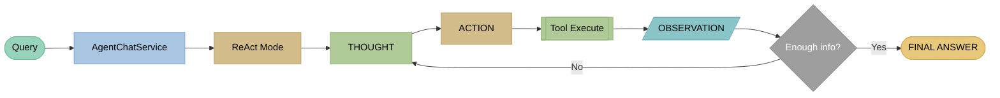
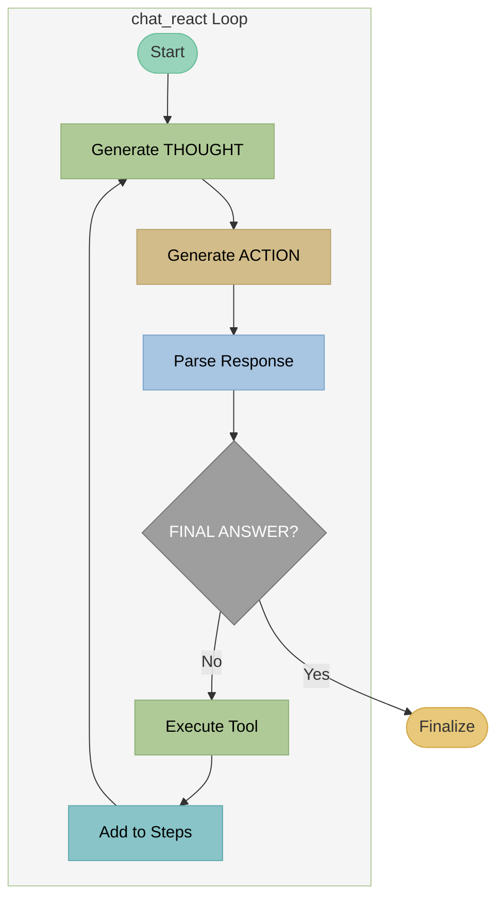

# ReACT - Reasoning and Acting

## Theory

### Paper

!!! quote "Original paper"
    **Yao, S., Zhao, J., Yu, D., et al. (2022)**
    *ReAct: Synergizing Reasoning and Acting in Language Models*
    **DOI:** [10.48550/arXiv.2210.03629](https://doi.org/10.48550/arXiv.2210.03629)
    **ICLR 2023**

!!! info "Concept"
    **ReAct** interleaves reasoning and acting in a loop. The LLM alternates between THOUGHT (reasoning), ACTION (tool call), and OBSERVATION (result). This enables transparent, traceable reasoning for complex multi‑hop requests.

### Architecture



**ReAct loop:** Query → THOUGHT (forward‑looking) → ACTION → Tool → OBSERVATION → (repeat or answer)

### Core Concept

**THOUGHT → ACTION → OBSERVATION → THOUGHT → ... → FINAL ANSWER**

The THOUGHT step is **forward‑looking**:

- "What do I need to do next?"
- "Which information is missing?"
- "Which tool should I use?"

### Advantages over ACT

| Aspect | ReACT | ACT |
|--------|-------|-----|
| Transparency | High (THOUGHT visible) | Low |
| Debugging | Easy | Hard |
| Multi‑hop reasoning | Good | Limited |
| Self‑correction | Possible | Hard |
| Token usage | Higher | Lower |

### Typical THOUGHT Patterns

```
THOUGHT: I need to search for the opening hours first.
THOUGHT: The search returned no results, I will try different keywords.
THOUGHT: I now have all necessary information and can answer.
```

---

## Example

### Query
```
"When is DG Agentur open and how can I reach them?"
```

### ReAct Trace

```
[Iteration 1]
THOUGHT: The user asks for opening hours AND contact details.
         I will search for opening hours first.
ACTION: rag_search("opening hours DG Agentur")
OBSERVATION:
  [1] Contact: Mon-Fri 9-18, Sat by appointment
  [2] You can reach us at +49 911 97554990

[Iteration 2]
THOUGHT: I found opening hours. For contact details,
         I will search for more information.
ACTION: rag_search("contact phone email address")
OBSERVATION:
  [1] Legal notice: Phone +49 911 97554990, Email office@dg-agentur.de
  [2] Address: Bahnhofstraße 2, 90402 Nürnberg

[Iteration 3]
THOUGHT: I now have all information: opening hours and
         full contact details. I can answer.
FINAL ANSWER: DG Agentur is open Monday to Friday 9-18,
              Saturday by appointment. [1]

              Contact:
              - Phone: +49 911 97554990
              - Email: office@dg-agentur.de
              - Address: Bahnhofstraße 2, 90402 Nürnberg [2]
```

### Response
```
DG Agentur is open Monday to Friday 9-18,
Saturday by appointment. [1]

Contact:
- Phone: +49 911 97554990
- Email: office@dg-agentur.de
- Address: Bahnhofstraße 2, 90402 Nürnberg [2]

Sources:
[1] Contact - DG Agentur
[2] Legal notice - DG Agentur
```

---

## Implementation in LLARS

!!! success "Status: Production"
    ReACT is fully implemented and in production use.

### Architecture



### System Prompt

```python
# DEFAULT_REACT_SYSTEM_PROMPT (db/models/chatbot.py)
"""
Du bist ein ReAct-Agent. Du denkst Schritt für Schritt und führst Aktionen aus.

## Zyklus (wiederhole bis fertig):
1. THOUGHT: Analysiere was du als nächstes tun musst
2. ACTION: Führe GENAU EINE Aktion aus
3. Warte auf OBSERVATION

## Verfügbare Aktionen (NUR diese!):
- rag_search("suchbegriff") - Semantische Dokumentensuche
- lexical_search("suchbegriff") - Keyword-Suche
- respond("antwort") - Finale Antwort (beendet Prozess)

## Format (EXAKT einhalten!):
THOUGHT: [deine Überlegung]
ACTION: rag_search("suchbegriff")

Wenn fertig:
THOUGHT: [deine Überlegung]
FINAL ANSWER: [vollständige Antwort mit Quellen]

## WICHTIG:
- IMMER erst THOUGHT, dann ACTION oder FINAL ANSWER
- Aktionen GENAU so schreiben: rag_search("text")
- KEINE anderen Aktionen erfinden!
- Wenn keine Treffer: Query reformulieren, Komposita zerlegen und Synonyme testen.
"""
```

**Additionally:**
- `chatbot.system_prompt` is **prefixed**.
- `build_tool_availability_prompt()` adds the **enabled tools** dynamically.
- `{PROJECT_URL}` placeholders are replaced before use.

### Files

| File | Function |
|-------|----------|
| `app/services/chatbot/agent_chat_service.py` | Routing to ACT/ReAct/ReflAct |
| `app/services/chatbot/agent_modes/mode_react.py` | `chat_react()` loop + streaming |
| `app/services/chatbot/agent_parsers.py` | `parse_react_response()` |
| `app/services/chatbot/agent_tools.py` | Tool execution + confidence checks |
| `app/db/models/chatbot.py` | DEFAULT_REACT_SYSTEM_PROMPT + prompt settings |

### Code Snippet

```python
# mode_react.py - chat_react()
for iteration in range(max_iterations):
    yield {"status": "iteration", "iteration": iteration + 1, "max": max_iterations}

    # Stream THOUGHT + ACTION
    response_text, thought, action, final_answer = yield from _stream_react_response(...)

    # Final answer
    if final_answer:
        yield {"status": "final_answer"}
        ...
        return

    # Execute tool
    result, sources = service._tool_executor.execute_tool(action_name, action_param, message, enabled_tools)
    yield {"status": "observation", "result_preview": result[:300], "iteration": iteration + 1}
```

### Parsing

```python
# agent_parsers.py - parse_react_response()
THOUGHT_PATTERN = r"THOUGHT:\s*(.+?)(?=ACTION:|FINAL ANSWER:|$)"
ACTION_PATTERN = r"ACTION:\s*(.+?)(?=OBSERVATION:|FINAL ANSWER:|$)"
FINAL_PATTERN = r"FINAL ANSWER:\s*(.+?)$"
```

### Configuration

```python
# ChatbotPromptSettings
agent_mode: str = "react"
task_type: str = "lookup" | "multihop"
agent_max_iterations: int = 5

# Multihop: max_iterations = min(agent_max_iterations + 2, 10)

tools_enabled: List[str] = ["rag_search", "lexical_search", "respond"]
web_search_enabled: bool = False
web_search_max_results: int = 5

react_system_prompt: str = "..."  # custom prompt (optional)
```

### Adaptive Iteration (High Confidence)

If the search yields **high confidence**, ReAct exits early and generates a final answer immediately.
Confidence is derived from source scores (`check_high_confidence`).

### Fallback Search

If no ACTION was generated but sources are required, ReAct triggers an automatic search (e.g., `rag_search`) to avoid stalling.

---

## Events (WebSocket)

```python
# Streaming Events (excerpt)
yield {"status": "starting", "mode": "react"}
yield {"status": "iteration", "iteration": 1, "max": 7, "steps": [...]}
yield {"status": "thinking", "iteration": 1}
yield {"status": "thought_delta", "delta": "...", "iteration": 1}
yield {"status": "thought", "thought": "...", "iteration": 1}
yield {"status": "action_delta", "delta": "...", "iteration": 1}
yield {"status": "action", "action": "rag_search", "param": "...", "iteration": 1}
yield {"status": "observation_delta", "delta": "...", "iteration": 1}
yield {"status": "observation", "result_preview": "...", "iteration": 1}
yield {"status": "adaptive_iteration", "iteration": 1, "reason": "high_confidence"}
yield {"status": "adaptive_response", "reason": "high_confidence_results"}
yield {"status": "max_iterations_reached"}
yield {"status": "final_answer"}
yield {"delta": "..."}
yield {"done": True, "full_response": "...", "sources": [...]} 
```

### Logs

```
[AgentChatService] ReAct adaptive iteration: high confidence on iteration 2
```

### Comparison: ACT vs ReACT in LLARS

| Aspect | ACT | ReACT |
|--------|-----|-------|
| Method | `chat_act()` | `chat_react()` |
| Location | `mode_act.py` | `mode_react.py` |
| THOUGHT step | No | Yes (streaming) |
| Adaptive iteration | Yes | Yes |
| Typical iterations | 1-3 | 2-5 |
