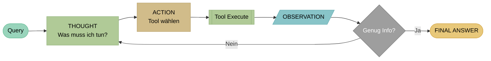
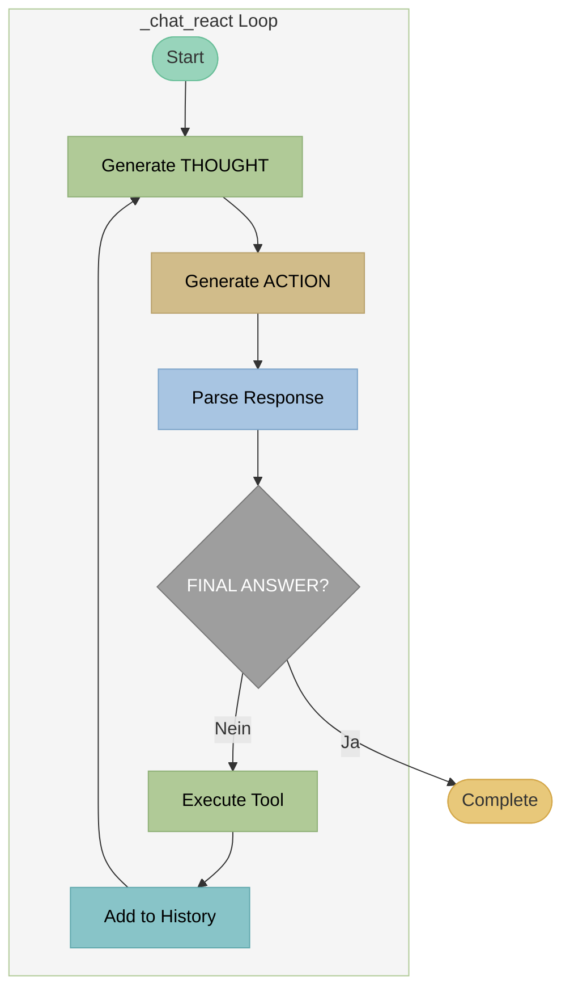

# ReACT - Reasoning and Acting

## Theorie

### Paper

!!! quote "Originalpaper"
    **Yao, S., Zhao, J., Yu, D., et al. (2022)**
    *ReAct: Synergizing Reasoning and Acting in Language Models*
    **DOI:** [10.48550/arXiv.2210.03629](https://doi.org/10.48550/arXiv.2210.03629)
    **ICLR 2023**

!!! info "Konzept"
    **ReAct** verbindet Reasoning (Denken) mit Acting (Handeln) in einer verschränkten Schleife. Das LLM generiert abwechselnd THOUGHT (Überlegung), ACTION (Tool-Aufruf) und erhält OBSERVATION (Ergebnis). Dies ermöglicht transparentes, nachvollziehbares Reasoning bei komplexen Multi-Hop-Anfragen.

### Architektur



**ReACT Loop:** Query → THOUGHT (vorwärts denken) → ACTION → Tool → OBSERVATION → (Wiederholung oder Antwort)

### Kernkonzept

**THOUGHT → ACTION → OBSERVATION → THOUGHT → ... → FINAL ANSWER**

Der THOUGHT-Schritt ist **vorwärtsgerichtet** (forward-looking):

- "Was muss ich als nächstes tun?"
- "Welche Information fehlt mir?"
- "Welches Tool sollte ich verwenden?"

### Vorteile gegenüber ACT

| Aspekt | ReACT | ACT |
|--------|-------|-----|
| Transparenz | Hoch (THOUGHT sichtbar) | Niedrig |
| Debugging | Einfach | Schwer |
| Multi-Hop Reasoning | Gut | Begrenzt |
| Selbstkorrektur | Möglich | Schwer |
| Token-Verbrauch | Höher | Niedriger |

### Typische THOUGHT-Muster

```
THOUGHT: Ich muss zuerst nach den Öffnungszeiten suchen.
THOUGHT: Die Suche hat keine Ergebnisse geliefert, ich versuche andere Keywords.
THOUGHT: Ich habe jetzt alle benötigten Informationen und kann antworten.
```

---

## Beispiel

### Query
```
"Wann hat die DG Agentur geöffnet und wie erreiche ich sie?"
```

### ReACT Trace

```
[Iteration 1]
THOUGHT: Der Benutzer fragt nach Öffnungszeiten UND Kontaktdaten.
         Ich suche zuerst nach Öffnungszeiten.
ACTION: rag_search("Öffnungszeiten DG Agentur")
OBSERVATION:
  [1] Kontakt: Mo-Fr 9-18 Uhr, Sa nach Vereinbarung
  [2] Wir sind telefonisch unter +49 911 97554990 erreichbar

[Iteration 2]
THOUGHT: Ich habe Öffnungszeiten gefunden. Für die Kontaktdaten
         suche ich noch nach weiteren Informationen.
ACTION: rag_search("Kontakt Telefon Email Adresse")
OBSERVATION:
  [1] Impressum: Telefon +49 911 97554990, Email office@dg-agentur.de
  [2] Adresse: Bahnhofstraße 2, 90402 Nürnberg

[Iteration 3]
THOUGHT: Ich habe jetzt alle Informationen: Öffnungszeiten und
         vollständige Kontaktdaten. Ich kann die Frage beantworten.
ACTION: respond("Die DG Agentur hat Montag bis Freitag von 9-18 Uhr
                 geöffnet, Samstag nach Vereinbarung. [1]

                 Kontakt:
                 - Telefon: +49 911 97554990
                 - Email: office@dg-agentur.de
                 - Adresse: Bahnhofstraße 2, 90402 Nürnberg [2]")
```

### Response
```
Die DG Agentur hat Montag bis Freitag von 9-18 Uhr geöffnet,
Samstag nach Vereinbarung. [1]

Kontakt:
- Telefon: +49 911 97554990
- Email: office@dg-agentur.de
- Adresse: Bahnhofstraße 2, 90402 Nürnberg [2]

Quellen:
[1] Kontakt - DG Agentur
[2] Impressum - DG Agentur
```

---

## Implementierung in LLARS

!!! success "Status: Produktiv"
    ReACT ist vollständig implementiert und im Produktiveinsatz.

### Architektur



### System Prompt

```python
# DEFAULT_REACT_SYSTEM_PROMPT (chatbot.py)
"""
Du bist ein hilfreicher Assistent mit Zugang zu Werkzeugen.
Denke Schritt für Schritt und nutze das folgende Format:

THOUGHT: [Deine Überlegung was als nächstes zu tun ist]
ACTION: werkzeug_name("parameter")

Nach Erhalt einer OBSERVATION, fahre mit dem nächsten THOUGHT fort.

Wenn du genug Informationen hast, antworte mit:
FINAL ANSWER: [Deine vollständige Antwort]

Verfügbare Werkzeuge:
- rag_search("suchbegriffe"): Semantische Suche in Dokumenten
- lexical_search("suchbegriffe"): Keyword-basierte Suche
- web_search("suchbegriffe"): Web-Suche (falls aktiviert)
"""
```

### Dateien

| Datei | Funktion |
|-------|----------|
| `app/services/chatbot/agent_chat_service.py` | `_chat_react()` (Zeilen 465-733) |
| `app/db/models/chatbot.py` | `DEFAULT_REACT_SYSTEM_PROMPT` |

### Code-Auszug

```python
# agent_chat_service.py - _chat_react()

def _chat_react(self, message: str, ...) -> Generator[Dict, None, None]:
    """ReACT agent loop - Reasoning + Acting."""

    for iteration in range(max_iterations):
        yield {"status": "iteration", "iteration": iteration + 1}

        # Generate THOUGHT + ACTION (streaming)
        full_response = ""
        for chunk in self._stream_llm_response(messages):
            full_response += chunk
            yield {"status": "thinking", "delta": chunk}

        # Parse response
        thought, action, argument, final_answer = \
            self._parse_react_response(full_response)

        if final_answer:
            yield {"status": "complete", "response": final_answer}
            return

        # Execute tool
        observation = self._execute_tool(action, argument)

        # Add to history
        messages.append({
            "role": "assistant",
            "content": f"THOUGHT: {thought}\nACTION: {action}(\"{argument}\")"
        })
        messages.append({
            "role": "user",
            "content": f"OBSERVATION: {observation}"
        })
```

### Parsing

```python
# _parse_react_response()

THOUGHT_PATTERN = r"THOUGHT:\s*(.+?)(?=ACTION:|FINAL ANSWER:|$)"
ACTION_PATTERN = r"ACTION:\s*(\w+)\s*\(\s*[\"'](.+?)[\"']\s*\)"
FINAL_PATTERN = r"FINAL ANSWER:\s*(.+)"
```

### Konfiguration

```python
# ChatbotPromptSettings
agent_mode: str = "react"
task_type: str = "multihop"  # Mehr Iterationen erlaubt
agent_max_iterations: int = 7
tools_enabled: List[str] = ["rag_search", "lexical_search", "web_search", "respond"]

# Custom System Prompt (optional)
react_system_prompt: str = "..."
```

### Events (WebSocket)

```python
# Streaming Events
yield {"status": "iteration", "iteration": 1, "max": 7}
yield {"status": "thinking", "delta": "Ich muss..."}  # Streaming THOUGHT
yield {"status": "thought", "content": "Ich muss nach..."}  # Complete THOUGHT
yield {"status": "action", "action": "rag_search", "argument": "..."}
yield {"status": "observation", "content": "..."}
yield {"status": "complete", "response": "...", "sources": [...]}
```

### Logs

```
[AgentChatService] ReACT iteration 1/7
[AgentChatService] THOUGHT: Ich muss nach Öffnungszeiten suchen...
[AgentChatService] ACTION: rag_search("Öffnungszeiten")
[AgentChatService] Tool executed: rag_search (3 results)
[AgentChatService] ReACT iteration 2/7
[AgentChatService] THOUGHT: Ich habe die Öffnungszeiten gefunden...
[AgentChatService] FINAL ANSWER detected
[AgentChatService] ReACT completed in 2 iterations
```

### Vergleich: ACT vs ReACT in LLARS

| Aspekt | ACT | ReACT |
|--------|-----|-------|
| Methode | `_chat_act()` | `_chat_react()` |
| System Prompt | `DEFAULT_ACT_SYSTEM_PROMPT` | `DEFAULT_REACT_SYSTEM_PROMPT` |
| THOUGHT-Schritt | Nein | Ja (streaming) |
| Parsing | `_parse_act_response()` | `_parse_react_response()` |
| Token/Iteration | ~50-100 | ~150-300 |
| Typische Iterationen | 1-3 | 2-5 |
