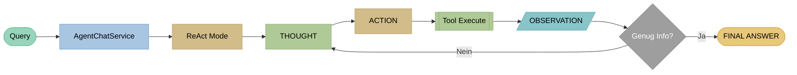
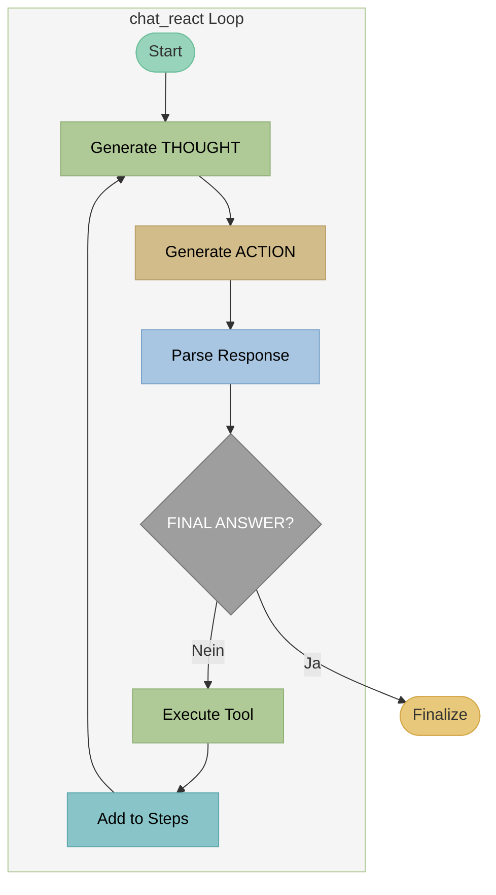

# ReACT - Reasoning and Acting

## Theorie

### Paper

!!! quote "Originalpaper"
    **Yao, S., Zhao, J., Yu, D., et al. (2022)**
    *ReAct: Synergizing Reasoning and Acting in Language Models*
    **DOI:** [10.48550/arXiv.2210.03629](https://doi.org/10.48550/arXiv.2210.03629)
    **ICLR 2023**

!!! info "Konzept"
    **ReAct** verbindet Reasoning (Denken) mit Acting (Handeln) in einer verschränkten Schleife. Das LLM generiert abwechselnd THOUGHT (Überlegung), ACTION (Tool-Aufruf) und erhält OBSERVATION (Ergebnis). Dies ermöglicht transparentes, nachvollziehbares Reasoning bei komplexen Multi-Hop-Anfragen.

### Architektur



**ReAct Loop:** Query → THOUGHT (vorwärts denken) → ACTION → Tool → OBSERVATION → (Wiederholung oder Antwort)

### Kernkonzept

**THOUGHT → ACTION → OBSERVATION → THOUGHT → ... → FINAL ANSWER**

Der THOUGHT-Schritt ist **vorwärtsgerichtet** (forward-looking):

- "Was muss ich als nächstes tun?"
- "Welche Information fehlt mir?"
- "Welches Tool sollte ich verwenden?"

### Vorteile gegenüber ACT

| Aspekt | ReACT | ACT |
|--------|-------|-----|
| Transparenz | Hoch (THOUGHT sichtbar) | Niedrig |
| Debugging | Einfach | Schwer |
| Multi-Hop Reasoning | Gut | Begrenzt |
| Selbstkorrektur | Möglich | Schwer |
| Token-Verbrauch | Höher | Niedriger |

### Typische THOUGHT-Muster

```
THOUGHT: Ich muss zuerst nach den Öffnungszeiten suchen.
THOUGHT: Die Suche hat keine Ergebnisse geliefert, ich versuche andere Keywords.
THOUGHT: Ich habe jetzt alle benötigten Informationen und kann antworten.
```

---

## Beispiel

### Query
```
"Wann hat die DG Agentur geöffnet und wie erreiche ich sie?"
```

### ReAct Trace

```
[Iteration 1]
THOUGHT: Der Benutzer fragt nach Öffnungszeiten UND Kontaktdaten.
         Ich suche zuerst nach Öffnungszeiten.
ACTION: rag_search("Öffnungszeiten DG Agentur")
OBSERVATION:
  [1] Kontakt: Mo-Fr 9-18 Uhr, Sa nach Vereinbarung
  [2] Wir sind telefonisch unter +49 911 97554990 erreichbar

[Iteration 2]
THOUGHT: Ich habe Öffnungszeiten gefunden. Für die Kontaktdaten
         suche ich noch nach weiteren Informationen.
ACTION: rag_search("Kontakt Telefon Email Adresse")
OBSERVATION:
  [1] Impressum: Telefon +49 911 97554990, Email office@dg-agentur.de
  [2] Adresse: Bahnhofstraße 2, 90402 Nürnberg

[Iteration 3]
THOUGHT: Ich habe jetzt alle Informationen: Öffnungszeiten und
         vollständige Kontaktdaten. Ich kann die Frage beantworten.
FINAL ANSWER: Die DG Agentur hat Montag bis Freitag von 9-18 Uhr
              geöffnet, Samstag nach Vereinbarung. [1]

              Kontakt:
              - Telefon: +49 911 97554990
              - Email: office@dg-agentur.de
              - Adresse: Bahnhofstraße 2, 90402 Nürnberg [2]
```

### Response
```
Die DG Agentur hat Montag bis Freitag von 9-18 Uhr geöffnet,
Samstag nach Vereinbarung. [1]

Kontakt:
- Telefon: +49 911 97554990
- Email: office@dg-agentur.de
- Adresse: Bahnhofstraße 2, 90402 Nürnberg [2]

Quellen:
[1] Kontakt - DG Agentur
[2] Impressum - DG Agentur
```

---

## Implementierung in LLARS

!!! success "Status: Produktiv"
    ReACT ist vollständig implementiert und im Produktiveinsatz.

### Architektur



### System Prompt

```python
# DEFAULT_REACT_SYSTEM_PROMPT (db/models/chatbot.py)
"""
Du bist ein ReAct-Agent. Du denkst Schritt für Schritt und führst Aktionen aus.

## Zyklus (wiederhole bis fertig):
1. THOUGHT: Analysiere was du als nächstes tun musst
2. ACTION: Führe GENAU EINE Aktion aus
3. Warte auf OBSERVATION

## Verfügbare Aktionen (NUR diese!):
- rag_search("suchbegriff") - Semantische Dokumentensuche
- lexical_search("suchbegriff") - Keyword-Suche
- respond("antwort") - Finale Antwort (beendet Prozess)

## Format (EXAKT einhalten!):
THOUGHT: [deine Überlegung]
ACTION: rag_search("suchbegriff")

Wenn fertig:
THOUGHT: [deine Überlegung]
FINAL ANSWER: [vollständige Antwort mit Quellen]

## WICHTIG:
- IMMER erst THOUGHT, dann ACTION oder FINAL ANSWER
- Aktionen GENAU so schreiben: rag_search("text")
- KEINE anderen Aktionen erfinden!
- Wenn keine Treffer: Query reformulieren, Komposita zerlegen und Synonyme testen.
"""
```

**Zusätzlich:**
- `chatbot.system_prompt` wird **vorangestellt**.
- `build_tool_availability_prompt()` ergänzt dynamisch die **freigeschalteten Tools**.
- `{PROJECT_URL}` Platzhalter werden vor Nutzung ersetzt.

### Dateien

| Datei | Funktion |
|-------|----------|
| `app/services/chatbot/agent_chat_service.py` | Routing auf ACT/ReAct/ReflAct |
| `app/services/chatbot/agent_modes/mode_react.py` | `chat_react()` Loop + Streaming |
| `app/services/chatbot/agent_parsers.py` | `parse_react_response()` |
| `app/services/chatbot/agent_tools.py` | Tool-Ausführung + Confidence-Check |
| `app/db/models/chatbot.py` | DEFAULT_REACT_SYSTEM_PROMPT + Prompt Settings |

### Code-Auszug

```python
# mode_react.py - chat_react()
for iteration in range(max_iterations):
    yield {"status": "iteration", "iteration": iteration + 1, "max": max_iterations}

    # Stream THOUGHT + ACTION
    response_text, thought, action, final_answer = yield from _stream_react_response(...)

    # Final answer
    if final_answer:
        yield {"status": "final_answer"}
        ...
        return

    # Execute tool
    result, sources = service._tool_executor.execute_tool(action_name, action_param, message, enabled_tools)
    yield {"status": "observation", "result_preview": result[:300], "iteration": iteration + 1}
```

### Parsing

```python
# agent_parsers.py - parse_react_response()
THOUGHT_PATTERN = r"THOUGHT:\s*(.+?)(?=ACTION:|FINAL ANSWER:|$)"
ACTION_PATTERN = r"ACTION:\s*(.+?)(?=OBSERVATION:|FINAL ANSWER:|$)"
FINAL_PATTERN = r"FINAL ANSWER:\s*(.+?)$"
```

### Konfiguration

```python
# ChatbotPromptSettings
agent_mode: str = "react"
task_type: str = "lookup" | "multihop"
agent_max_iterations: int = 5

# Multihop: max_iterations = min(agent_max_iterations + 2, 10)

tools_enabled: List[str] = ["rag_search", "lexical_search", "respond"]
web_search_enabled: bool = False
web_search_max_results: int = 5

react_system_prompt: str = "..."  # Custom Prompt (optional)
```

### Adaptive Iteration (High Confidence)

Wenn die Suche **hohe Konfidenz** liefert, beendet ReAct die Iteration frühzeitig und generiert direkt eine finale Antwort.
Die Konfidenz wird aus den Source‑Scores abgeleitet (`check_high_confidence`).

### Fallback Search

Wenn keine ACTION generiert wurde, aber Quellen erforderlich sind, führt ReAct eine automatische Suche aus (z.B. `rag_search`), um nicht zu „stallen“.

---

## Events (WebSocket)

```python
# Streaming Events (Auszug)
yield {"status": "starting", "mode": "react"}
yield {"status": "iteration", "iteration": 1, "max": 7, "steps": [...]}
yield {"status": "thinking", "iteration": 1}
yield {"status": "thought_delta", "delta": "...", "iteration": 1}
yield {"status": "thought", "thought": "...", "iteration": 1}
yield {"status": "action_delta", "delta": "...", "iteration": 1}
yield {"status": "action", "action": "rag_search", "param": "...", "iteration": 1}
yield {"status": "observation_delta", "delta": "...", "iteration": 1}
yield {"status": "observation", "result_preview": "...", "iteration": 1}
yield {"status": "adaptive_iteration", "iteration": 1, "reason": "high_confidence"}
yield {"status": "adaptive_response", "reason": "high_confidence_results"}
yield {"status": "max_iterations_reached"}
yield {"status": "final_answer"}
yield {"delta": "..."}
yield {"done": True, "full_response": "...", "sources": [...]} 
```

### Logs

```
[AgentChatService] ReAct adaptive iteration: high confidence on iteration 2
```

### Vergleich: ACT vs ReACT in LLARS

| Aspekt | ACT | ReACT |
|--------|-----|-------|
| Methode | `chat_act()` | `chat_react()` |
| Ort | `mode_act.py` | `mode_react.py` |
| THOUGHT-Schritt | Nein | Ja (streaming) |
| Adaptive Iteration | Ja | Ja |
| Typische Iterationen | 1-3 | 2-5 |
