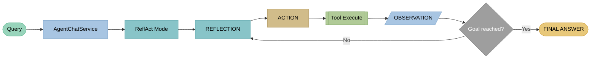
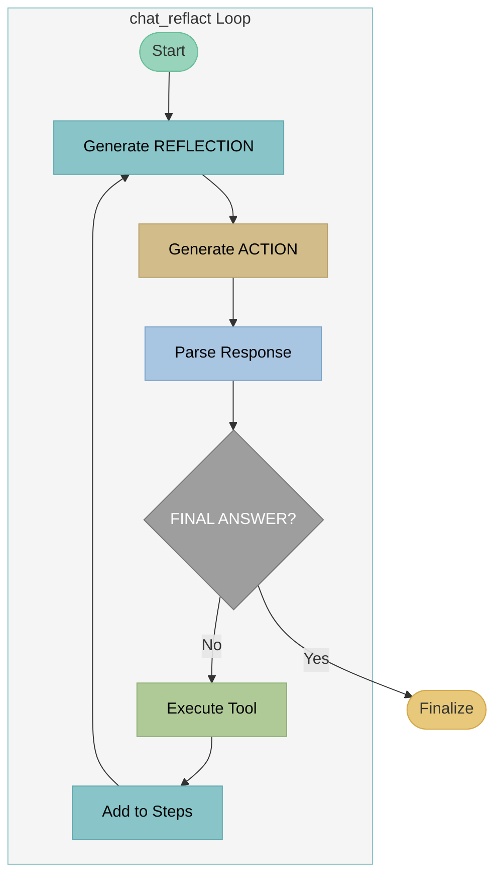

# ReflAct - Reflection-Grounded Agent Reasoning

## Theory

### Paper

!!! quote "Original paper"
    **Kim, J., Rhee, S., Kim, M., et al. (2025)**
    *ReflAct: World-Grounded Decision Making in LLM Agents via Goal-State Reflection*
    **DOI:** [10.48550/arXiv.2505.15182](https://doi.org/10.48550/arXiv.2505.15182)
    **EMNLP 2025 (Main Conference)**

!!! info "Concept"
    **ReflAct** extends ReAct with state‑grounded reflection. Instead of forward‑planning ("What should I do next?"), the agent reflects on its current state relative to the goal ("Where am I relative to the goal?"). This enables systematic self‑correction and better goal focus.

### Architecture



**ReflAct loop:** Query → REFLECTION (state‑grounded) → ACTION → Tool → OBSERVATION → (repeat or answer)

### Core Concept

**REFLECTION → ACTION → OBSERVATION → REFLECTION → ... → FINAL ANSWER**

The REFLECTION step is **state‑grounded**:

- "Where am I relative to the goal?"
- "What do I already know?"
- "What did I just discover?"
- "What is still missing to reach the goal?"

### Difference from ReACT

| Aspect | ReACT (THOUGHT) | ReflAct (REFLECTION) |
|--------|-----------------|---------------------|
| Focus | Forward‑looking | State‑grounded |
| Question | "What should I do next?" | "Where am I relative to the goal?" |
| Perspective | Planning | Evaluation |
| State awareness | Partial | Full |
| Self‑correction | Possible | Systematic |

### REFLECTION Structure

Each reflection contains three components:

```
REFLECTION:
1. Current state: [What I already know]
2. Latest discovery: [What was just found]
3. Goal relation: [How close am I? What is still missing?]
```

### Advantages over ReACT

| Advantage | Description |
|---------|--------------|
| **Better self‑correction** | Explicit state evaluation enables early error detection |
| **Goal focus** | Each step is measured against the goal |
| **Transparency** | Fully traceable reasoning process |
| **Robustness** | Less prone to drifting off goal |

---

## Example

### Query
```
"When is DG Agentur open and how can I reach them?"
```

### ReflAct Trace

```
[Iteration 1]
REFLECTION:
  Current state: The user asks for opening hours AND contact details.
                 I have no information yet.
  Latest discovery: (None - start of task)
  Goal relation: I need both pieces of information. I will search
                 for opening hours first.
ACTION: rag_search("opening hours DG Agentur")
OBSERVATION:
  [1] Contact: Mon-Fri 9-18, Sat by appointment
  [2] You can reach us at +49 911 97554990

[Iteration 2]
REFLECTION:
  Current state: I have opening hours (Mon-Fri 9-18, Sat by appointment)
                 and a phone number (+49 911 97554990).
  Latest discovery: Document [1] contains opening hours,
                    [2] provides the phone number.
  Goal relation: Opening hours: ✓ complete
                 Contact details: partial (phone ✓, email missing, address missing)
ACTION: rag_search("contact email address legal notice")
OBSERVATION:
  [1] Legal notice: Phone +49 911 97554990, Email office@dg-agentur.de
  [2] Address: Bahnhofstraße 2, 90402 Nürnberg

[Iteration 3]
REFLECTION:
  Current state: I have all required information:
                 - Opening hours: Mon-Fri 9-18, Sat by appointment
                 - Phone: +49 911 97554990
                 - Email: office@dg-agentur.de
                 - Address: Bahnhofstraße 2, 90402 Nürnberg
  Latest discovery: Email and address from the legal notice.
  Goal relation: GOAL REACHED - all information complete.
FINAL ANSWER: DG Agentur is open Monday to Friday 9-18,
              Saturday by appointment. [1]

              Contact:
              - Phone: +49 911 97554990
              - Email: office@dg-agentur.de
              - Address: Bahnhofstraße 2, 90402 Nürnberg [2]
```

### Response
```
DG Agentur is open Monday to Friday 9-18,
Saturday by appointment. [1]

Contact:
- Phone: +49 911 97554990
- Email: office@dg-agentur.de
- Address: Bahnhofstraße 2, 90402 Nürnberg [2]

Sources:
[1] Contact - DG Agentur
[2] Legal notice - DG Agentur
```

---

## Implementation in LLARS

!!! success "Status: Production"
    ReflAct is fully implemented and in production use.

### Architecture



### System Prompt

```python
# DEFAULT_REFLACT_SYSTEM_PROMPT (db/models/chatbot.py)
"""
Du bist ein ReflAct-Agent. Bei jedem Schritt reflektierst du deinen aktuellen Zustand
RELATIV zum Aufgabenziel, dann wählst du die nächste Aktion.

## ReflAct-Prinzip (basierend auf arxiv.org/abs/2505.15182):
- Nicht "Was soll ich als nächstes tun?" (vorausschauend)
- Sondern "Wo stehe ich relativ zum Ziel?" (zustandsbasiert)

## Deine Reflection muss IMMER enthalten:
1. Aktueller Zustand: Was weißt du bereits?
2. Letzte Entdeckung: Was hast du gerade erfahren?
3. Ziel-Relation: Wie nah bist du dem Ziel? Was fehlt noch?

## Verfügbare Aktionen:
- rag_search("suchbegriff") - Semantische Dokumentensuche
- lexical_search("suchbegriff") - Keyword-Suche

## Format (STRIKT einhalten!):

REFLECTION: Aktuell weiß ich [Zustand]. Die letzte Suche ergab [Ergebnis]. Dies bringt mich [näher/nicht näher] zum Ziel [X], weil [Begründung].
ACTION: rag_search("suchbegriff")

Wenn das Ziel erreicht ist:
REFLECTION: Ich habe alle nötigen Informationen: [Zusammenfassung]. Das Ziel ist erreicht.
FINAL ANSWER: [Vollständige Antwort basierend auf den gefundenen Informationen]
"""
```

**Additionally:**
- `chatbot.system_prompt` is **prefixed**.
- `build_tool_availability_prompt()` adds the **enabled tools** dynamically.
- `{PROJECT_URL}` placeholders are replaced before use.

### Files

| File | Function |
|-------|----------|
| `app/services/chatbot/agent_chat_service.py` | Routing to ACT/ReAct/ReflAct |
| `app/services/chatbot/agent_modes/mode_reflact.py` | `chat_reflact()` loop + streaming |
| `app/services/chatbot/agent_parsers.py` | `parse_reflact_response_v2()` |
| `app/services/chatbot/agent_tools.py` | Tool execution + confidence checks |
| `app/db/models/chatbot.py` | DEFAULT_REFLACT_SYSTEM_PROMPT + prompt settings |

### Code Snippet

```python
# mode_reflact.py - chat_reflact()
for iteration in range(max_iterations):
    yield {"status": "iteration", "iteration": iteration + 1, "max": max_iterations, "goal": goal}

    # Stream REFLECTION + ACTION
    response_text, reflection, action, final_answer = yield from _stream_reflact_response(...)

    if final_answer:
        yield {"status": "final_answer"}
        ...
        return

    # Execute tool
    result, sources = service._tool_executor.execute_tool(action_name, action_param, message, enabled_tools)
    yield {"status": "observation", "result_preview": result[:300], "iteration": iteration + 1}
```

### Parsing

```python
# agent_parsers.py - parse_reflact_response_v2()
REFLECTION_PATTERN = r"REFLECTION:\s*(.+?)(?=ACTION:|FINAL ANSWER:|THOUGHT:|GOAL:|$)"
ACTION_PATTERN = r"ACTION:\s*(.+?)(?=OBSERVATION:|REFLECTION:|FINAL ANSWER:|THOUGHT:|GOAL:|$)"
FINAL_PATTERN = r"FINAL ANSWER:\s*(.+?)(?=ACTION:|REFLECTION:|THOUGHT:|GOAL:|$)"

# Backward‑compatible: THOUGHT is interpreted as REFLECTION
THOUGHT_AS_REFLECTION = r"THOUGHT:\s*(.+?)(?=ACTION:|FINAL ANSWER:|REFLECTION:|GOAL:|$)"
```

### Configuration

```python
# ChatbotPromptSettings
agent_mode: str = "reflact"
task_type: str = "lookup" | "multihop"
agent_max_iterations: int = 5

# Multihop: max_iterations = min(agent_max_iterations + 2, 10)

tools_enabled: List[str] = ["rag_search", "lexical_search", "respond"]
web_search_enabled: bool = False
web_search_max_results: int = 5

reflact_system_prompt: str = "..."  # custom prompt (optional)
```

### Adaptive Iteration (High Confidence)

If the search yields **high confidence**, ReflAct exits early and generates a final answer immediately.
Confidence is derived from source scores (`check_high_confidence`).

---

## Events (WebSocket)

```python
# Streaming Events (excerpt)
yield {"status": "starting", "mode": "reflact"}
yield {"status": "iteration", "iteration": 1, "max": 7, "goal": "...", "steps": [...]}
yield {"status": "reflecting", "iteration": 1}
yield {"status": "reflection_delta", "delta": "...", "iteration": 1}
yield {"status": "reflection", "reflection": "...", "iteration": 1}
yield {"status": "action_delta", "delta": "...", "iteration": 1}
yield {"status": "action", "action": "rag_search", "param": "...", "iteration": 1}
yield {"status": "observation_delta", "delta": "...", "iteration": 1}
yield {"status": "observation", "result_preview": "...", "iteration": 1}
yield {"status": "adaptive_iteration", "iteration": 1, "reason": "high_confidence"}
yield {"status": "adaptive_response", "reason": "high_confidence_results"}
yield {"status": "max_iterations_reached"}
yield {"status": "final_answer"}
yield {"delta": "..."}
yield {"done": True, "full_response": "...", "sources": [...], "goal": "..."} 
```

### Logs

```
[AgentChatService] ReflAct adaptive iteration: high confidence on iteration 2
```

### Comparison: ReACT vs ReflAct in LLARS

| Aspect | ReACT | ReflAct |
|--------|-------|---------|
| Method | `chat_react()` | `chat_reflact()` |
| Location | `mode_react.py` | `mode_reflact.py` |
| Reasoning step | THOUGHT (forward) | REFLECTION (state‑grounded) |
| Parsing | `parse_react_response()` | `parse_reflact_response_v2()` |
| State tracking | Implicit | Explicit (3‑part structure) |
| Goal evaluation | No | Yes (goal relation) |
| Tokens/iteration | ~150-300 | ~200-400 |
| Typical iterations | 2-5 | 2-5 |
| Self‑correction | Possible | Systematic |

### When to use ReflAct over ReACT

| Use case | Recommendation |
|----------------|------------|
| Simple lookups | ReACT or ACT |
| Multi‑hop with clear goal | ReflAct |
| Complex research | ReflAct |
| Maximum transparency | ReflAct |
| Self‑correction important | ReflAct |
| Minimal token usage | ACT or ReACT |
