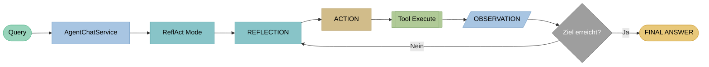
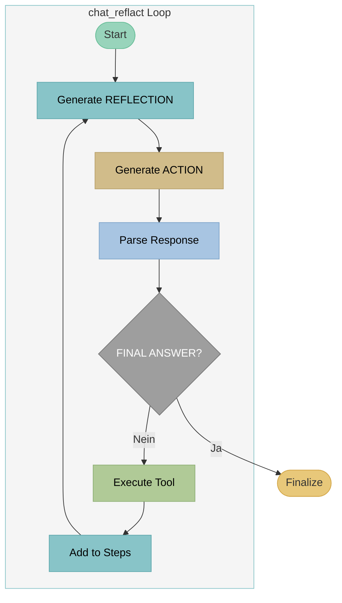

# ReflAct - Reflection-Grounded Agent Reasoning

## Theorie

### Paper

!!! quote "Originalpaper"
    **Kim, J., Rhee, S., Kim, M., et al. (2025)**
    *ReflAct: World-Grounded Decision Making in LLM Agents via Goal-State Reflection*
    **DOI:** [10.48550/arXiv.2505.15182](https://doi.org/10.48550/arXiv.2505.15182)
    **EMNLP 2025 (Main Conference)**

!!! info "Konzept"
    **ReflAct** erweitert ReAct durch zustandsbasierte Reflexion. Statt vorwärtsgerichtet zu planen ("Was soll ich als nächstes tun?"), reflektiert der Agent seinen aktuellen Zustand relativ zum Ziel ("Wo stehe ich im Verhältnis zum Ziel?"). Dies ermöglicht systematische Selbstkorrektur und bessere Ziel-Fokussierung.

### Architektur



**ReflAct Loop:** Query → REFLECTION (zustandsbasiert) → ACTION → Tool → OBSERVATION → (Wiederholung oder Antwort)

### Kernkonzept

**REFLECTION → ACTION → OBSERVATION → REFLECTION → ... → FINAL ANSWER**

Der REFLECTION-Schritt ist **zustandsbasiert** (state-grounded):

- "Wo stehe ich gerade relativ zum Ziel?"
- "Was weiß ich bereits?"
- "Was habe ich gerade entdeckt?"
- "Was fehlt noch, um das Ziel zu erreichen?"

### Unterschied zu ReACT

| Aspekt | ReACT (THOUGHT) | ReflAct (REFLECTION) |
|--------|-----------------|---------------------|
| Fokus | Vorwärtsgerichtet | Zustandsbasiert |
| Frage | "Was soll ich als nächstes tun?" | "Wo stehe ich relativ zum Ziel?" |
| Perspektive | Planung | Evaluation |
| State-Awareness | Teilweise | Vollständig |
| Selbstkorrektur | Möglich | Systematisch |

### REFLECTION-Struktur

Jede Reflexion enthält drei Komponenten:

```
REFLECTION:
1. Aktueller Zustand: [Was ich bereits weiß]
2. Letzte Entdeckung: [Was gerade gefunden wurde]
3. Ziel-Relation: [Wie nah bin ich dem Ziel? Was fehlt noch?]
```

### Vorteile gegenüber ReACT

| Vorteil | Beschreibung |
|---------|--------------|
| **Bessere Selbstkorrektur** | Explizite State-Evaluation ermöglicht frühe Fehlererkennung |
| **Ziel-Fokussierung** | Jeder Schritt wird am Ziel gemessen |
| **Transparenz** | Vollständig nachvollziehbarer Reasoning-Prozess |
| **Robustheit** | Weniger anfällig für "Abwege" |

---

## Beispiel

### Query
```
"Wann hat die DG Agentur geöffnet und wie erreiche ich sie?"
```

### ReflAct Trace

```
[Iteration 1]
REFLECTION:
  Aktueller Zustand: Der Benutzer fragt nach Öffnungszeiten UND Kontaktdaten.
                     Ich habe noch keine Informationen.
  Letzte Entdeckung: (Keine - Start der Aufgabe)
  Ziel-Relation: Ich brauche beide Informationen. Zuerst suche ich
                 nach Öffnungszeiten.
ACTION: rag_search("Öffnungszeiten DG Agentur")
OBSERVATION:
  [1] Kontakt: Mo-Fr 9-18 Uhr, Sa nach Vereinbarung
  [2] Wir sind telefonisch unter +49 911 97554990 erreichbar

[Iteration 2]
REFLECTION:
  Aktueller Zustand: Ich habe Öffnungszeiten (Mo-Fr 9-18, Sa Vereinbarung)
                     und eine Telefonnummer (+49 911 97554990).
  Letzte Entdeckung: Dokument [1] enthält Öffnungszeiten,
                     [2] liefert Telefonnummer.
  Ziel-Relation: Öffnungszeiten: ✓ vollständig
                 Kontaktdaten: teilweise (Telefon ✓, Email fehlt, Adresse fehlt)
ACTION: rag_search("Kontakt Email Adresse Impressum")
OBSERVATION:
  [1] Impressum: Telefon +49 911 97554990, Email office@dg-agentur.de
  [2] Adresse: Bahnhofstraße 2, 90402 Nürnberg

[Iteration 3]
REFLECTION:
  Aktueller Zustand: Ich habe alle benötigten Informationen:
                     - Öffnungszeiten: Mo-Fr 9-18 Uhr, Sa nach Vereinbarung
                     - Telefon: +49 911 97554990
                     - Email: office@dg-agentur.de
                     - Adresse: Bahnhofstraße 2, 90402 Nürnberg
  Letzte Entdeckung: Email und Adresse aus dem Impressum.
  Ziel-Relation: ZIEL ERREICHT - Alle Informationen vollständig.
FINAL ANSWER: Die DG Agentur hat Montag bis Freitag von 9-18 Uhr
              geöffnet, Samstag nach Vereinbarung. [1]

              Kontakt:
              - Telefon: +49 911 97554990
              - Email: office@dg-agentur.de
              - Adresse: Bahnhofstraße 2, 90402 Nürnberg [2]
```

### Response
```
Die DG Agentur hat Montag bis Freitag von 9-18 Uhr geöffnet,
Samstag nach Vereinbarung. [1]

Kontakt:
- Telefon: +49 911 97554990
- Email: office@dg-agentur.de
- Adresse: Bahnhofstraße 2, 90402 Nürnberg [2]

Quellen:
[1] Kontakt - DG Agentur
[2] Impressum - DG Agentur
```

---

## Implementierung in LLARS

!!! success "Status: Produktiv"
    ReflAct ist vollständig implementiert und im Produktiveinsatz.

### Architektur



### System Prompt

```python
# DEFAULT_REFLACT_SYSTEM_PROMPT (db/models/chatbot.py)
"""
Du bist ein ReflAct-Agent. Bei jedem Schritt reflektierst du deinen aktuellen Zustand
RELATIV zum Aufgabenziel, dann wählst du die nächste Aktion.

## ReflAct-Prinzip (basierend auf arxiv.org/abs/2505.15182):
- Nicht "Was soll ich als nächstes tun?" (vorausschauend)
- Sondern "Wo stehe ich relativ zum Ziel?" (zustandsbasiert)

## Deine Reflection muss IMMER enthalten:
1. Aktueller Zustand: Was weißt du bereits?
2. Letzte Entdeckung: Was hast du gerade erfahren?
3. Ziel-Relation: Wie nah bist du dem Ziel? Was fehlt noch?

## Verfügbare Aktionen:
- rag_search("suchbegriff") - Semantische Dokumentensuche
- lexical_search("suchbegriff") - Keyword-Suche

## Format (STRIKT einhalten!):

REFLECTION: Aktuell weiß ich [Zustand]. Die letzte Suche ergab [Ergebnis]. Dies bringt mich [näher/nicht näher] zum Ziel [X], weil [Begründung].
ACTION: rag_search("suchbegriff")

Wenn das Ziel erreicht ist:
REFLECTION: Ich habe alle nötigen Informationen: [Zusammenfassung]. Das Ziel ist erreicht.
FINAL ANSWER: [Vollständige Antwort basierend auf den gefundenen Informationen]
"""
```

**Zusätzlich:**
- `chatbot.system_prompt` wird **vorangestellt**.
- `build_tool_availability_prompt()` ergänzt dynamisch die **freigeschalteten Tools**.
- `{PROJECT_URL}` Platzhalter werden vor Nutzung ersetzt.

### Dateien

| Datei | Funktion |
|-------|----------|
| `app/services/chatbot/agent_chat_service.py` | Routing auf ACT/ReAct/ReflAct |
| `app/services/chatbot/agent_modes/mode_reflact.py` | `chat_reflact()` Loop + Streaming |
| `app/services/chatbot/agent_parsers.py` | `parse_reflact_response_v2()` |
| `app/services/chatbot/agent_tools.py` | Tool-Ausführung + Confidence-Check |
| `app/db/models/chatbot.py` | DEFAULT_REFLACT_SYSTEM_PROMPT + Prompt Settings |

### Code-Auszug

```python
# mode_reflact.py - chat_reflact()
for iteration in range(max_iterations):
    yield {"status": "iteration", "iteration": iteration + 1, "max": max_iterations, "goal": goal}

    # Stream REFLECTION + ACTION
    response_text, reflection, action, final_answer = yield from _stream_reflact_response(...)

    if final_answer:
        yield {"status": "final_answer"}
        ...
        return

    # Execute tool
    result, sources = service._tool_executor.execute_tool(action_name, action_param, message, enabled_tools)
    yield {"status": "observation", "result_preview": result[:300], "iteration": iteration + 1}
```

### Parsing

```python
# agent_parsers.py - parse_reflact_response_v2()
REFLECTION_PATTERN = r"REFLECTION:\s*(.+?)(?=ACTION:|FINAL ANSWER:|THOUGHT:|GOAL:|$)"
ACTION_PATTERN = r"ACTION:\s*(.+?)(?=OBSERVATION:|REFLECTION:|FINAL ANSWER:|THOUGHT:|GOAL:|$)"
FINAL_PATTERN = r"FINAL ANSWER:\s*(.+?)(?=ACTION:|REFLECTION:|THOUGHT:|GOAL:|$)"

# Rückwärtskompatibel: THOUGHT wird als REFLECTION interpretiert
THOUGHT_AS_REFLECTION = r"THOUGHT:\s*(.+?)(?=ACTION:|FINAL ANSWER:|REFLECTION:|GOAL:|$)"
```

### Konfiguration

```python
# ChatbotPromptSettings
agent_mode: str = "reflact"
task_type: str = "lookup" | "multihop"
agent_max_iterations: int = 5

# Multihop: max_iterations = min(agent_max_iterations + 2, 10)

tools_enabled: List[str] = ["rag_search", "lexical_search", "respond"]
web_search_enabled: bool = False
web_search_max_results: int = 5

reflact_system_prompt: str = "..."  # Custom Prompt (optional)
```

### Adaptive Iteration (High Confidence)

Wenn die Suche **hohe Konfidenz** liefert, beendet ReflAct die Iteration frühzeitig und generiert direkt eine finale Antwort.
Die Konfidenz wird aus den Source‑Scores abgeleitet (`check_high_confidence`).

---

## Events (WebSocket)

```python
# Streaming Events (Auszug)
yield {"status": "starting", "mode": "reflact"}
yield {"status": "iteration", "iteration": 1, "max": 7, "goal": "...", "steps": [...]}
yield {"status": "reflecting", "iteration": 1}
yield {"status": "reflection_delta", "delta": "...", "iteration": 1}
yield {"status": "reflection", "reflection": "...", "iteration": 1}
yield {"status": "action_delta", "delta": "...", "iteration": 1}
yield {"status": "action", "action": "rag_search", "param": "...", "iteration": 1}
yield {"status": "observation_delta", "delta": "...", "iteration": 1}
yield {"status": "observation", "result_preview": "...", "iteration": 1}
yield {"status": "adaptive_iteration", "iteration": 1, "reason": "high_confidence"}
yield {"status": "adaptive_response", "reason": "high_confidence_results"}
yield {"status": "max_iterations_reached"}
yield {"status": "final_answer"}
yield {"delta": "..."}
yield {"done": True, "full_response": "...", "sources": [...], "goal": "..."} 
```

### Logs

```
[AgentChatService] ReflAct adaptive iteration: high confidence on iteration 2
```

### Vergleich: ReACT vs ReflAct in LLARS

| Aspekt | ReACT | ReflAct |
|--------|-------|---------|
| Methode | `chat_react()` | `chat_reflact()` |
| Ort | `mode_react.py` | `mode_reflact.py` |
| Reasoning-Schritt | THOUGHT (vorwärts) | REFLECTION (zustandsbasiert) |
| Parsing | `parse_react_response()` | `parse_reflact_response_v2()` |
| State-Tracking | Implizit | Explizit (3-Punkte-Struktur) |
| Ziel-Evaluation | Nein | Ja (Ziel-Relation) |
| Token/Iteration | ~150-300 | ~200-400 |
| Typische Iterationen | 2-5 | 2-5 |
| Selbstkorrektur | Möglich | Systematisch |

### Wann ReflAct statt ReACT?

| Anwendungsfall | Empfehlung |
|----------------|------------|
| Einfache Lookups | ReACT oder ACT |
| Multi-Hop mit klarem Ziel | ReflAct |
| Komplexe Recherche | ReflAct |
| Maximale Transparenz gewünscht | ReflAct |
| Selbstkorrektur wichtig | ReflAct |
| Minimaler Token-Verbrauch | ACT oder ReACT |
