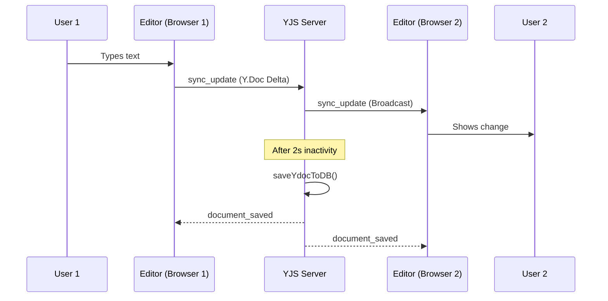
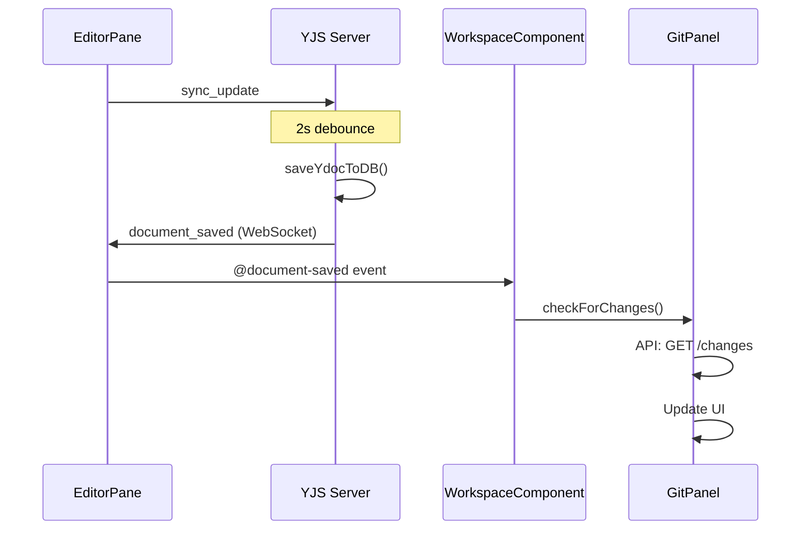

# Collaboration System

This page documents the real-time collaboration system for LaTeX and Markdown editors.

!!! info "Technology stack"
    - **YJS** - CRDT-based conflict resolution
    - **Socket.IO** - Real-time WebSocket communication
    - **CodeMirror 6** - Editor integration
    - **MariaDB** - Persistent storage

---

## Architecture overview

```
┌─────────────────────────────────────────────────────────────────────┐
│                           Frontend                                   │
│  ┌──────────────┐    ┌──────────────┐    ┌──────────────────────┐  │
│  │ LatexEditor  │    │MarkdownEditor│    │  WorkspaceGitPanel   │  │
│  │    Pane      │    │    Pane      │    │                      │  │
│  └──────┬───────┘    └──────┬───────┘    └──────────┬───────────┘  │
│         │                   │                        │              │
│         └─────────┬─────────┘                        │              │
│                   │                                  │              │
│         ┌─────────▼─────────┐              ┌────────▼────────┐     │
│         │useYjsCollaboration│              │  checkForChanges │     │
│         │   (Composable)    │◄─────────────│    (API Call)    │     │
│         └─────────┬─────────┘              └─────────────────┘     │
│                   │ document_saved                                  │
└───────────────────┼─────────────────────────────────────────────────┘
                    │ Socket.IO (/collab)
                    ▼
┌───────────────────────────────────────────────────────────────────┐
│                        YJS Server (:8082)                          │
│  ┌─────────────┐  ┌─────────────┐  ┌─────────────────────────┐   │
│  │  Y.Doc      │  │  Room       │  │   Workspace Room        │   │
│  │  Cache      │  │  Manager    │  │   (document_saved)      │   │
│  └──────┬──────┘  └──────┬──────┘  └───────────┬─────────────┘   │
│         │                │                      │                  │
│         └────────────────┼──────────────────────┘                  │
│                          │                                         │
│                   ┌──────▼──────┐                                  │
│                   │ saveYdocToDB │                                  │
│                   │ (2s debounce)│                                  │
│                   └──────┬──────┘                                  │
└──────────────────────────┼─────────────────────────────────────────┘
                           │ SQL
                           ▼
┌───────────────────────────────────────────────────────────────────┐
│                      MariaDB                                       │
│  ┌─────────────────┐  ┌─────────────────┐                        │
│  │ latex_documents │  │markdown_documents│                        │
│  │ - content (YJS) │  │ - content (YJS)  │                        │
│  │ - content_text  │  │ - content_text   │                        │
│  └─────────────────┘  └─────────────────┘                        │
└───────────────────────────────────────────────────────────────────┘
```

---

## Data flow

### 1. Editor synchronization (YJS)



### 2. Git Panel real-time updates



---

## YJS server events

### Socket.IO namespace: `/collab`

The YJS server runs on port 8082 and communicates via Socket.IO.

### Room structure

```javascript
// Document rooms (for sync)
"latex_{document_id}"      // e.g. "latex_42"
"markdown_{document_id}"   // e.g. "markdown_15"

// Workspace rooms (for document_saved events)
"workspace_latex_{workspace_id}"      // e.g. "workspace_latex_2"
"workspace_markdown_{workspace_id}"   // e.g. "workspace_markdown_1"
```

### Events (Client → Server)

#### `join_room`

Join a document room and automatically the associated workspace room.

```javascript
socket.emit('join_room', {
  room: 'latex_42',    // Document room
  username: 'admin'
})

// Server automatically executes:
// 1. socket.join('latex_42')
// 2. socket.join('workspace_latex_{workspace_id}')
```

#### `sync_update`

Send YJS changes to other clients.

```javascript
socket.emit('sync_update', {
  room: 'latex_42',
  update: Array.from(Y.encodeStateAsUpdate(ydoc))
})
```

#### `leave_room`

Leave a room.

```javascript
socket.emit('leave_room', {
  room: 'latex_42'
})
```

#### `reload_room`

Force reload from the database (after rollback).

```javascript
socket.emit('reload_room', { room: 'latex_42' }, (response) => {
  // response = { success: true }
})
```

### Events (Server → Client)

#### `snapshot_document`

Full document state on join.

```javascript
socket.on('snapshot_document', (fullUpdate) => {
  Y.applyUpdate(ydoc, new Uint8Array(fullUpdate))
})
```

#### `sync_update`

Incremental updates from other clients.

```javascript
socket.on('sync_update', ({ update }) => {
  Y.applyUpdate(ydoc, new Uint8Array(update))
})
```

#### `document_saved` ⭐ NEW

Sent to all clients in the workspace room after the document is stored in the DB.

```javascript
socket.on('document_saved', (data) => {
  // data = {
  //   documentId: 42,
  //   workspaceId: 2,
  //   kind: 'latex',        // 'latex' | 'markdown'
  //   contentLength: 1500,
  //   savedAt: '2025-01-03T12:00:00.000Z'
  // }

  // Typical usage: refresh Git panel
  if (data.workspaceId === currentWorkspaceId) {
    gitPanel.checkForChanges()
  }
})
```

**Important:** This event is sent to the **workspace room**, not the document room. This way all users in the workspace receive it, regardless of the document they are editing.

#### `room_state`

Current users and cursor positions.

```javascript
socket.on('room_state', (state) => {
  // state = {
  //   users: { socketId: { username, color } },
  //   cursors: { socketId: { line, ch } }
  // }
})
```

#### `user_joined` / `user_left`

User joins/leaves a room.

```javascript
socket.on('user_joined', ({ userId, username, color }) => {
  // Show new user in UI
})

socket.on('user_left', ({ userId }) => {
  // Remove user cursor
})
```
