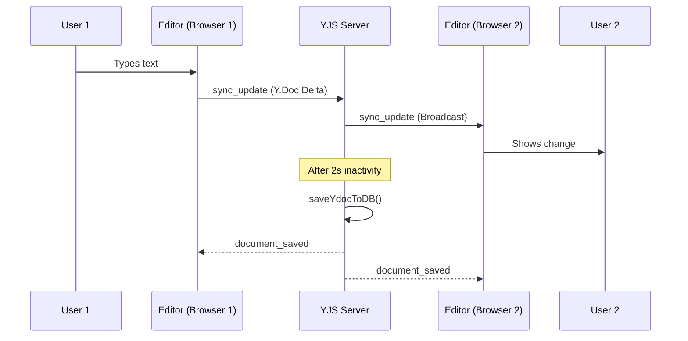
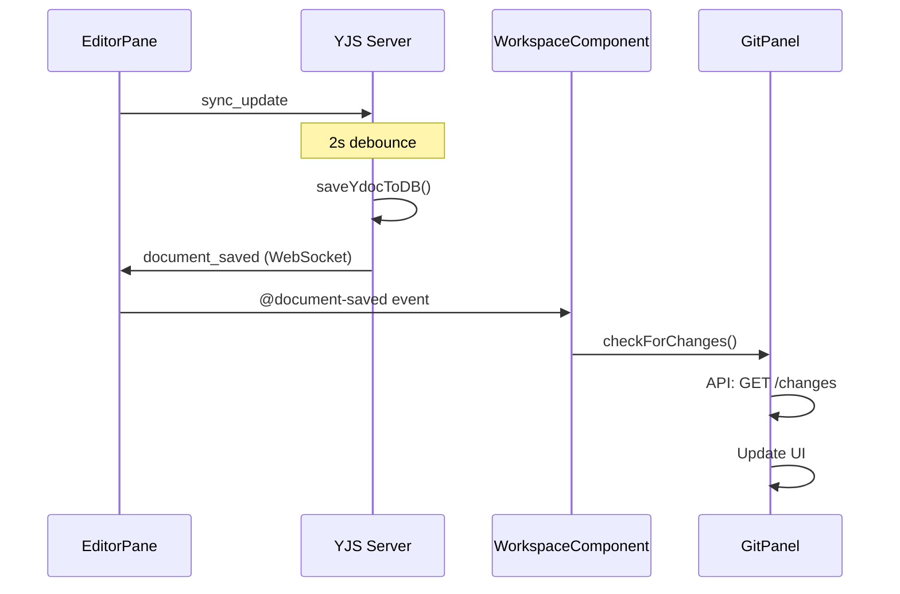

# Collaboration System

This page documents the real-time collaboration system for LaTeX and Markdown editors.

!!! info "Technology stack"
    - **YJS** - CRDT-based conflict resolution
    - **Socket.IO** - Real-time WebSocket communication
    - **CodeMirror 6** - Editor integration
    - **MariaDB** - Persistent storage

---

## Architecture overview

```
┌─────────────────────────────────────────────────────────────────────┐
│                           Frontend                                   │
│  ┌──────────────┐    ┌──────────────┐    ┌──────────────────────┐  │
│  │ LatexEditor  │    │MarkdownEditor│    │  WorkspaceGitPanel   │  │
│  │    Pane      │    │    Pane      │    │                      │  │
│  └──────┬───────┘    └──────┬───────┘    └──────────┬───────────┘  │
│         │                   │                        │              │
│         └─────────┬─────────┘                        │              │
│                   │                                  │              │
│         ┌─────────▼─────────┐              ┌────────▼────────┐     │
│         │useYjsCollaboration│              │  checkForChanges │     │
│         │   (Composable)    │◄─────────────│    (API Call)    │     │
│         └─────────┬─────────┘              └─────────────────┘     │
│                   │ document_saved                                  │
└───────────────────┼─────────────────────────────────────────────────┘
                    │ Socket.IO (/collab)
                    ▼
┌───────────────────────────────────────────────────────────────────┐
│                        YJS Server (:8082)                          │
│  ┌─────────────┐  ┌─────────────┐  ┌─────────────────────────┐   │
│  │  Y.Doc      │  │  Room       │  │   Workspace Room        │   │
│  │  Cache      │  │  Manager    │  │   (document_saved)      │   │
│  └──────┬──────┘  └──────┬──────┘  └───────────┬─────────────┘   │
│         │                │                      │                  │
│         └────────────────┼──────────────────────┘                  │
│                          │                                         │
│                   ┌──────▼──────┐                                  │
│                   │ saveYdocToDB │                                  │
│                   │ (2s debounce)│                                  │
│                   └──────┬──────┘                                  │
└──────────────────────────┼─────────────────────────────────────────┘
                           │ SQL
                           ▼
┌───────────────────────────────────────────────────────────────────┐
│                      MariaDB                                       │
│  ┌─────────────────┐  ┌─────────────────┐                        │
│  │ latex_documents │  │markdown_documents│                        │
│  │ - content (YJS) │  │ - content (YJS)  │                        │
│  │ - content_text  │  │ - content_text   │                        │
│  └─────────────────┘  └─────────────────┘                        │
└───────────────────────────────────────────────────────────────────┘
```

---

## Data flow

### 1. Editor synchronization (YJS)


```mermaid
sequenceDiagram
    participant User1 as User 1
    participant Editor1 as Editor (Browser 1)
    participant YJS as YJS Server
    participant Editor2 as Editor (Browser 2)
    participant User2 as User 2

    User1->>Editor1: Types text
    Editor1->>YJS: sync_update (Y.Doc Delta)
    YJS->>Editor2: sync_update (Broadcast)
    Editor2->>User2: Shows change

    Note over YJS: After 2s inactivity
    YJS->>YJS: saveYdocToDB()
    YJS-->>Editor1: document_saved
    YJS-->>Editor2: document_saved
```

### 2. Git Panel real-time updates


```mermaid
sequenceDiagram
    participant Editor as EditorPane
    participant YJS as YJS Server
    participant Parent as WorkspaceComponent
    participant GitPanel as GitPanel

    Editor->>YJS: sync_update
    Note over YJS: 2s debounce
    YJS->>YJS: saveYdocToDB()
    YJS->>Editor: document_saved (WebSocket)
    Editor->>Parent: @document-saved event
    Parent->>GitPanel: checkForChanges()
    GitPanel->>GitPanel: API: GET /changes
    GitPanel->>GitPanel: Update UI
```

---

## YJS server events

### Socket.IO namespace: `/collab`

The YJS server runs on port 8082 and communicates via Socket.IO.

### Room structure

```javascript
// Document rooms (for sync)
"latex_{document_id}"      // e.g. "latex_42"
"markdown_{document_id}"   // e.g. "markdown_15"

// Workspace rooms (for document_saved events)
"workspace_latex_{workspace_id}"      // e.g. "workspace_latex_2"
"workspace_markdown_{workspace_id}"   // e.g. "workspace_markdown_1"
```

### Events (Client → Server)

#### `join_room`

Join a document room and automatically the associated workspace room.

```javascript
socket.emit('join_room', {
  room: 'latex_42',    // Document room
  username: 'admin'
})

// Server automatically executes:
// 1. socket.join('latex_42')
// 2. socket.join('workspace_latex_{workspace_id}')
```

#### `sync_update`

Send YJS changes to other clients.

```javascript
socket.emit('sync_update', {
  room: 'latex_42',
  update: Array.from(Y.encodeStateAsUpdate(ydoc))
})
```

#### `leave_room`

Leave a room.

```javascript
socket.emit('leave_room', {
  room: 'latex_42'
})
```

#### `reload_room`

Force reload from the database (after rollback).

```javascript
socket.emit('reload_room', { room: 'latex_42' }, (response) => {
  // response = { success: true }
})
```

### Events (Server → Client)

#### `snapshot_document`

Full document state on join.

```javascript
socket.on('snapshot_document', (fullUpdate) => {
  Y.applyUpdate(ydoc, new Uint8Array(fullUpdate))
})
```

#### `sync_update`

Incremental updates from other clients.

```javascript
socket.on('sync_update', ({ update }) => {
  Y.applyUpdate(ydoc, new Uint8Array(update))
})
```

#### `document_saved` ⭐ NEW

Sent to all clients in the workspace room after the document is stored in the DB.

```javascript
socket.on('document_saved', (data) => {
  // data = {
  //   documentId: 42,
  //   workspaceId: 2,
  //   kind: 'latex',        // 'latex' | 'markdown'
  //   contentLength: 1500,
  //   savedAt: '2025-01-03T12:00:00.000Z'
  // }

  // Typical usage: refresh Git panel
  if (data.workspaceId === currentWorkspaceId) {
    gitPanel.checkForChanges()
  }
})
```

**Important:** This event is sent to the **workspace room**, not the document room. This way all users in the workspace receive it, regardless of the document they are editing.

#### `room_state`

Current users and cursor positions.

```javascript
socket.on('room_state', (state) => {
  // state = {
  //   users: { socketId: { username, color } },
  //   cursors: { socketId: { line, ch } }
  // }
})
```

#### `user_joined` / `user_left`

User joins/leaves a room.

```javascript
socket.on('user_joined', ({ userId, username, color }) => {
  // Show new user in UI
})

socket.on('user_left', ({ userId }) => {
  // Remove user cursor
})
```

---

## Frontend integration

### useYjsCollaboration composable

The composable manages the Socket.IO connection and YJS document synchronization.

```javascript
import { useYjsCollaboration } from '@/components/PromptEngineering/composables/useYjsCollaboration'

const collaboration = useYjsCollaboration(
  roomId,           // Ref<string> - e.g. 'latex_42'
  username,         // string
  processYDoc,      // Callback for document updates
  onUpdateCursor,   // Callback for cursor updates
  {
    autoSync: true,
    onColorUpdate: (userId, color) => { /* ... */ },
    onDocumentSaved: (data) => {
      // Real-time Git panel updates
      emit('document-saved', data)
    }
  }
)

const {
  ydoc,           // Ref<Y.Doc>
  socket,         // Ref<Socket>
  users,          // Ref<Object>
  initialize,     // () => void
  cleanup,        // () => void
  switchRoom,     // (oldRoom, newRoom) => void
  reloadRoom,     // () => Promise<boolean>
  reloadAnyRoom   // (roomName) => Promise<boolean>
} = collaboration
```

### Editor integration (LatexEditorPane)

```vue
<script setup>
const emit = defineEmits([
  'content-change',
  'document-saved'  // NEW: For Git panel updates
])

const collaboration = useYjsCollaboration(roomId, username, processYDoc, onUpdateCursor, {
  autoSync: true,
  onDocumentSaved: (data) => {
    emit('document-saved', data)
  }
})
</script>
```

### Parent component (LatexCollabWorkspace)

```vue
<template>
  <LatexEditorPane
    ref="editorRef"
    :document="selectedNode"
    @document-saved="handleDocumentSaved"
  />

  <LatexWorkspaceGitPanel
    ref="gitPanelRef"
    :workspace-id="workspaceId"
  />
</template>

<script setup>
const gitPanelRef = ref(null)

function handleDocumentSaved(data) {
  // Only update if event is for our workspace
  if (data.workspaceId === workspaceId.value) {
    gitPanelRef.value?.checkForChanges?.()
  }
}
</script>
```

---

## Database schema

### latex_documents

```sql
CREATE TABLE latex_documents (
  id INT PRIMARY KEY AUTO_INCREMENT,
  workspace_id INT NOT NULL,
  title VARCHAR(255) NOT NULL,
  content LONGTEXT,           -- YJS JSON state
  content_text LONGTEXT,      -- Plain text (for search/diff)
  node_type ENUM('file', 'folder'),
  parent_id INT,
  order_index INT DEFAULT 0,
  last_editor_username VARCHAR(255),
  created_at DATETIME,
  updated_at DATETIME,
  deleted_at DATETIME,        -- Soft delete

  FOREIGN KEY (workspace_id) REFERENCES latex_workspaces(id),
  INDEX idx_workspace (workspace_id),
  INDEX idx_parent (parent_id)
);
```

### markdown_documents

Identical structure to `latex_documents`.

### Dual content storage

Each document has two content fields:

| Field | Description | Usage |
|-------|-------------|-------|
| `content` | YJS JSON state | Collaboration sync |
| `content_text` | Plain text | Git diff, search, baseline |

**Fallback logic:** If `content` is corrupt (e.g. after a crash), `content_text` is used as fallback.

---

## Git integration

### Workspace-level Git panel

The Git panel shows changes for **all documents** in the workspace.

```
┌─────────────────────────────────────┐
│ Git Changes (3 files)               │
├─────────────────────────────────────┤
│ ☑ main.tex          +15 -3    [M]  │
│ ☑ chapter1.tex      +42 -0    [M]  │
│ ☐ references.bib    +5  -2    [M]  │
├─────────────────────────────────────┤
│ Commit message:                     │
│ ┌─────────────────────────────────┐ │
│ │ Extended chapter 1              │ │
│ └─────────────────────────────────┘ │
│                    [Commit]         │
└─────────────────────────────────────┘
```

### API endpoints

#### GET `/api/{latex,markdown}-collab/workspaces/{id}/changes`

Returns all uncommitted changes.

```json
{
  "success": true,
  "workspace_id": 2,
  "changed_files": [
    {
      "id": 42,
      "title": "main.tex",
      "path": "main.tex",
      "status": "M",
      "insertions": 15,
      "deletions": 3,
      "has_baseline": true
    }
  ],
  "deleted_files": [],
  "total_changes": 3
}
```

#### POST `/api/{latex,markdown}-collab/workspaces/{id}/commit`

Commits multiple files at once.

```json
// Request
{
  "message": "Extended chapter 1",
  "document_ids": [42, 43, 44]
}

// Response
{
  "success": true,
  "commits": [
    { "id": 100, "document_id": 42, "message": "..." },
    { "id": 101, "document_id": 43, "message": "..." }
  ],
  "total_committed": 2
}
```

### Real-time update flow

```
1. User types in editor
   │
   ▼
2. YJS sync_update to server (immediate)
   │
   ▼
3. Server saves after 2s inactivity
   │
   ▼
4. Server emits document_saved to workspace room
   │
   ▼
5. Frontend receives event
   │
   ▼
6. Git panel calls checkForChanges()
   │
   ▼
7. API call: GET /workspaces/{id}/changes
   │
   ▼
8. UI updates
```

---

## Rollback mechanism

### Problem: YJS cache invalidation

During rollback the YJS server must invalidate its cache, otherwise it delivers stale data.

### Solution: reload_room event

```javascript
// Frontend after rollback
async function handleRollback(payload) {
  const documentId = payload.documentId
  const roomName = `latex_${documentId}`

  if (selectedDocumentId === documentId) {
    // Document is open: full reload
    await editorRef.value?.reloadRoom?.()
  } else {
    // Document not open: just invalidate cache
    await editorRef.value?.reloadAnyRoom?.(roomName)
  }
}
```

### Server side (reload_room handler)

```javascript
socket.on('reload_room', async (data, callback) => {
  const room = data.room

  // 1. Cancel pending save
  const timer = saveTimers.get(room)
  if (timer) {
    clearTimeout(timer)
    saveTimers.delete(room)
  }

  // 2. Clear cache
  ydocs.delete(room)

  // 3. Reload from DB
  const doc = await loadYdocFromDB(room)
  ydocs.set(room, doc)

  // 4. Broadcast to all clients
  const fullState = Y.encodeStateAsUpdate(doc)
  io.to(room).emit('snapshot_document', fullState)

  callback({ success: true })
})
```

---

## Error handling

### Corrupt YJS data

If `content` cannot be parsed, `content_text` is used as fallback:

```javascript
async function loadYdocFromDB(roomName) {
  const [rows] = await pool.query(
    'SELECT content, content_text FROM latex_documents WHERE id = ?',
    [roomId]
  )

  if (rows[0].content) {
    try {
      const doc = jsonToYdoc(rows[0].content)
      const text = doc.getText('content').toString()

      // Check if YJS content is valid
      if (text.length > 0 || !rows[0].content_text) {
        return doc
      }
    } catch (e) {
      console.error('YJS parse failed, using content_text fallback')
    }
  }

  // Fallback: use content_text
  if (rows[0].content_text) {
    const doc = new Y.Doc()
    doc.getText('content').insert(0, rows[0].content_text)
    return doc
  }

  return new Y.Doc()
}
```

### Connection loss

Socket.IO reconnects automatically:

```javascript
socket.io.opts = {
  reconnection: true,
  reconnectionDelay: 1000,
  reconnectionDelayMax: 5000
}

socket.on('reconnect', () => {
  // Rejoin room
  socket.emit('join_room', { room: currentRoom })
})
```

---

## Performance optimizations

### 1. Debounced persistence

Saving occurs after 2 seconds of inactivity:

```javascript
// On every sync_update
const existingTimer = saveTimers.get(room)
if (existingTimer) clearTimeout(existingTimer)

saveTimers.set(room, setTimeout(async () => {
  await saveYdocToDB(room, doc, ...)
}, 2000))
```

### 2. Workspace room broadcasts

`document_saved` events go only to clients in the same workspace, not to everyone:

```javascript
const workspaceRoom = `workspace_latex_${workspaceId}`
io.to(workspaceRoom).emit('document_saved', data)
```

### 3. Selective Git panel updates

The Git panel only updates for events in the current workspace:

```javascript
function handleDocumentSaved(data) {
  if (data.workspaceId === workspaceId.value) {
    gitPanelRef.value?.checkForChanges?.()
  }
}
```

---

## Debugging

### YJS server logs

```bash
docker logs -f llars_yjs_service
```

Relevant log messages:

```
[join_room] Also joined workspace room: workspace_latex_2
[saveYdocToDB] Room: latex_42, docId: 42, contentLength: 1500
[document_saved] Emitted to workspace_latex_2 for latex doc 42
[reload_room] START - Reloading room "latex_42" from database
```

### Frontend console

```javascript
// In useYjsCollaboration
socket.on('document_saved', (data) => {
  console.log('[useYjsCollaboration] document_saved received:', data)
})

// In parent component
function handleDocumentSaved(data) {
  console.log('[LatexCollabWorkspace] document_saved received:', data)
}
```

### Network tab

WebSocket frames in Chrome DevTools:

1. **Filter:** `WS`
2. **Frames:** `document_saved`, `sync_update`, `snapshot_document`

---

## Troubleshooting

| Problem | Cause | Solution |
|---------|-------|----------|
| Git panel does not update | Event not received | Check if in workspace room |
| Document empty after rollback | YJS cache not invalidated | Call `reloadRoom()` |
| Changes are lost | Save before disconnect | `flush_document` before navigation |
| Cursor jumps | Race condition during sync | Check `applyingRemoteUpdate` flag |

---

## Files

### Backend (YJS Server)

```
yjs-server/
├── server.js           # Express + Socket.IO setup
├── websocket.js        # Event handlers + saveYdocToDB
└── db/
    └── db.js           # MySQL pool
```

### Frontend

```
llars-frontend/src/
├── components/
│   ├── LatexCollab/
│   │   ├── LatexEditorPane.vue
│   │   └── LatexWorkspaceGitPanel.vue
│   ├── MarkdownCollab/
│   │   ├── MarkdownEditorPane.vue
│   │   └── MarkdownGitPanel.vue (deprecated)
│   └── PromptEngineering/
│       └── composables/
│           └── useYjsCollaboration.js
└── views/
    ├── LatexCollab/
    │   └── LatexCollabWorkspace.vue
    └── MarkdownCollab/
        └── MarkdownCollabWorkspace.vue
```
