# Database Schema

This page documents the LLARS database schema (MariaDB 11.2).

## Entity-Relationship Diagram

```mermaid
erDiagram
    User ||--o{ Chatbot : owns
    User ||--o{ RAGCollection : owns
    User ||--o{ RAGDocument : uploads
    User ||--o{ Conversation : has
    User ||--o{ ScenarioUser : participates

    Chatbot ||--o{ Conversation : has
    Chatbot ||--o{ ChatbotCollection : uses
    Chatbot }o--|| LLMModel : uses

    RAGCollection ||--o{ CollectionDocumentLink : contains
    RAGCollection ||--o{ ChatbotCollection : used_by

    RAGDocument ||--o{ CollectionDocumentLink : in_collection
    RAGDocument ||--o{ RAGDocumentChunk : has

    RatingScenario ||--o{ ScenarioItem : contains
    RatingScenario ||--o{ ScenarioItemDistribution : distributes

    EvaluationItem ||--o{ ScenarioItem : in_scenario
    EvaluationItem ||--o{ Feature : has
    EvaluationItem ||--o{ Message : contains

    JudgeSession ||--o{ JudgeComparison : has
    JudgeComparison ||--o{ JudgeEvaluation : results
    JudgeSession ||--o{ PillarStatistics : aggregates
    EvaluationItem ||--o{ PillarThread : assigned

    LatexWorkspace ||--o{ LatexDocument : contains
    LatexWorkspace ||--o{ WorkspaceUser : has_access

    MarkdownWorkspace ||--o{ MarkdownDocument : contains
    MarkdownWorkspace ||--o{ WorkspaceCollaborator : has_access
```



---

## Core Tables

### User

Users synced via Authentik OAuth2/OIDC.

| Column | Type | Description |
|--------|------|-------------|
| `id` | INT | Primary key |
| `username` | VARCHAR(255) | Unique username |
| `email` | VARCHAR(255) | Email address |
| `authentik_id` | VARCHAR(255) | Authentik user ID |
| `collab_color` | VARCHAR(7) | Collaboration color (#hex) |
| `avatar_seed` | VARCHAR(255) | Seed for default avatar |
| `avatar_url` | VARCHAR(500) | Path to uploaded avatar |
| `created_at` | DATETIME | Created at |
| `last_login` | DATETIME | Last login |

### Role

User roles with permissions.

| Column | Type | Description |
|--------|------|-------------|
| `id` | INT | Primary key |
| `name` | VARCHAR(50) | Role name (admin, researcher, evaluator) |
| `description` | TEXT | Description |

### Permission

Granular permissions.

| Column | Type | Description |
|--------|------|-------------|
| `id` | INT | Primary key |
| `name` | VARCHAR(100) | Permission name (e.g. `feature:ranking:view`) |
| `description` | TEXT | Description |

---

## Chatbot & RAG

### Chatbot

Chatbot configurations.

| Column | Type | Description |
|--------|------|-------------|
| `id` | INT | Primary key |
| `name` | VARCHAR(255) | Chatbot name |
| `description` | TEXT | Description |
| `owner_id` | INT | FK → User |
| `llm_model_id` | INT | FK → LLMModel |
| `system_prompt` | TEXT | System prompt |
| `is_published` | BOOLEAN | Publicly available |
| `agent_mode` | ENUM | standard, act, react, reflact |
| `task_type` | ENUM | lookup, multihop |
| `created_at` | DATETIME | Created at |

### RAGCollection

Document collections for RAG.

| Column | Type | Description |
|--------|------|-------------|
| `id` | INT | Primary key |
| `name` | VARCHAR(255) | Collection name |
| `description` | TEXT | Description |
| `owner_id` | INT | FK → User |
| `is_public` | BOOLEAN | Publicly visible |
| `embedding_model` | VARCHAR(255) | Embedding model used |
| `chroma_collection_name` | VARCHAR(255) | ChromaDB collection name |
| `total_chunks` | INT | Number of chunks |
| `created_at` | DATETIME | Created at |

### RAGDocument

Uploaded documents.

| Column | Type | Description |
|--------|------|-------------|
| `id` | INT | Primary key |
| `filename` | VARCHAR(255) | Original filename |
| `file_path` | VARCHAR(500) | Storage path |
| `mime_type` | VARCHAR(100) | MIME type |
| `file_size` | BIGINT | File size in bytes |
| `status` | ENUM | pending, processing, indexed, failed |
| `chunk_count` | INT | Number of chunks |
| `embedding_model` | VARCHAR(255) | Model used |
| `processing_error` | TEXT | Error message |
| `uploaded_by` | INT | FK → User |
| `created_at` | DATETIME | Uploaded at |
| `processed_at` | DATETIME | Processed at |

### RAGDocumentChunk

Document chunks with embeddings.

| Column | Type | Description |
|--------|------|-------------|
| `id` | INT | Primary key |
| `document_id` | INT | FK → RAGDocument |
| `chunk_index` | INT | Position in document |
| `content` | TEXT | Chunk text |
| `content_hash` | VARCHAR(64) | SHA-256 hash |
| `page_number` | INT | Page number (PDF) |
| `start_char` | INT | Start position |
| `end_char` | INT | End position |
| `vector_id` | VARCHAR(100) | ChromaDB vector ID |
| `embedding_model` | VARCHAR(255) | Embedding model |
| `embedding_status` | ENUM | pending, completed, failed |
| `has_image` | BOOLEAN | Contains image |
| `image_path` | VARCHAR(500) | Image path |

### CollectionDocumentLink

Many-to-many relation between collections and documents.

| Column | Type | Description |
|--------|------|-------------|
| `id` | INT | Primary key |
| `collection_id` | INT | FK → RAGCollection |
| `document_id` | INT | FK → RAGDocument |
| `created_at` | DATETIME | Created at |

---

## Rating & Ranking

**Note:** Legacy names such as `EmailThread` and `ScenarioThreads` exist in the codebase as aliases.
The current database tables are `evaluation_items` and `scenario_items`.

### RatingScenario

Evaluation scenarios.

| Column | Type | Description |
|--------|------|-------------|
| `id` | INT | Primary key |
| `scenario_name` | VARCHAR(255) | Scenario name |
| `function_type_id` | INT | 1=ranking, 2=rating, 3=mail_rating, 4=comparison, 5=authenticity, 7=labeling |
| `begin` | DATETIME | Start date |
| `end` | DATETIME | End date |
| `timestamp` | DATETIME | Created at |
| `created_by` | VARCHAR(255) | Creator (Authentik username) |
| `llm1_model` | VARCHAR(255) | Comparison model A (optional) |
| `llm2_model` | VARCHAR(255) | Comparison model B (optional) |
| `config_json` | JSON | Extended configuration |

### ScenarioUser

User assignment to scenarios.

| Column | Type | Description |
|--------|------|-------------|
| `id` | INT | Primary key |
| `scenario_id` | INT | FK → RatingScenario |
| `user_id` | INT | FK → User |
| `role` | ENUM | OWNER, EVALUATOR, VIEWER |
| `invitation_status` | ENUM | accepted, rejected, pending |
| `invited_at` | DATETIME | Invitation sent |
| `responded_at` | DATETIME | Response time |
| `invited_by` | VARCHAR(255) | Inviter (username) |
| `membership_status` | ENUM | active, archived |

### ScenarioItems (formerly ScenarioThreads)

Links evaluation items to scenarios.

| Column | Type | Description |
|--------|------|-------------|
| `id` | INT | Primary key |
| `scenario_id` | INT | FK → RatingScenario |
| `item_id` | INT | FK → EvaluationItem |

### ScenarioItemDistribution (formerly ScenarioThreadDistribution)

Distributes items to scenario users.

| Column | Type | Description |
|--------|------|-------------|
| `id` | INT | Primary key |
| `scenario_id` | INT | FK → RatingScenario |
| `scenario_user_id` | INT | FK → ScenarioUser |
| `scenario_item_id` | INT | FK → ScenarioItems |

### EvaluationItem (formerly EmailThread)

Generic evaluation item (text, conversation, etc.).

| Column | Type | Description |
|--------|------|-------------|
| `item_id` | INT | Primary key |
| `chat_id` | INT | Chat/thread ID |
| `institut_id` | INT | Institute/source |
| `subject` | TEXT | Subject or short description |
| `sender` | TEXT | Sender/source |
| `function_type_id` | INT | 1=ranking, 2=rating, 3=mail_rating, 4=comparison, 5=authenticity, 7=labeling |
| `ground_truth_label` | TEXT | Optional ground truth label |

### Feature

LLM-generated features for evaluation items.

| Column | Type | Description |
|--------|------|-------------|
| `feature_id` | INT | Primary key |
| `item_id` | INT | FK → EvaluationItem |
| `type_id` | INT | FK → FeatureType |
| `llm_id` | INT | FK → LLM |
| `content` | TEXT | Feature content |

---

## LLM Evaluator (LLM-as-Judge)

### JudgeSession

Orchestrates LLM comparison sessions.

| Column | Type | Description |
|--------|------|-------------|
| `id` | INT | Primary key |
| `user_id` | VARCHAR(255) | Owner (user ID) |
| `name` | VARCHAR(255) | Session name |
| `config_json` | JSON | Session configuration |
| `status` | ENUM | created, queued, running, paused, completed, failed |
| `total_comparisons` | INT | Number of comparisons |
| `completed_comparisons` | INT | Completed count |
| `created_at` | DATETIME | Created at |

### JudgeComparison

Pairwise comparison of two items within a session.

| Column | Type | Description |
|--------|------|-------------|
| `id` | INT | Primary key |
| `session_id` | INT | FK → JudgeSession |
| `item_a_id` | INT | FK → EvaluationItem |
| `item_b_id` | INT | FK → EvaluationItem |
| `pillar_a` | INT | Pillar 1‑5 |
| `pillar_b` | INT | Pillar 1‑5 |
| `position_order` | INT | 1 or 2 |
| `status` | ENUM | pending, running, completed, failed |
| `created_at` | DATETIME | Created at |

### JudgeEvaluation

LLM result of a comparison.

| Column | Type | Description |
|--------|------|-------------|
| `id` | INT | Primary key |
| `comparison_id` | INT | FK → JudgeComparison |
| `winner` | ENUM | A, B, TIE |
| `evaluation_json` | JSON | Structured evaluation |
| `reasoning` | TEXT | Reasoning |
| `confidence` | FLOAT | Confidence (0‑1) |
| `created_at` | DATETIME | Created at |

### PillarThread

Assigns items to pillars.

| Column | Type | Description |
|--------|------|-------------|
| `id` | INT | Primary key |
| `item_id` | INT | FK → EvaluationItem |
| `pillar_number` | INT | 1‑5 |
| `pillar_name` | VARCHAR(255) | Name |
| `created_at` | DATETIME | Created at |

### PillarStatistics

Aggregated statistics per pillar pair.

| Column | Type | Description |
|--------|------|-------------|
| `id` | INT | Primary key |
| `session_id` | INT | FK → JudgeSession |
| `pillar_a` | INT | 1‑5 |
| `pillar_b` | INT | 1‑5 |
| `wins_a` | INT | Wins A |
| `wins_b` | INT | Wins B |
| `ties` | INT | Ties |
| `avg_confidence` | FLOAT | Avg. confidence |
| `updated_at` | DATETIME | Last update |

---

## Collaboration

### LatexWorkspace

LaTeX workspaces.

| Column | Type | Description |
|--------|------|-------------|
| `id` | INT | Primary key |
| `name` | VARCHAR(255) | Workspace name |
| `owner_id` | INT | FK → User |
| `git_enabled` | BOOLEAN | Git integration enabled |
| `git_repo_url` | VARCHAR(500) | Git repository URL |
| `created_at` | DATETIME | Created at |

### LatexDocument

LaTeX documents.

| Column | Type | Description |
|--------|------|-------------|
| `id` | INT | Primary key |
| `workspace_id` | INT | FK → LatexWorkspace |
| `filename` | VARCHAR(255) | Filename |
| `content_text` | LONGTEXT | Document content |
| `is_main` | BOOLEAN | Main document |
| `file_type` | VARCHAR(10) | tex, bib, sty |
| `yjs_state` | BLOB | YJS sync state |

### MarkdownWorkspace

Markdown workspaces (analogous to LaTeX).

---

## LLM Models

### LLMModel

Available LLM models.

| Column | Type | Description |
|--------|------|-------------|
| `id` | INT | Primary key |
| `name` | VARCHAR(255) | Display name |
| `model_id` | VARCHAR(255) | API model ID |
| `provider` | VARCHAR(50) | openai, anthropic, local |
| `model_type` | ENUM | llm, embedding, reranker |
| `is_default` | BOOLEAN | Default model for type |
| `supports_vision` | BOOLEAN | Image processing |
| `supports_streaming` | BOOLEAN | Streaming support |
| `supports_function_calling` | BOOLEAN | Tool-use support |

---

## Indexes

### Performance-critical indexes

```sql
-- RAG document status for workers
CREATE INDEX idx_rag_documents_status ON rag_documents(status);

-- Collection-document lookups
CREATE INDEX idx_collection_document_links_collection
    ON collection_document_links(collection_id);
CREATE INDEX idx_collection_document_links_document
    ON collection_document_links(document_id);

-- Chunk lookups
CREATE INDEX idx_rag_document_chunks_document
    ON rag_document_chunks(document_id);
CREATE INDEX idx_rag_document_chunks_vector
    ON rag_document_chunks(vector_id);

-- Conversation lookups
CREATE INDEX idx_conversations_chatbot ON conversations(chatbot_id);
CREATE INDEX idx_conversations_user ON conversations(user_id);
CREATE INDEX idx_conversations_session ON conversations(session_id);

-- Scenario user lookups
CREATE INDEX idx_scenario_users_scenario ON scenario_users(scenario_id);
CREATE INDEX idx_scenario_users_user ON scenario_users(user_id);
```

---

## Migrations

LLARS uses SQLAlchemy for schema management. New tables are created automatically.

For manual migrations:

```bash
# Create migration
cat > migrations/001_add_new_column.sql << 'EOF'
ALTER TABLE chatbots ADD COLUMN new_field VARCHAR(255);
EOF

# Run migration
docker exec llars_db_service mariadb -u dev_user -pdev_password_change_me database_llars \
  -e "source /tmp/001_add_new_column.sql"
```

See [CLAUDE.md](https://github.com/your-repo/llars/blob/main/CLAUDE.md) for detailed migration instructions.
