# Datenbank-Schema

Diese Seite dokumentiert das Datenbankschema von LLARS (MariaDB 11.2).

## Entity-Relationship-Diagramm

```mermaid
erDiagram
    User ||--o{ Chatbot : owns
    User ||--o{ RAGCollection : owns
    User ||--o{ RAGDocument : uploads
    User ||--o{ Conversation : has
    User ||--o{ ScenarioUser : participates

    Chatbot ||--o{ Conversation : has
    Chatbot ||--o{ ChatbotCollection : uses
    Chatbot }o--|| LLMModel : uses

    RAGCollection ||--o{ CollectionDocumentLink : contains
    RAGCollection ||--o{ ChatbotCollection : used_by

    RAGDocument ||--o{ CollectionDocumentLink : in_collection
    RAGDocument ||--o{ RAGDocumentChunk : has

    RatingScenario ||--o{ ScenarioUser : has
    RatingScenario ||--o{ ScenarioThread : contains
    RatingScenario ||--o{ ScenarioThreadDistribution : distributes

    EmailThread ||--o{ ScenarioThread : in_scenario
    EmailThread ||--o{ Feature : has
    EmailThread ||--o{ Message : contains

    JudgeSession ||--o{ ComparisonEvaluation : generates
    JudgeSession }o--|| JudgePillar : uses

    LatexWorkspace ||--o{ LatexDocument : contains
    LatexWorkspace ||--o{ WorkspaceUser : has_access

    MarkdownWorkspace ||--o{ MarkdownDocument : contains
    MarkdownWorkspace ||--o{ WorkspaceCollaborator : has_access
```



---

## Haupt-Tabellen

### User

Benutzer, synchronisiert mit Authentik via OAuth2/OIDC.

| Spalte | Typ | Beschreibung |
|--------|-----|--------------|
| `id` | INT | Primary Key |
| `username` | VARCHAR(255) | Eindeutiger Benutzername |
| `email` | VARCHAR(255) | E-Mail-Adresse |
| `authentik_id` | VARCHAR(255) | Authentik User ID |
| `collab_color` | VARCHAR(7) | Kollaborationsfarbe (#hex) |
| `avatar_seed` | VARCHAR(255) | Seed für Standardavatar |
| `avatar_url` | VARCHAR(500) | Pfad zum hochgeladenen Avatar |
| `created_at` | DATETIME | Erstellzeitpunkt |
| `last_login` | DATETIME | Letzter Login |

### Role

Benutzerrollen mit Berechtigungen.

| Spalte | Typ | Beschreibung |
|--------|-----|--------------|
| `id` | INT | Primary Key |
| `name` | VARCHAR(50) | Rollenname (admin, researcher, evaluator) |
| `description` | TEXT | Beschreibung |

### Permission

Granulare Berechtigungen.

| Spalte | Typ | Beschreibung |
|--------|-----|--------------|
| `id` | INT | Primary Key |
| `name` | VARCHAR(100) | Permission-Name (z.B. `feature:ranking:view`) |
| `description` | TEXT | Beschreibung |

---

## Chatbot & RAG

### Chatbot

Chatbot-Konfigurationen.

| Spalte | Typ | Beschreibung |
|--------|-----|--------------|
| `id` | INT | Primary Key |
| `name` | VARCHAR(255) | Chatbot-Name |
| `description` | TEXT | Beschreibung |
| `owner_id` | INT | FK → User |
| `llm_model_id` | INT | FK → LLMModel |
| `system_prompt` | TEXT | System-Prompt |
| `is_published` | BOOLEAN | Öffentlich verfügbar |
| `agent_mode` | ENUM | standard, act, react, reflact |
| `task_type` | ENUM | lookup, multihop |
| `created_at` | DATETIME | Erstellzeitpunkt |

### RAGCollection

Dokumenten-Sammlungen für RAG.

| Spalte | Typ | Beschreibung |
|--------|-----|--------------|
| `id` | INT | Primary Key |
| `name` | VARCHAR(255) | Collection-Name |
| `description` | TEXT | Beschreibung |
| `owner_id` | INT | FK → User |
| `is_public` | BOOLEAN | Öffentlich sichtbar |
| `embedding_model` | VARCHAR(255) | Verwendetes Embedding-Modell |
| `chroma_collection_name` | VARCHAR(255) | ChromaDB Collection-Name |
| `total_chunks` | INT | Anzahl Chunks |
| `created_at` | DATETIME | Erstellzeitpunkt |

### RAGDocument

Hochgeladene Dokumente.

| Spalte | Typ | Beschreibung |
|--------|-----|--------------|
| `id` | INT | Primary Key |
| `filename` | VARCHAR(255) | Originaler Dateiname |
| `file_path` | VARCHAR(500) | Speicherpfad |
| `mime_type` | VARCHAR(100) | MIME-Typ |
| `file_size` | BIGINT | Dateigröße in Bytes |
| `status` | ENUM | pending, processing, indexed, failed |
| `chunk_count` | INT | Anzahl Chunks |
| `embedding_model` | VARCHAR(255) | Verwendetes Modell |
| `processing_error` | TEXT | Fehlermeldung bei Fehler |
| `uploaded_by` | INT | FK → User |
| `created_at` | DATETIME | Upload-Zeitpunkt |
| `processed_at` | DATETIME | Verarbeitungszeitpunkt |

### RAGDocumentChunk

Dokument-Chunks mit Embeddings.

| Spalte | Typ | Beschreibung |
|--------|-----|--------------|
| `id` | INT | Primary Key |
| `document_id` | INT | FK → RAGDocument |
| `chunk_index` | INT | Position im Dokument |
| `content` | TEXT | Chunk-Text |
| `content_hash` | VARCHAR(64) | SHA-256 Hash |
| `page_number` | INT | Seitennummer (PDF) |
| `start_char` | INT | Start-Position |
| `end_char` | INT | End-Position |
| `vector_id` | VARCHAR(100) | ChromaDB Vector-ID |
| `embedding_model` | VARCHAR(255) | Embedding-Modell |
| `embedding_status` | ENUM | pending, completed, failed |
| `has_image` | BOOLEAN | Enthält Bild |
| `image_path` | VARCHAR(500) | Pfad zum Bild |

### CollectionDocumentLink

N:M Beziehung zwischen Collections und Dokumenten.

| Spalte | Typ | Beschreibung |
|--------|-----|--------------|
| `id` | INT | Primary Key |
| `collection_id` | INT | FK → RAGCollection |
| `document_id` | INT | FK → RAGDocument |
| `created_at` | DATETIME | Erstellzeitpunkt |

---

## Rating & Ranking

### RatingScenario

Bewertungs-Szenarien.

| Spalte | Typ | Beschreibung |
|--------|-----|--------------|
| `id` | INT | Primary Key |
| `name` | VARCHAR(255) | Szenario-Name |
| `description` | TEXT | Beschreibung |
| `begin` | DATETIME | Startdatum |
| `end` | DATETIME | Enddatum |
| `function_type_id` | INT | 1=ranking, 2=rating, 3=mail_rating |
| `distribution_mode` | ENUM | all, round_robin |
| `order_mode` | ENUM | none, shuffle_same, shuffle_per_user |
| `config_json` | JSON | Erweiterte Konfiguration |

### ScenarioUser

Benutzer-Zuordnung zu Szenarien.

| Spalte | Typ | Beschreibung |
|--------|-----|--------------|
| `id` | INT | Primary Key |
| `scenario_id` | INT | FK → RatingScenario |
| `user_id` | INT | FK → User |
| `role` | ENUM | EVALUATOR, RATER |

### EmailThread

E-Mail-Konversationen zur Bewertung.

| Spalte | Typ | Beschreibung |
|--------|-----|--------------|
| `id` | INT | Primary Key |
| `subject` | VARCHAR(500) | Betreff |
| `function_type_id` | INT | 1=ranking, 2=rating, 3=mail_rating |
| `created_at` | DATETIME | Erstellzeitpunkt |

### Feature

LLM-generierte Features für E-Mails.

| Spalte | Typ | Beschreibung |
|--------|-----|--------------|
| `id` | INT | Primary Key |
| `thread_id` | INT | FK → EmailThread |
| `type_id` | INT | FK → FeatureType |
| `llm_id` | INT | FK → LLMModel |
| `content` | TEXT | Feature-Inhalt |
| `created_at` | DATETIME | Erstellzeitpunkt |

---

## LLM-as-Judge

### JudgeSession

Automatisierte Vergleichs-Sessions.

| Spalte | Typ | Beschreibung |
|--------|-----|--------------|
| `id` | INT | Primary Key |
| `name` | VARCHAR(255) | Session-Name |
| `status` | ENUM | created, running, paused, completed |
| `sampling_strategy` | VARCHAR(50) | random, stratified, all |
| `sample_size` | INT | Anzahl Vergleiche |
| `completed_count` | INT | Abgeschlossene Vergleiche |
| `created_by` | INT | FK → User |
| `created_at` | DATETIME | Erstellzeitpunkt |

### JudgePillar

Bewertungskriterien.

| Spalte | Typ | Beschreibung |
|--------|-----|--------------|
| `id` | INT | Primary Key |
| `name` | VARCHAR(100) | Kriterium-Name |
| `description` | TEXT | Beschreibung |
| `weight` | FLOAT | Gewichtung |
| `prompt_template` | TEXT | Prompt für LLM-Judge |

### ComparisonEvaluation

Einzelne Vergleichsergebnisse.

| Spalte | Typ | Beschreibung |
|--------|-----|--------------|
| `id` | INT | Primary Key |
| `session_id` | INT | FK → JudgeSession |
| `pillar_id` | INT | FK → JudgePillar |
| `thread_id` | INT | FK → EmailThread |
| `feature_a_id` | INT | FK → Feature |
| `feature_b_id` | INT | FK → Feature |
| `winner` | ENUM | A, B, TIE |
| `confidence` | FLOAT | Konfidenz (0-1) |
| `reasoning` | TEXT | LLM-Begründung |
| `created_at` | DATETIME | Erstellzeitpunkt |

---

## Collaboration

### LatexWorkspace

LaTeX-Arbeitsbereiche.

| Spalte | Typ | Beschreibung |
|--------|-----|--------------|
| `id` | INT | Primary Key |
| `name` | VARCHAR(255) | Workspace-Name |
| `owner_id` | INT | FK → User |
| `git_enabled` | BOOLEAN | Git-Integration aktiv |
| `git_repo_url` | VARCHAR(500) | Git Repository URL |
| `created_at` | DATETIME | Erstellzeitpunkt |

### LatexDocument

LaTeX-Dokumente.

| Spalte | Typ | Beschreibung |
|--------|-----|--------------|
| `id` | INT | Primary Key |
| `workspace_id` | INT | FK → LatexWorkspace |
| `filename` | VARCHAR(255) | Dateiname |
| `content_text` | LONGTEXT | Dokumentinhalt |
| `is_main` | BOOLEAN | Hauptdokument |
| `file_type` | VARCHAR(10) | tex, bib, sty |
| `yjs_state` | BLOB | YJS Sync-State |

### MarkdownWorkspace

Markdown-Arbeitsbereiche (analog zu LaTeX).

---

## LLM Models

### LLMModel

Verfügbare LLM-Modelle.

| Spalte | Typ | Beschreibung |
|--------|-----|--------------|
| `id` | INT | Primary Key |
| `name` | VARCHAR(255) | Anzeigename |
| `model_id` | VARCHAR(255) | API Model-ID |
| `provider` | VARCHAR(50) | openai, anthropic, local |
| `model_type` | ENUM | llm, embedding, reranker |
| `is_default` | BOOLEAN | Standardmodell für Typ |
| `supports_vision` | BOOLEAN | Bildverarbeitung |
| `supports_streaming` | BOOLEAN | Streaming-Support |
| `supports_function_calling` | BOOLEAN | Tool-Use Support |

---

## Indizes

### Performance-kritische Indizes

```sql
-- RAG Document Status für Worker
CREATE INDEX idx_rag_documents_status ON rag_documents(status);

-- Collection-Document Lookups
CREATE INDEX idx_collection_document_links_collection
    ON collection_document_links(collection_id);
CREATE INDEX idx_collection_document_links_document
    ON collection_document_links(document_id);

-- Chunk Lookups
CREATE INDEX idx_rag_document_chunks_document
    ON rag_document_chunks(document_id);
CREATE INDEX idx_rag_document_chunks_vector
    ON rag_document_chunks(vector_id);

-- Conversation Lookups
CREATE INDEX idx_conversations_chatbot ON conversations(chatbot_id);
CREATE INDEX idx_conversations_user ON conversations(user_id);
CREATE INDEX idx_conversations_session ON conversations(session_id);

-- Scenario User Lookups
CREATE INDEX idx_scenario_users_scenario ON scenario_users(scenario_id);
CREATE INDEX idx_scenario_users_user ON scenario_users(user_id);
```

---

## Migrationen

LLARS verwendet SQLAlchemy für Schema-Management. Neue Tabellen werden automatisch erstellt.

Für manuelle Migrationen:

```bash
# Migration erstellen
cat > migrations/001_add_new_column.sql << 'EOF'
ALTER TABLE chatbots ADD COLUMN new_field VARCHAR(255);
EOF

# Migration ausführen
docker exec llars_db_service mariadb -u dev_user -pdev_password_change_me database_llars \
  -e "source /tmp/001_add_new_column.sql"
```

Siehe [CLAUDE.md](https://github.com/your-repo/llars/blob/main/CLAUDE.md) für detaillierte Migrations-Anweisungen.
