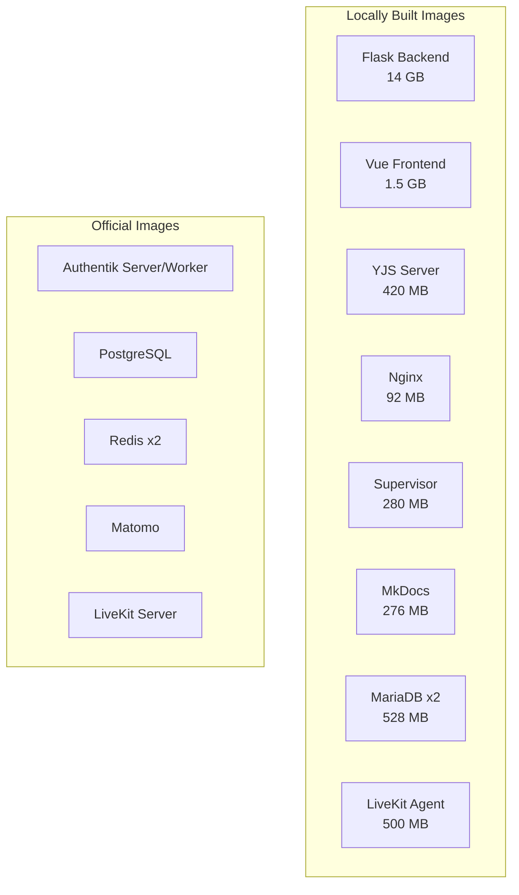
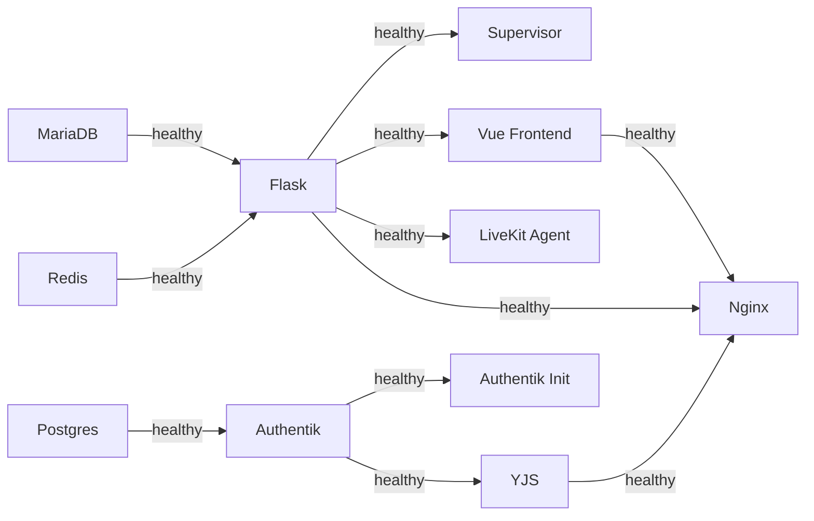

# Docker Architecture & Build Caching

This page describes LLARS' Docker build strategy and how layer caching works.

---

## Overview

LLARS consists of 17 Docker services. 9 are built locally, the rest use official images.



---

## Start Commands

| Command | What happens | When to use |
|---------|-------------|-------------|
| `./start_llars.sh` | Starts containers with existing images. No build, no Dockerfile check. | Default. Code changes come via volume mounts. |
| `./start_llars.sh --build` | Docker checks all Dockerfiles. Unchanged layers come from cache, only changed layers are rebuilt. | After changes to `requirements.txt`, `package.json`, Dockerfiles, or `docker-compose.yml`. |
| `./start_llars.sh --update` | Rebuilds only backend + frontend and restarts them. Other services keep running. | Quick update after Dockerfile change to Flask or Vue. |

### Additional Flags

| Flag | Description |
|------|-------------|
| `--detach` | Start in background (no Docker Watch) |
| `dev` / `prod` | Force development or production mode |

### Variables

| Variable | Description |
|----------|-------------|
| `REMOVE_LLARS_VOLUMES=True` | Deletes all LLARS data and automatically forces `--build` |
| `PRUNE_LLARS_SYSTEM=True` | Deletes all LLARS containers, images, volumes and build cache |

---

## Layer Caching Strategy

Docker builds images in layers. Each `RUN`, `COPY`, or `ADD` instruction creates a layer. If a layer hasn't changed, it's taken from the cache. **Once a layer changes, all subsequent layers are also rebuilt.**

That's why ordering matters: rarely changed things first, frequently changed things last.

### Flask Backend (14 GB)

The backend has the most complex layer structure:

```
Layer 1: texlive-full (~5 GB)          ← Almost never changes
Layer 2: System packages (~200 MB)     ← Rarely changes
Layer 3: Heavy ML packages (~4 GB)     ← torch, transformers, flair, chromadb
         (requirements-heavy.txt)         Changes very rarely
Layer 4: Python packages (~500 MB)     ← requirements.txt
         (with BuildKit cache mount)      Changes occasionally
Layer 5: Playwright Chromium (~300 MB) ← Rarely changes
Layer 6: App code (~500 MB)            ← Changes frequently
```

**Effect:** A code change only rebuilds Layer 6 (~seconds). A dependency change rebuilds Layers 4+6. texlive-full and ML packages stay cached.

### Vue Frontend (1.5 GB)

```
Layer 1: Start scripts             ← Almost never changes
Layer 2: npm ci (~400 MB)          ← Only on package.json change
         (with BuildKit cache mount)
Layer 3: Source code               ← Changes frequently
```

### YJS Server (420 MB)

Identical strategy to Vue.

---

## BuildKit Cache Mounts

All Dockerfiles use [BuildKit cache mounts](https://docs.docker.com/build/cache/#use-cache-mounts):

```dockerfile
RUN --mount=type=cache,target=/root/.cache/pip \
    pip install -r requirements.txt

RUN --mount=type=cache,target=/root/.npm \
    npm ci
```

**Advantage:** Even when `requirements.txt` changes, only changed packages are downloaded. The pip/npm download cache persists between builds.

---

## Build Context (.dockerignore)

The build context is what Docker sends to the daemon when building. Everything in the project directory not listed in `.dockerignore` is transferred.

**Current size: ~1.3 GB** (reduced from 6.8 GB via `.dockerignore`)

Excluded large directories:

| Directory | Size | Reason |
|-----------|------|--------|
| `docs/docs/projekte/anonymize/models/` | 2.1 GB | Mounted via volume |
| `app/data/rag/` | 638 MB | Runtime data |
| `Paper/` | 430 MB | Not needed for builds |
| `app/models/oncoco/model.safetensors` | 2.1 GB | Mounted via volume |
| `llars-frontend/node_modules` | varies | Installed in container |
| `yjs-server/node_modules` | 22 MB | Installed in container |

---

## npm install at Startup

In development mode, Docker mounts the host directory (`./llars-frontend:/vue`), which overwrites the `node_modules` installed in the image. The start scripts check if a re-install is needed:

```bash
# start_vue.sh / start_yjs.sh
if [ ! -d node_modules ] || [ ! -f node_modules/.package-lock.json ]; then
    npm install          # node_modules missing
elif [ package-lock.json -nt node_modules/.install-stamp ]; then
    npm install          # Dependencies changed
else
    echo "Skipping"      # Everything up to date
fi
```

On the **first start** after a fresh build, `npm install` runs (~5s for Vue, ~1s for YJS). On subsequent starts it's skipped.

!!! tip "Tip"
    If you run `npm install` locally on the host, `node_modules` are immediately available on the next container start.

---

## Service Dependencies

Startup order is controlled by healthchecks:



**Critical path:** MariaDB → Flask → Vue → Nginx (~30s)

---

## Image Sizes

| Image | Size | Base Image |
|-------|------|------------|
| Flask Backend | 14.2 GB | python:3.10-slim + texlive-full |
| Vue Frontend | 1.55 GB | node:23-slim |
| YJS Server | 419 MB | node:23-slim |
| LiveKit Agent | ~500 MB | python:3.11-slim |
| Supervisor | 281 MB | python:3.10-slim |
| MkDocs | 276 MB | python:3.12-alpine |
| Nginx | 92 MB | nginx:alpine |
| MariaDB | 528 MB | mariadb:11.2.2 |

---

## Troubleshooting

### Build is slow

```bash
# Check build cache usage
docker system df

# Clean up build cache (only unused layers)
docker builder prune

# Full cleanup and rebuild
PRUNE_LLARS_SYSTEM=True ./start_llars.sh --build
```

### Layer cache not being used

Common causes:

1. **Base image update:** When `python:3.10-slim` has a new digest, all layers are invalidated.
2. **Order:** If a file changes that is copied before dependencies, everything after it is rebuilt.
3. **Build context:** Large files forgotten in `.dockerignore` → slow context transfer.

### Image too large

```bash
# Analyze layer sizes
docker history llars-backend-flask-service --human
```

### npm install runs on every start

Check if `node_modules/.install-stamp` exists:

```bash
docker exec llars_frontend_service ls -la /vue/node_modules/.install-stamp
```

If not, `npm install` runs on every start. This happens when the host directory has no `node_modules`.

**Solution:** Run `cd llars-frontend && npm install` locally once.
