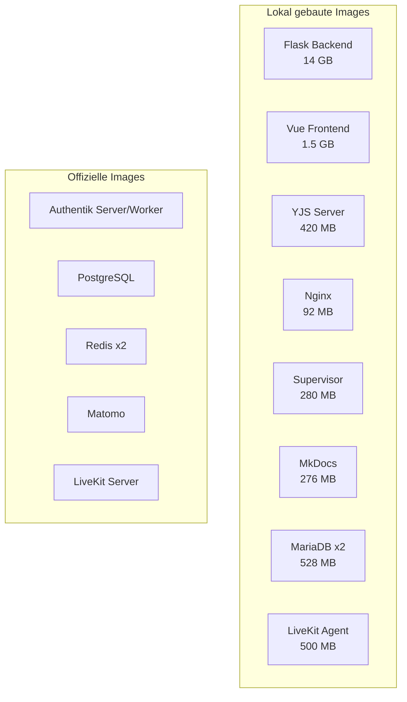
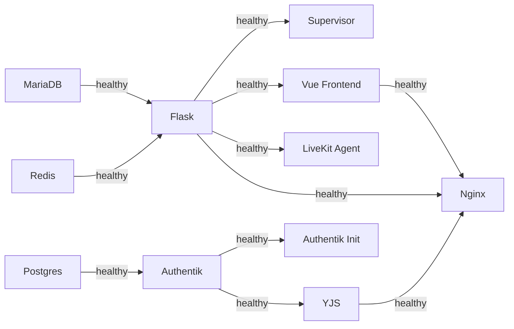

# Docker-Architektur & Build-Caching

Diese Seite beschreibt die Docker-Build-Strategie von LLARS und wie das Layer-Caching funktioniert.

---

## Übersicht

LLARS besteht aus 17 Docker-Services. Davon werden 9 lokal gebaut, der Rest nutzt offizielle Images.



---

## Start-Befehle

| Befehl | Was passiert | Wann nutzen |
|--------|-------------|-------------|
| `./start_llars.sh` | Startet Container mit vorhandenen Images. Kein Build, kein Dockerfile-Check. | Standard. Code-Änderungen kommen über Volume-Mounts. |
| `./start_llars.sh --build` | Docker prüft alle Dockerfiles. Unveränderte Layer werden aus dem Cache genommen, nur geänderte Layer werden neu gebaut. | Nach Änderungen an `requirements.txt`, `package.json`, Dockerfiles oder `docker-compose.yml`. |
| `./start_llars.sh --update` | Baut nur Backend + Frontend neu und startet sie. Andere Services bleiben laufen. | Schnelles Update nach Dockerfile-Änderung an Flask oder Vue. |

### Zusätzliche Flags

| Flag | Beschreibung |
|------|-------------|
| `--detach` | Start im Hintergrund (ohne Docker Watch) |
| `dev` / `prod` | Erzwingt Development- oder Production-Modus |

### Variablen

| Variable | Beschreibung |
|----------|-------------|
| `REMOVE_LLARS_VOLUMES=True` | Löscht alle LLARS-Daten und erzwingt `--build` automatisch |
| `PRUNE_LLARS_SYSTEM=True` | Löscht alle LLARS-Container, Images, Volumes und Build-Cache |

---

## Layer-Caching-Strategie

Docker baut Images in Layern. Jeder `RUN`, `COPY` oder `ADD` Befehl erzeugt einen Layer. Wenn sich ein Layer nicht geändert hat, wird er aus dem Cache genommen. **Sobald sich ein Layer ändert, werden alle folgenden Layer ebenfalls neu gebaut.**

Deshalb ist die Reihenfolge entscheidend: Selten geänderte Dinge zuerst, häufig geänderte zuletzt.

### Flask Backend (14 GB)

Das Backend hat die komplexeste Layer-Struktur:

```
Layer 1: texlive-full (~5 GB)          ← Ändert sich fast nie
Layer 2: System-Pakete (~200 MB)       ← Ändert sich selten
Layer 3: Schwere ML-Pakete (~4 GB)     ← torch, transformers, flair, chromadb
         (requirements-heavy.txt)         Ändert sich sehr selten
Layer 4: Python-Pakete (~500 MB)       ← requirements.txt
         (mit BuildKit Cache-Mount)       Ändert sich gelegentlich
Layer 5: Playwright Chromium (~300 MB) ← Ändert sich selten
Layer 6: App-Code (~500 MB)            ← Ändert sich häufig
```

**Effekt:** Eine Code-Änderung baut nur Layer 6 neu (~Sekunden). Eine Dependency-Änderung baut Layer 4+6 neu. texlive-full und die ML-Pakete bleiben gecacht.

### Vue Frontend (1.5 GB)

```
Layer 1: Start-Scripts             ← Ändert sich fast nie
Layer 2: npm ci (~400 MB)          ← Nur bei package.json-Änderung
         (mit BuildKit Cache-Mount)
Layer 3: Source-Code               ← Ändert sich häufig
```

### YJS Server (420 MB)

Identische Strategie wie Vue.

---

## BuildKit Cache-Mounts

Alle Dockerfiles nutzen [BuildKit Cache-Mounts](https://docs.docker.com/build/cache/#use-cache-mounts):

```dockerfile
RUN --mount=type=cache,target=/root/.cache/pip \
    pip install -r requirements.txt

RUN --mount=type=cache,target=/root/.npm \
    npm ci
```

**Vorteil:** Selbst wenn sich `requirements.txt` ändert, werden nur die geänderten Pakete heruntergeladen. Der pip/npm Download-Cache bleibt zwischen Builds erhalten.

---

## Build-Context (.dockerignore)

Der Build-Context ist das, was Docker beim Bauen an den Daemon sendet. Alles im Projektverzeichnis, das nicht in `.dockerignore` steht, wird übertragen.

**Aktuelle Größe: ~1.3 GB** (durch `.dockerignore` von 6.8 GB reduziert)

Ausgeschlossene große Verzeichnisse:

| Verzeichnis | Größe | Grund |
|-------------|-------|-------|
| `docs/docs/projekte/anonymize/models/` | 2.1 GB | Wird via Volume gemountet |
| `app/data/rag/` | 638 MB | Laufzeitdaten |
| `Paper/` | 430 MB | Nicht für Builds benötigt |
| `app/models/oncoco/model.safetensors` | 2.1 GB | Wird via Volume gemountet |
| `llars-frontend/node_modules` | variabel | Wird im Container installiert |
| `yjs-server/node_modules` | 22 MB | Wird im Container installiert |

---

## npm install beim Start

Im Development-Modus mounted Docker das Host-Verzeichnis (`./llars-frontend:/vue`), was die im Image installierten `node_modules` überschreibt. Deshalb prüfen die Start-Scripts ob ein Re-Install nötig ist:

```bash
# start_vue.sh / start_yjs.sh
if [ ! -d node_modules ] || [ ! -f node_modules/.package-lock.json ]; then
    npm install          # node_modules fehlen
elif [ package-lock.json -nt node_modules/.install-stamp ]; then
    npm install          # Dependencies haben sich geändert
else
    echo "Skipping"      # Alles aktuell
fi
```

Beim **ersten Start** nach einem frischen Build wird `npm install` ausgeführt (~5s für Vue, ~1s für YJS). Bei weiteren Starts wird es übersprungen.

!!! tip "Tipp"
    Wenn du `npm install` lokal auf dem Host ausführst, sind die `node_modules` beim nächsten Container-Start sofort verfügbar.

---

## Service-Abhängigkeiten

Die Startup-Reihenfolge wird durch Healthchecks gesteuert:



**Kritischer Pfad:** MariaDB → Flask → Vue → Nginx (~30s)

---

## Image-Größen

| Image | Größe | Base Image |
|-------|-------|------------|
| Flask Backend | 14.2 GB | python:3.10-slim + texlive-full |
| Vue Frontend | 1.55 GB | node:23-slim |
| YJS Server | 419 MB | node:23-slim |
| LiveKit Agent | ~500 MB | python:3.11-slim |
| Supervisor | 281 MB | python:3.10-slim |
| MkDocs | 276 MB | python:3.12-alpine |
| Nginx | 92 MB | nginx:alpine |
| MariaDB | 528 MB | mariadb:11.2.2 |

---

## Troubleshooting

### Build ist langsam

```bash
# Prüfe Build-Cache-Auslastung
docker system df

# Build-Cache aufräumen (nur nicht verwendete Layer)
docker builder prune

# Alles bereinigen und neu bauen
PRUNE_LLARS_SYSTEM=True ./start_llars.sh --build
```

### Layer-Cache wird nicht genutzt

Häufige Ursachen:

1. **Base Image Update:** Wenn `python:3.10-slim` ein neues Digest hat, werden alle Layer invalidiert.
2. **Reihenfolge:** Wenn sich eine Datei ändert, die vor den Dependencies kopiert wird, wird alles danach neu gebaut.
3. **Build-Context:** Große Dateien in `.dockerignore` vergessen → langsame Context-Übertragung.

### Image zu groß

```bash
# Analysiere Layer-Größen
docker history llars-backend-flask-service --human
```

### npm install läuft bei jedem Start

Prüfe ob `node_modules/.install-stamp` existiert:

```bash
docker exec llars_frontend_service ls -la /vue/node_modules/.install-stamp
```

Falls nicht, läuft `npm install` bei jedem Start. Das passiert wenn das Host-Verzeichnis keine `node_modules` hat.

**Lösung:** Einmal lokal `cd llars-frontend && npm install` ausführen.
