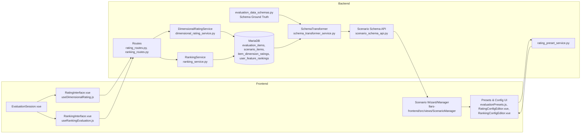

# Rating/Ranking Overview

This page shows the key files and data flows for ratings and rankings in the LLARS stack.

---

## System Map (Flow)

---

## Key Files (Short List)

**Schema & conventions**
- `app/schemas/evaluation_data_schemas.py`
- `llars-frontend/src/schemas/evaluationSchemas.js`

**Presets & configuration**
- `app/services/evaluation/rating_preset_service.py`
- `llars-frontend/src/views/ScenarioManager/config/evaluationPresets.js`

**Schema API & adapters**
- `app/services/evaluation/schema_transformer_service.py`
- `app/services/evaluation/schema_adapter_service.py`
- `app/routes/scenarios/scenario_schema_api.py`

**Rating/Ranking runtime**
- `app/routes/rating/rating_routes.py`
- `app/routes/rating/ranking_routes.py`
- `app/services/evaluation/dimensional_rating_service.py`
- `app/services/ranking_service.py`
- `llars-frontend/src/views/Evaluation/EvaluationSession.vue`
- `llars-frontend/src/views/Evaluation/interfaces/RatingInterface.vue`
- `llars-frontend/src/views/Evaluation/interfaces/RankingInterface.vue`
- `llars-frontend/src/composables/useDimensionalRating.js`
- `llars-frontend/src/composables/useRankingEvaluation.js`

**Database (core tables)**
- `evaluation_items` (formerly EmailThread)
- `scenario_items` (formerly ScenarioThreads)
- `item_dimension_ratings`
- `user_feature_rankings`

---

## Typical changes for new variants

- Add preset (backend + frontend)
- Adjust schema/transformer if new fields are needed
- Extend config editors (RatingConfigEditor/RankingConfigEditor)
- Verify API and service logic
- Add tests and documentation
