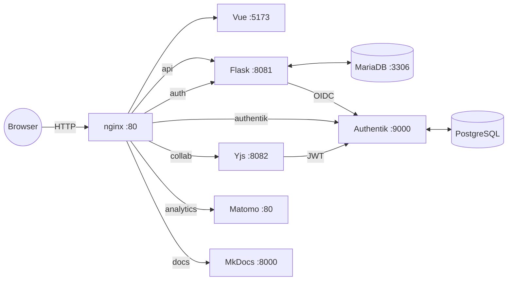

# LLARS Documentation

Welcome to the documentation of the **LLM Assisted Research System (LLARS)**.

## Overview

LLARS is a platform for AI-supported analysis and evaluation of email counseling conversations. Core features:

- **Mail Rating & Ranking**: Structured assessment and comparison of threads
- **LLM Integration**: OpenAI and LiteLLM/Mistral
- **Authentication**: Authentik (OIDC) with roles and permissions
- **Collaboration**: Yjs for real-time synchronization
- **RAG Pipeline**: Knowledge-grounded answers via ChromaDB

## Architecture

**Service Overview (internal ports)**

**Standard Ports (Development)**
- 55080 -> nginx (Frontend + API + Matomo + Docs Proxy)
- 55095 -> Authentik (optional direct; also via nginx `/authentik/`)
- 55306 -> MariaDB (optional direct; debug only)
- 55800 -> Docs (MkDocs, optional direct; also via nginx `/mkdocs/` in dev, `/mkdocs/` in prod)

In production, only 80/443 are exposed externally.

## Quick Start

1. Clone the repository
2. Copy `.env.template.development` to `.env` and adjust as needed
3. Run the start script: `./start_llars.sh`
4. Open: `http://localhost:55080`

## Further Information

See [Getting Started](getting-started/installation.md) for installation and configuration details.
