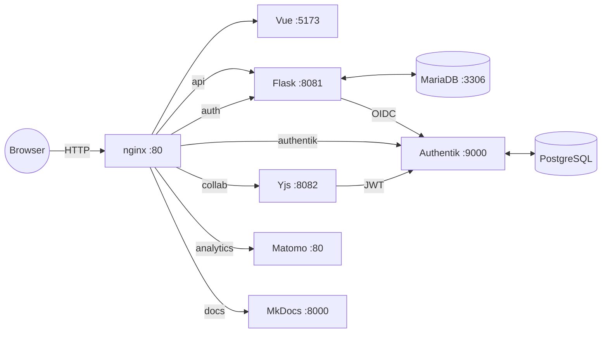

# LLARS Dokumentation

Willkommen zur Dokumentation des **LLM Assisted Research System (LLARS)**.

## Überblick

LLARS ist eine Plattform zur KI-gestützten Analyse und Bewertung von E-Mail-Konversationen. Kernfunktionen:

- **Mail-Rating & Ranking**: Strukturiertes Bewerten und Vergleichen von Threads
- **LLM-Integration**: OpenAI und LiteLLM/Mistral
- **Authentifizierung**: Authentik (OIDC) mit Rollen- und Rechtemodell
- **Kollaboration**: Yjs für Echtzeit-Synchronisation
- **RAG-Pipeline**: Wissensbasierte Antworten über ChromaDB

## Architektur

**Service-Übersicht (interne Ports)**

**Standard-Ports (Development)**
- 55080 → nginx (Frontend + API + Matomo + Docs Proxy)
- 55095 → Authentik (optional direkt; zusätzlich via nginx `/authentik/`)
- 55306 → MariaDB (optional direkt; nur Debugging)
- 55800 → Docs (MkDocs, optional direkt; zusätzlich via nginx `/docs/` in Dev, `/docs/` in Prod)

In Production werden nur 80/443 nach außen exponiert.

## Schnellstart

1. Repository klonen  
2. `.env.template.development` nach `.env` kopieren und anpassen  
3. Startskript ausführen: `./start_llars.sh`  
4. Aufrufen: `http://localhost:55080`

## Weiterführende Infos

Siehe [Getting Started](getting-started/installation.md) für Details zu Installation und Konfiguration.
