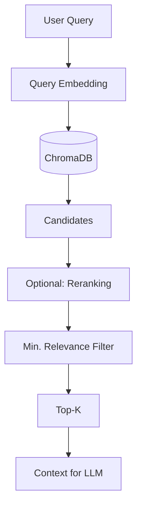
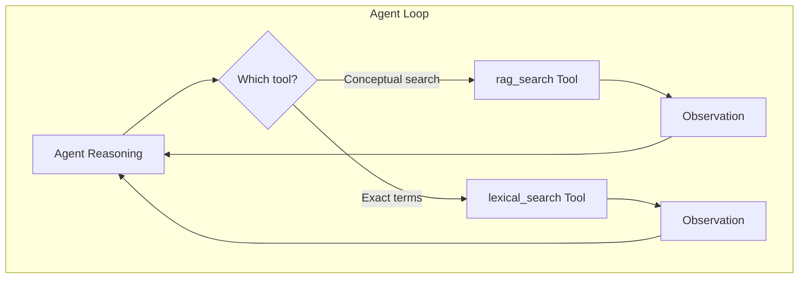
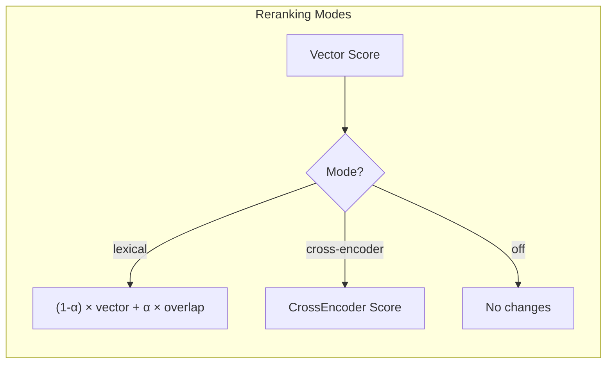
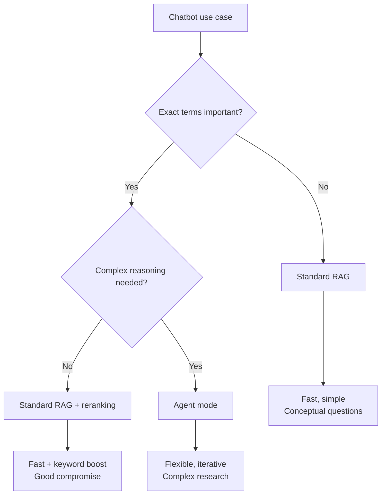

# Hybrid Search in LLARS

!!! warning "Clarification"
    LLARS does **not** use true hybrid search with RRF in the standard RAG mode.
    Instead, it provides two separate search strategies depending on the mode.

## Overview

| Mode | Semantic Search | Lexical Search | Combination |
|------|-----------------|----------------|-------------|
| **Standard RAG** | ✅ Always | ❌ Not available | - |
| **Agent Modes** (ACT/ReAct/ReflAct) | ✅ As a tool | ✅ As a tool | Agent decides |

## Standard RAG: Semantic Search Only



Standard RAG uses **semantic search only** (vector similarity):

1. Query is embedded (VDR-2B or fallback)
2. Similarity search in ChromaDB
3. Optional: reranking (lexical blending or cross-encoder)
4. Top‑K results as context

**No RRF, no parallel lexical search.**

## Agent Modes: Two Separate Tools

In agent modes (ACT, ReAct, ReflAct), **two separate search tools** are available:



### rag_search tool
- Semantic search in ChromaDB
- Good for conceptual questions
- "What are the benefits of X?"

### lexical_search tool
- BM25/FTS5 search in SQLite
- Good for exact terms, names, IDs
- "Who is Max Mustermann?"

The agent decides which tool to use - or both in sequence.

## Reranking (Optional)

After initial retrieval, reranking can be applied:



### Lexical Blending (Default)

```python
rerank_score = (1 - alpha) * vector_score + alpha * token_overlap
# alpha = 0.15 (default)
```

- Token overlap between query and chunk content
- Lightweight, no extra models required
- Helps with exact keyword matches

### Cross-Encoder

```python
rerank_score = CrossEncoder(query, chunk_content)
```

- Sentence‑Transformers CrossEncoder
- Higher quality, but slower
- Requires model download

### Configuration

| Environment variable | Values | Default |
|----------------------|--------|---------|
| `RAG_RERANK_MODE` | `off`, `lexical`, `cross-encoder` | `lexical` |
| `RAG_RERANK_ALPHA` | 0.0 - 1.0 | 0.15 |

## Query Expansion (Lexical Search Only)

Synonyms are automatically expanded for lexical search:

| Token | Expanded to |
|-------|-------------|
| `inhaber` | `impressum`, `betreiber`, `verantwortlich`, `geschäftsführer` |
| `kontakt` | `email`, `telefon`, `adresse`, `impressum` |
| `chef` | `inhaber`, `geschäftsführer`, `leitung` |

## Comparison: Standard RAG vs. Agent Mode

| Aspect | Standard RAG | Agent Mode |
|--------|--------------|------------|
| **Semantic search** | Automatic | Available as a tool |
| **Lexical search** | ❌ Not available | Available as a tool |
| **Combination** | Reranking only | Agent chooses iteratively |
| **Latency** | Low (1 search) | Higher (multiple steps possible) |
| **Exact terms** | Only via reranking | Lexical tool |

## When to use which mode?



## Files

| File | Purpose |
|------|---------|
| `app/services/chatbot/chat_service.py` | Semantic search (standard RAG) |
| `app/services/chatbot/lexical_index.py` | FTS5 index (agent tool) |
| `app/services/rag/reranker.py` | Lexical blending / cross-encoder |
| `app/services/chatbot/agent_chat_service.py` | Agent modes with both tools |

## Troubleshooting

### Lexical search finds nothing

1. Check whether the index exists:
```bash
ls -la app/data/rag/indexes/lexical_index.sqlite
```

2. The index is created lazily on first access

### Reranking has no effect

- Check: `RAG_RERANK_MODE` environment variable
- Cross‑encoder requires a model in `llm_models` (type=reranker)

### Agent uses the wrong tool

- ReAct/ReflAct show reasoning - check why the agent chose a tool
- Adjust system prompt if needed
