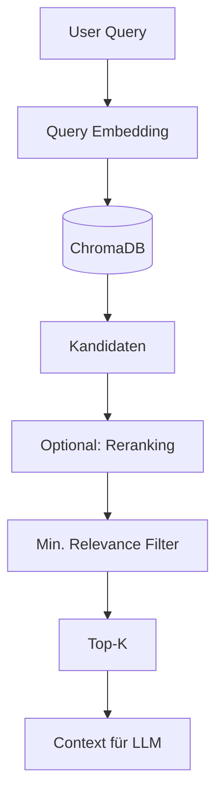
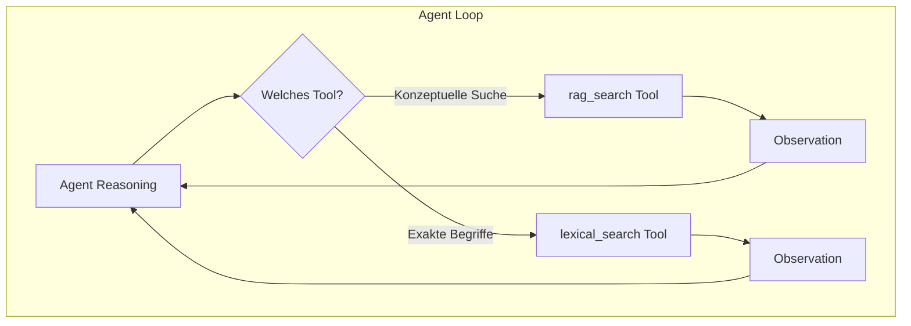
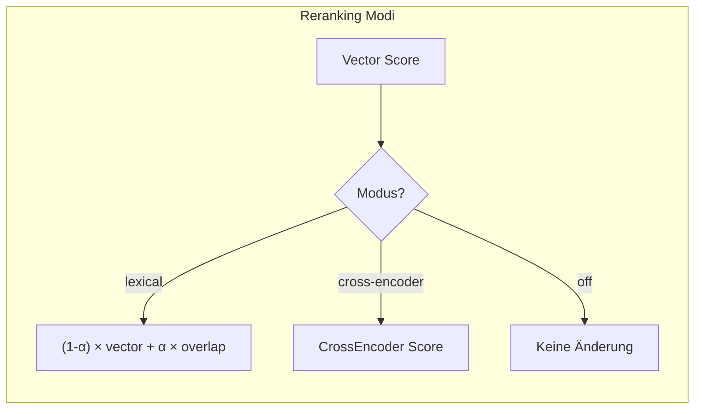
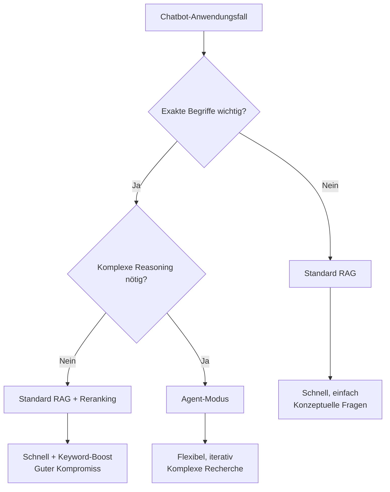

# Hybrid Search in LLARS

!!! warning "Klarstellung"
    LLARS verwendet **keine echte Hybrid Search mit RRF** im Standard-RAG-Modus.
    Stattdessen gibt es zwei getrennte Such-Strategien je nach Modus.

## Übersicht

| Modus | Semantic Search | Lexical Search | Kombination |
|-------|-----------------|----------------|-------------|
| **Standard RAG** | ✅ Immer | ❌ Nicht verfügbar | - |
| **Agent-Modi** (ACT/ReAct/ReflAct) | ✅ Als Tool | ✅ Als Tool | Agent entscheidet |

## Standard RAG: Nur Semantic Search



Der Standard-RAG-Modus verwendet **ausschließlich semantische Suche** (Vektor-Ähnlichkeit):

1. Query wird embedded (VDR-2B oder Fallback)
2. Ähnlichkeitssuche in ChromaDB
3. Optional: Reranking (Lexical Blending oder Cross-Encoder)
4. Top-K Ergebnisse als Kontext

**Kein RRF, keine parallele Lexical Search.**

## Agent-Modi: Zwei separate Tools

In den Agent-Modi (ACT, ReAct, ReflAct) stehen **zwei separate Such-Tools** zur Verfügung:



### rag_search Tool
- Semantische Suche in ChromaDB
- Gut für konzeptuelle Fragen
- "Was sind die Vorteile von X?"

### lexical_search Tool
- BM25/FTS5 Suche in SQLite
- Gut für exakte Begriffe, Namen, IDs
- "Wer ist Max Mustermann?"

Der Agent entscheidet selbstständig, welches Tool er nutzt - oder beide nacheinander.

## Reranking (Optional)

Nach der initialen Suche kann ein Reranking durchgeführt werden:



### Lexical Blending (Default)

```python
rerank_score = (1 - alpha) * vector_score + alpha * token_overlap
# alpha = 0.15 (default)
```

- Token-Overlap zwischen Query und Chunk-Content
- Leichtgewichtig, keine zusätzlichen Modelle nötig
- Hilft bei exakten Keyword-Matches

### Cross-Encoder

```python
rerank_score = CrossEncoder(query, chunk_content)
```

- Sentence-Transformers CrossEncoder
- Höhere Qualität, aber langsamer
- Erfordert Modell-Download

### Konfiguration

| Umgebungsvariable | Werte | Default |
|-------------------|-------|---------|
| `RAG_RERANK_MODE` | `off`, `lexical`, `cross-encoder` | `lexical` |
| `RAG_RERANK_ALPHA` | 0.0 - 1.0 | 0.15 |

## Query Expansion (Nur Lexical Search)

Für die lexikalische Suche werden Synonyme automatisch hinzugefügt:

| Token | Expandiert zu |
|-------|---------------|
| `inhaber` | `impressum`, `betreiber`, `verantwortlich`, `geschäftsführer` |
| `kontakt` | `email`, `telefon`, `adresse`, `impressum` |
| `chef` | `inhaber`, `geschäftsführer`, `leitung` |

## Vergleich: Standard RAG vs. Agent-Modus

| Aspekt | Standard RAG | Agent-Modus |
|--------|--------------|-------------|
| **Semantic Search** | Automatisch | Als Tool verfügbar |
| **Lexical Search** | ❌ Nicht verfügbar | Als Tool verfügbar |
| **Kombination** | Nur Reranking | Agent wählt iterativ |
| **Latenz** | Niedrig (1 Suche) | Höher (mehrere Iterationen möglich) |
| **Exakte Begriffe** | Nur via Reranking | Lexical Tool |

## Wann welchen Modus nutzen?



## Dateien

| Datei | Funktion |
|-------|----------|
| `app/services/chatbot/chat_service.py` | Semantic Search (Standard RAG) |
| `app/services/chatbot/lexical_index.py` | FTS5 Index (Agent Tool) |
| `app/services/rag/reranker.py` | Lexical Blending / Cross-Encoder |
| `app/services/chatbot/agent_chat_service.py` | Agent-Modi mit beiden Tools |

## Troubleshooting

### Lexical Search findet nichts

1. Prüfen ob Index existiert:
```bash
ls -la app/data/rag/indexes/lexical_index.sqlite
```

2. Index wird lazy beim ersten Zugriff erstellt

### Reranking hat keinen Effekt

- Prüfen: `RAG_RERANK_MODE` Umgebungsvariable
- Cross-Encoder erfordert Modell in `llm_models` Tabelle (type=reranker)

### Agent nutzt falsches Tool

- ReAct/ReflAct Modi zeigen Reasoning - prüfen warum Agent so entscheidet
- System Prompt ggf. anpassen für bessere Tool-Auswahl
