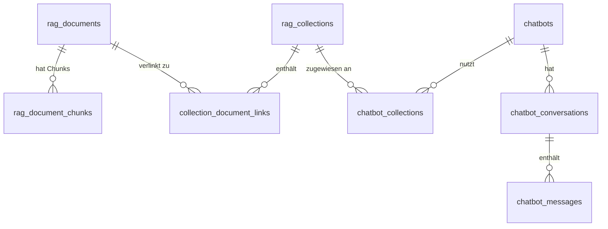

# Chatbot Builder mit Web Crawler RAG Pipeline - Konzept

!!! warning "Status: Konzept"
    Dieses Projekt befindet sich in der **Konzeptphase**.
    Das Design wird erarbeitet und ersetzt das bisherige chatbot-rag Konzept.

**Erstellt:** 2025-11-28
**Autor:** Claude (AI Assistant)
**Version:** 2.1 (überarbeitet nach Review)

---

## Ziel

Ein **integriertes Chatbot-Builder-System** mit nahtloser Web Crawler RAG Pipeline. Benutzer sollen in wenigen Schritten einen vollständigen Chatbot erstellen können, der auf einer automatisch gecrawlten und indexierten Wissensbasis basiert. KI-gestützte Generierung von System-Prompts, Willkommensnachrichten und Namen beschleunigt die Konfiguration.

**Kernidee:**
```
URL eingeben → Crawlen → Embedden → Chatbot konfigurieren → Testen → Veröffentlichen
```

---

## Anforderungen

### Funktionale Anforderungen

| ID | Anforderung | Priorität |
|----|-------------|-----------|
| F01 | Web Crawler crawlt eine URL und legt jede Seite als Dokument ab | Hoch |
| F02 | Dokumente werden mit Content-Hash dedupliziert (ein Dokument kann in mehreren Collections sein) | Hoch |
| F03 | Embedding-Fortschritt wird pro Collection via WebSocket angezeigt | Hoch |
| F04 | Chatbot-Erstellung mit integriertem Crawler-Start | Hoch |
| F05 | Generate-Buttons für kontextbasierte Feldbefüllung (Name, System-Prompt, Willkommensnachricht) | Hoch |
| F06 | Admin-Testseite zum Tweaken und Testen des Chatbots | Hoch |
| F07 | Collection-Name automatisch aus URL extrahieren oder manuell festlegen | Mittel |
| F08 | Chatbot-Konfiguration vollständig auf DB gespeichert mit Referenzen | Hoch |
| F09 | Test-Chat-Interface zum Ausprobieren vor Veröffentlichung | Hoch |
| F10 | Multi-Collection-Support: Chatbot kann mehrere Collections nutzen | Mittel |
| F11 | Abbruch-Funktion für laufende Crawl/Embedding-Prozesse | Mittel |
| F12 | Sitemap.xml Support für effizienteres Crawling | Niedrig |

### Nicht-funktionale Anforderungen

| ID | Anforderung | Priorität |
|----|-------------|-----------|
| NF01 | Performance: Embedding-Fortschritt in Echtzeit ohne Polling | Hoch |
| NF02 | Sicherheit: Alle Daten mit Referenzen, keine Duplikate | Hoch |
| NF03 | Usability: Wizard-artige Benutzerführung beim Chatbot-Erstellen | Hoch |
| NF04 | Skalierbarkeit: Tausende Dokumente pro Collection unterstützen | Mittel |
| NF05 | Robustheit: WebSocket Reconnection mit State-Recovery | Hoch |
| NF06 | Wartbarkeit: Konsistente API-Struktur unter `/api/chatbots/*` | Hoch |

---

## Datenbank-Design

### Design-Prinzipien

1. **Bestehende Tabellen erweitern** statt neue zu erstellen
2. **Keine Datenduplikate** - alles über Referenzen
3. **Konsistente Feldnamen** - bestehende Namen beibehalten
4. **Rückwärtskompatibilität** - bestehender Code soll weiter funktionieren

### Tabellen-Übersicht



---

### Schema-Änderungen

#### `rag_document_chunks` (erweitern - NICHT neue Tabelle)

Die bestehende Chunks-Tabelle wird um Embedding-Metadaten erweitert.

**Neue Spalten:**

| Spalte | Typ | Nullable | Default | Beschreibung |
|--------|-----|----------|---------|--------------|
| embedding_model | VARCHAR(255) | Ja | NULL | Verwendetes Embedding-Modell |
| embedding_dimensions | INT | Ja | NULL | Dimensionen des Embeddings |
| embedding_status | ENUM | Nein | 'pending' | 'pending', 'processing', 'completed', 'failed' |
| embedding_error | TEXT | Ja | NULL | Fehlermeldung bei status='failed' |

**Migration:**
```sql
ALTER TABLE rag_document_chunks
ADD COLUMN embedding_model VARCHAR(255) NULL,
ADD COLUMN embedding_dimensions INT NULL,
ADD COLUMN embedding_status ENUM('pending', 'processing', 'completed', 'failed') NOT NULL DEFAULT 'pending',
ADD COLUMN embedding_error TEXT NULL,
ADD INDEX idx_embedding_status (embedding_status);

-- Bestehende Chunks mit vector_id als 'completed' markieren
UPDATE rag_document_chunks SET embedding_status = 'completed' WHERE vector_id IS NOT NULL;
```

---

#### `rag_collections` (erweitern)

**Neue Spalten:**

| Spalte | Typ | Nullable | Default | Beschreibung |
|--------|-----|----------|---------|--------------|
| source_type | ENUM | Nein | 'upload' | 'crawler', 'upload', 'mixed' |
| source_url | VARCHAR(2048) | Ja | NULL | Basis-URL bei Crawling |
| crawl_job_id | VARCHAR(36) | Ja | NULL | Aktueller/letzter Crawler-Job |
| embedding_status | ENUM | Nein | 'idle' | 'idle', 'processing', 'completed', 'failed' |
| embedding_progress | INT | Ja | 0 | Fortschritt 0-100 |
| embedding_error | TEXT | Ja | NULL | Fehlermeldung bei Fehler |

**Migration:**
```sql
ALTER TABLE rag_collections
ADD COLUMN source_type ENUM('crawler', 'upload', 'mixed') NOT NULL DEFAULT 'upload',
ADD COLUMN source_url VARCHAR(2048) NULL,
ADD COLUMN crawl_job_id VARCHAR(36) NULL,
ADD COLUMN embedding_status ENUM('idle', 'processing', 'completed', 'failed') NOT NULL DEFAULT 'idle',
ADD COLUMN embedding_progress INT DEFAULT 0,
ADD COLUMN embedding_error TEXT NULL,
ADD INDEX idx_source_type (source_type),
ADD INDEX idx_embedding_status (embedding_status),
ADD INDEX idx_crawl_job_id (crawl_job_id);
```

---

#### `chatbots` (erweitern)

**Neue Spalten:**

| Spalte | Typ | Nullable | Default | Beschreibung |
|--------|-----|----------|---------|--------------|
| build_status | ENUM | Nein | 'ready' | Build-Pipeline Status |
| build_error | TEXT | Ja | NULL | Fehlermeldung bei Problemen |
| source_url | VARCHAR(2048) | Ja | NULL | Ursprungs-URL (bei Wizard-Erstellung) |
| primary_collection_id | INT (FK) | Ja | NULL | Haupt-Collection (Shortcut) |

**Build-Status Enum-Werte:**

| Status | Beschreibung |
|--------|--------------|
| `draft` | Chatbot angelegt, aber noch nicht konfiguriert |
| `crawling` | Web Crawler läuft |
| `embedding` | Embeddings werden erstellt |
| `configuring` | Warte auf Konfiguration durch User |
| `ready` | Einsatzbereit |
| `error` | Fehler aufgetreten |
| `paused` | Manuell pausiert |

**Migration:**
```sql
ALTER TABLE chatbots
ADD COLUMN build_status ENUM('draft', 'crawling', 'embedding', 'configuring', 'ready', 'error', 'paused') NOT NULL DEFAULT 'ready',
ADD COLUMN build_error TEXT NULL,
ADD COLUMN source_url VARCHAR(2048) NULL,
ADD COLUMN primary_collection_id INT NULL,
ADD INDEX idx_build_status (build_status),
ADD CONSTRAINT fk_primary_collection FOREIGN KEY (primary_collection_id) REFERENCES rag_collections(id) ON DELETE SET NULL;

-- Bestehende Chatbots sind bereits 'ready'
UPDATE chatbots SET build_status = 'ready' WHERE build_status IS NULL;
```

---

### Vollständiges Relationen-Diagramm

```
                        ┌─────────────────────┐
                        │     chatbots        │
                        │  + build_status     │
                        │  + build_error      │
                        │  + source_url       │
                        │  + primary_coll_id  │
                        └─────────┬───────────┘
                                  │ 1:n
                                  ▼
                        ┌─────────────────────┐
                        │ chatbot_collections │
                        │  (priority, weight) │
                        └─────────┬───────────┘
                                  │ n:1
                                  ▼
┌─────────────────────────────────────────────────────────────────┐
│                      rag_collections                             │
│  + source_type, source_url, crawl_job_id                        │
│  + embedding_status, embedding_progress, embedding_error         │
└────────────────────────────┬────────────────────────────────────┘
                             │ 1:n
                             ▼
              ┌──────────────────────────────────┐
              │   collection_document_links      │
              │   (n:m, link_type, source_url)   │
              └──────────────────┬───────────────┘
                                 │ n:1
                                 ▼
┌─────────────────────────────────────────────────────────────────┐
│                      rag_documents                               │
│  file_hash (UNIQUE) → Deduplizierung                            │
│  status: pending|processing|indexed|failed|archived             │
└────────────────────────────┬────────────────────────────────────┘
                             │ 1:n
                             ▼
              ┌──────────────────────────────────┐
              │      rag_document_chunks         │
              │  + embedding_model               │
              │  + embedding_dimensions          │
              │  + embedding_status              │
              │  + embedding_error               │
              │  vector_id → ChromaDB            │
              └──────────────────────────────────┘
```

---

### Bestehende Tabellen (unverändert)

Diese Tabellen bleiben wie sie sind:

| Tabelle | Beschreibung |
|---------|--------------|
| `collection_document_links` | n:m Verknüpfung (bereits vorhanden) |
| `chatbot_collections` | n:m Chatbot ↔ Collection (bereits vorhanden) |
| `chatbot_conversations` | Chat-Sessions (bereits vorhanden) |
| `chatbot_messages` | Chat-Nachrichten (bereits vorhanden) |
| `rag_document_versions` | Versionshistorie (bereits vorhanden) |
| `rag_document_permissions` | Granulare Permissions (bereits vorhanden) |
| `rag_retrieval_logs` | Analytics (bereits vorhanden) |
| `rag_processing_queue` | Background Jobs (bereits vorhanden) |

---

## API-Design

### Design-Prinzipien

1. **Konsistente Pfade** - Alle Chatbot-APIs unter `/api/chatbots/*`
2. **RESTful** - Standard HTTP-Methoden
3. **Vollständige Fehler-Dokumentation** - Jeder Endpoint mit Error-Codes

---

### Chatbot API (erweitert)

#### `POST /api/chatbots` (erweitert für Wizard-Modus)

**Beschreibung:** Erstellt einen Chatbot. Mit `mode=wizard` wird der Builder-Workflow gestartet.

**Permission:** `feature:chatbots:edit`

**Request (Standard):**
```json
{
  "name": "support-bot",
  "display_name": "Support Bot",
  "system_prompt": "Du bist ein hilfreicher Assistent...",
  "collection_ids": [1, 2]
}
```

**Request (Wizard-Modus):**
```json
{
  "mode": "wizard",
  "source_url": "https://example.com",
  "name": "example-support",
  "display_name": "Example Support Bot",
  "crawler_config": {
    "max_pages": 50,
    "max_depth": 3,
    "respect_robots_txt": true,
    "use_sitemap": true
  },
  "auto_generate": true
}
```

**Response (Wizard-Modus):**
```json
{
  "id": 1,
  "name": "example-support",
  "build_status": "crawling",
  "collection_id": 123,
  "crawl_job_id": "uuid-string",
  "websocket_room": "chatbot_build_1"
}
```

**Fehler:**

| Code | Error | Beschreibung |
|------|-------|--------------|
| 400 | `INVALID_URL` | URL ist ungültig oder nicht erreichbar |
| 400 | `MISSING_FIELDS` | Pflichtfelder fehlen |
| 403 | `FORBIDDEN` | Keine Berechtigung |
| 409 | `NAME_EXISTS` | Chatbot-Name existiert bereits |
| 409 | `COLLECTION_EXISTS` | Collection-Name existiert bereits |
| 503 | `CRAWLER_UNAVAILABLE` | Crawler-Service nicht verfügbar |

---

#### `GET /api/chatbots/<id>/build-status`

**Beschreibung:** Build-Status eines Chatbots im Wizard-Modus.

**Permission:** `feature:chatbots:view`

**Response:**
```json
{
  "chatbot_id": 1,
  "build_status": "embedding",
  "stages": {
    "crawling": {
      "status": "completed",
      "started_at": "2025-11-28T10:00:00Z",
      "completed_at": "2025-11-28T10:05:00Z",
      "pages_crawled": 50,
      "documents_created": 48,
      "documents_linked": 2
    },
    "embedding": {
      "status": "processing",
      "started_at": "2025-11-28T10:05:01Z",
      "progress_percent": 45,
      "chunks_completed": 220,
      "chunks_total": 480,
      "current_document": "leistungen.md"
    },
    "configuration": {
      "status": "pending"
    }
  },
  "error": null,
  "can_cancel": true,
  "estimated_completion_seconds": 180
}
```

---

#### `POST /api/chatbots/<id>/cancel-build`

**Beschreibung:** Bricht den Build-Prozess ab.

**Permission:** `feature:chatbots:edit`

**Response:**
```json
{
  "chatbot_id": 1,
  "build_status": "paused",
  "message": "Build wurde abgebrochen",
  "cleanup": {
    "documents_kept": 48,
    "embeddings_kept": 220,
    "collection_status": "partial"
  }
}
```

---

#### `POST /api/chatbots/<id>/resume-build`

**Beschreibung:** Setzt einen pausierten Build fort.

**Permission:** `feature:chatbots:edit`

**Response:**
```json
{
  "chatbot_id": 1,
  "build_status": "embedding",
  "resumed_at": "2025-11-28T10:30:00Z"
}
```

---

#### `POST /api/chatbots/generate-field`

**Beschreibung:** Generiert ein einzelnes Feld basierend auf Kontext.

**Permission:** `feature:chatbots:edit`

**Request:**
```json
{
  "field": "system_prompt",
  "context": {
    "source_url": "https://anwalt-muenchen.de",
    "name": "anwalt-helper",
    "display_name": "Anwaltshelfer",
    "crawled_pages_sample": ["Startseite", "Leistungen", "Kontakt"],
    "existing_fields": {
      "description": "Chatbot für Anwaltskanzlei"
    }
  }
}
```

**Response:**
```json
{
  "field": "system_prompt",
  "value": "Du bist der freundliche Assistent für die Anwaltskanzlei in München...",
  "confidence": 0.92,
  "alternatives": [
    "Du bist ein professioneller Rechtsberater-Assistent...",
    "Als virtueller Assistent der Kanzlei..."
  ]
}
```

**Unterstützte Felder:**

| Feld | Kontext-Abhängigkeiten |
|------|------------------------|
| `name` | source_url |
| `display_name` | source_url, name |
| `description` | source_url, name, display_name |
| `system_prompt` | source_url, name, display_name, crawled_pages_sample |
| `welcome_message` | display_name, system_prompt |
| `fallback_message` | display_name, system_prompt |

**Fehler:**

| Code | Error | Beschreibung |
|------|-------|--------------|
| 400 | `INVALID_FIELD` | Unbekanntes Feld |
| 400 | `INSUFFICIENT_CONTEXT` | Zu wenig Kontext für Generierung |
| 429 | `RATE_LIMITED` | Zu viele Anfragen |
| 503 | `LLM_UNAVAILABLE` | LLM-Service nicht verfügbar |

---

#### `GET /api/chatbots/<id>/admin-test`

**Beschreibung:** Daten für Admin-Testseite.

**Permission:** `feature:chatbots:edit`

**Response:**
```json
{
  "chatbot": {
    "id": 1,
    "name": "anwalt-helper",
    "display_name": "Anwaltshelfer",
    "system_prompt": "...",
    "build_status": "ready",
    "source_url": "https://anwalt-muenchen.de"
  },
  "collections": [
    {
      "id": 123,
      "name": "anwalt-muenchen",
      "document_count": 48,
      "embedding_status": "completed",
      "is_primary": true
    }
  ],
  "stats": {
    "total_documents": 48,
    "total_chunks": 480,
    "total_embeddings": 480,
    "avg_response_time_ms": 1250,
    "conversations_count": 0,
    "messages_count": 0
  },
  "sample_documents": [
    {
      "id": 1,
      "title": "Startseite",
      "excerpt": "Willkommen bei der Anwaltskanzlei...",
      "chunks_count": 12
    }
  ],
  "test_queries": [
    "Welche Rechtsgebiete bieten Sie an?",
    "Wie kann ich einen Termin vereinbaren?",
    "Was kostet eine Erstberatung?"
  ]
}
```

---

#### `PATCH /api/chatbots/<id>/tweak`

**Beschreibung:** Schnelles Anpassen von Chatbot-Parametern (partial update).

**Permission:** `feature:chatbots:edit`

**Request:**
```json
{
  "temperature": 0.8,
  "rag_retrieval_k": 6,
  "system_prompt": "Angepasster Prompt..."
}
```

**Response:**
```json
{
  "id": 1,
  "updated_fields": ["temperature", "rag_retrieval_k", "system_prompt"],
  "updated_at": "2025-11-28T10:30:00Z"
}
```

---

### Collection Embedding API

#### `POST /api/rag/collections/<id>/embed`

**Beschreibung:** Startet Embedding-Prozess für eine Collection.

**Permission:** `feature:rag:edit`

**Request:**
```json
{
  "force_reembed": false,
  "embedding_model": "sentence-transformers/all-MiniLM-L6-v2",
  "batch_size": 10
}
```

**Response:**
```json
{
  "collection_id": 123,
  "status": "started",
  "documents_to_process": 42,
  "chunks_to_embed": 480,
  "websocket_room": "embedding_collection_123",
  "estimated_duration_seconds": 300
}
```

**Fehler:**

| Code | Error | Beschreibung |
|------|-------|--------------|
| 400 | `NO_DOCUMENTS` | Collection hat keine Dokumente |
| 409 | `ALREADY_PROCESSING` | Embedding läuft bereits |
| 503 | `EMBEDDING_SERVICE_UNAVAILABLE` | Embedding-Service nicht verfügbar |

---

#### `GET /api/rag/collections/<id>/embedding-status`

**Beschreibung:** Aktueller Embedding-Status einer Collection.

**Permission:** `feature:rag:view`

**Response:**
```json
{
  "collection_id": 123,
  "embedding_status": "processing",
  "progress": {
    "percent": 65,
    "documents_completed": 28,
    "documents_total": 42,
    "chunks_completed": 312,
    "chunks_total": 480,
    "current_document": {
      "id": 15,
      "filename": "familienrecht.md",
      "chunks_done": 8,
      "chunks_total": 15
    }
  },
  "timing": {
    "started_at": "2025-11-28T10:05:00Z",
    "elapsed_seconds": 120,
    "estimated_remaining_seconds": 65
  },
  "errors": []
}
```

---

#### `POST /api/rag/collections/<id>/cancel-embedding`

**Beschreibung:** Bricht Embedding-Prozess ab.

**Permission:** `feature:rag:edit`

**Response:**
```json
{
  "collection_id": 123,
  "embedding_status": "idle",
  "embeddings_completed": 312,
  "embeddings_pending": 168,
  "message": "Embedding abgebrochen. Bereits erstellte Embeddings bleiben erhalten."
}
```

---

### Crawler API (erweitert)

#### `POST /api/crawler/start`

**Beschreibung:** Startet einen Crawl-Job.

**Permission:** `feature:rag:edit`

**Request:**
```json
{
  "urls": ["https://example.com"],
  "collection_name": "example-docs",
  "collection_display_name": "Example Docs",
  "description": "Dokumentation von example.com",
  "max_pages": 50,
  "max_depth": 3,
  "existing_collection_id": null,
  "respect_robots_txt": true,
  "use_sitemap": true,
  "auto_embed": true,
  "chatbot_id": null
}
```

**Response:**
```json
{
  "job_id": "uuid-string",
  "collection_id": 123,
  "collection_name": "example-docs",
  "status": "started",
  "websocket_room": "crawler_uuid-string",
  "estimated_pages": 50
}
```

**Fehler:**

| Code | Error | Beschreibung |
|------|-------|--------------|
| 400 | `INVALID_URL` | URL ungültig oder nicht erreichbar |
| 400 | `BLOCKED_BY_ROBOTS` | robots.txt verbietet Crawling |
| 403 | `FORBIDDEN` | Keine Berechtigung |
| 409 | `COLLECTION_EXISTS` | Collection-Name existiert bereits |
| 429 | `RATE_LIMITED` | Zu viele Crawl-Jobs |

---

## WebSocket-Design

### Namespace: Standard (/)

Alle Events über den Standard-Namespace mit Präfix.

### Reconnection-Strategie

Bei Verbindungsabbruch:
1. Client versucht automatisch Reconnect (max. 10 Versuche)
2. Nach erfolgreichem Reconnect: `get_current_status` Event senden
3. Server antwortet mit aktuellem State aus DB
4. Client synchronisiert UI

```javascript
// Client-seitige Reconnection
socket.on('reconnect', () => {
  socket.emit('get_current_status', {
    type: 'chatbot_build',
    id: chatbotId
  });
});

socket.on('status_sync', (data) => {
  // UI mit aktuellem State aktualisieren
  updateBuildProgress(data);
});
```

---

### Crawler Events (bestehend, erweitert)

#### Client → Server

| Event | Payload | Beschreibung |
|-------|---------|--------------|
| `crawler:join_session` | `{ job_id: string }` | Tritt Crawler-Room bei |
| `crawler:leave_session` | `{ job_id: string }` | Verlässt Room |
| `crawler:get_status` | `{ job_id: string }` | Aktuellen Status anfordern (Reconnect) |

#### Server → Client

| Event | Payload | Beschreibung |
|-------|---------|--------------|
| `crawler:progress` | `{ job_id, pages_crawled, pages_total, current_url }` | Fortschritt |
| `crawler:page_crawled` | `{ job_id, url, title, status, size_bytes }` | Seite verarbeitet |
| `crawler:document_created` | `{ job_id, document_id, title, link_type }` | Dokument erstellt/verlinkt |
| `crawler:complete` | `{ job_id, documents_created, documents_linked, duration_seconds }` | Fertig |
| `crawler:error` | `{ job_id, error, url, recoverable }` | Fehler |
| `crawler:status_sync` | `{ job_id, full_state }` | Vollständiger State (Reconnect) |

---

### Embedding Events

#### Client → Server

| Event | Payload | Beschreibung |
|-------|---------|--------------|
| `embedding:join_collection` | `{ collection_id: int }` | Tritt Collection-Room bei |
| `embedding:leave_collection` | `{ collection_id: int }` | Verlässt Room |
| `embedding:get_status` | `{ collection_id: int }` | Aktuellen Status anfordern |

#### Server → Client

| Event | Payload | Beschreibung |
|-------|---------|--------------|
| `embedding:progress` | `{ collection_id, progress_percent, documents_completed, documents_total, current_document }` | Fortschritt |
| `embedding:chunk_complete` | `{ collection_id, document_id, chunk_index, chunks_total }` | Chunk fertig |
| `embedding:document_complete` | `{ collection_id, document_id, chunks_created, duration_ms }` | Dokument fertig |
| `embedding:complete` | `{ collection_id, total_embeddings, duration_seconds }` | Alle Embeddings fertig |
| `embedding:error` | `{ collection_id, document_id, chunk_index, error, recoverable }` | Fehler |
| `embedding:status_sync` | `{ collection_id, full_state }` | Vollständiger State |

---

### Chatbot Builder Events

#### Client → Server

| Event | Payload | Beschreibung |
|-------|---------|--------------|
| `chatbot_build:join` | `{ chatbot_id: int }` | Tritt Build-Room bei |
| `chatbot_build:leave` | `{ chatbot_id: int }` | Verlässt Room |
| `chatbot_build:get_status` | `{ chatbot_id: int }` | Aktuellen Status anfordern |

#### Server → Client

| Event | Payload | Beschreibung |
|-------|---------|--------------|
| `chatbot_build:stage_change` | `{ chatbot_id, from_stage, to_stage, timestamp }` | Stage gewechselt |
| `chatbot_build:progress` | `{ chatbot_id, stage, progress_percent, details }` | Fortschritt in Stage |
| `chatbot_build:complete` | `{ chatbot_id, success, duration_seconds }` | Build fertig |
| `chatbot_build:error` | `{ chatbot_id, stage, error, recoverable, can_retry }` | Fehler |
| `chatbot_build:status_sync` | `{ chatbot_id, full_state }` | Vollständiger State |

---

### Rooms

| Room-Name | Format | Beschreibung |
|-----------|--------|--------------|
| `crawler_{job_id}` | `crawler_abc123` | Crawler-Job Updates |
| `embedding_collection_{id}` | `embedding_collection_123` | Collection Embedding Updates |
| `chatbot_build_{id}` | `chatbot_build_1` | Chatbot Build Updates |

---

## Frontend-Design

### Neue Komponenten-Struktur

```
llars-frontend/src/components/
├── ChatbotBuilder/
│   ├── ChatbotBuilderWizard.vue       # Haupt-Wizard mit Schritten
│   ├── steps/
│   │   ├── SourceStep.vue             # URL-Eingabe & Crawl-Start
│   │   ├── CrawlProgressStep.vue      # Live Crawl-Fortschritt
│   │   ├── EmbeddingProgressStep.vue  # Live Embedding-Fortschritt
│   │   ├── ConfigurationStep.vue      # Chatbot-Konfiguration
│   │   └── TestStep.vue               # Test-Chat
│   ├── GenerateFieldButton.vue        # Magic-Generate Button
│   ├── BuildProgressIndicator.vue     # Kompakte Progress-Anzeige
│   └── ChatbotBuilderComplete.vue     # Abschluss-Ansicht
│
├── Admin/
│   └── ChatbotAdmin/
│       ├── ChatbotTestPage.vue        # Vollständige Admin-Testseite
│       ├── ChatbotTweakPanel.vue      # Schnell-Einstellungen
│       ├── ChatbotAnalytics.vue       # Statistiken
│       └── ChatbotBuildMonitor.vue    # Build-Überwachung
│
└── RAG/
    └── CollectionEmbeddingProgress.vue # Embedding-Fortschritt Komponente
```

---

### Chatbot Builder Wizard

```
┌─────────────────────────────────────────────────────────────────────┐
│  Neuen Chatbot erstellen                                            │
├─────────────────────────────────────────────────────────────────────┤
│                                                                      │
│  ○────────●────────○────────○────────○                               │
│  URL     Crawl   Embed   Config   Test                               │
│                                                                      │
├─────────────────────────────────────────────────────────────────────┤
│                                                                      │
│  Schritt 1: Quelle angeben                                          │
│                                                                      │
│  Website-URL:                                                        │
│  ┌─────────────────────────────────────────────────────────────┐    │
│  │ https://anwalt-muenchen.de                                  │    │
│  └─────────────────────────────────────────────────────────────┘    │
│                                                                      │
│  Collection-Name: (wird aus URL generiert wenn leer)                │
│  ┌─────────────────────────────────────────────────────────────┐    │
│  │ anwalt-muenchen                                              │    │
│  └─────────────────────────────────────────────────────────────┘    │
│                                                                      │
│  ▼ Erweiterte Einstellungen                                         │
│    Max. Seiten: [50 ▼]    Max. Tiefe: [3 ▼]                         │
│    ☑ robots.txt respektieren    ☑ Sitemap nutzen                    │
│                                                                      │
│                                         [Abbrechen] [Crawl starten] │
│                                                                      │
└─────────────────────────────────────────────────────────────────────┘
```

---

### Crawl-Fortschritt (Schritt 2)

```
┌─────────────────────────────────────────────────────────────────────┐
│  Neuen Chatbot erstellen                                            │
├─────────────────────────────────────────────────────────────────────┤
│                                                                      │
│  ●────────●────────○────────○────────○                               │
│  URL     Crawl   Embed   Config   Test                               │
│                                                                      │
├─────────────────────────────────────────────────────────────────────┤
│                                                                      │
│  🕷️ Website wird gecrawlt...                          [Abbrechen]   │
│                                                                      │
│  ████████████████████░░░░░░░░░░  45/50 Seiten                       │
│                                                                      │
│  Aktuelle Seite:                                                     │
│  https://anwalt-muenchen.de/leistungen/familienrecht               │
│                                                                      │
│  ┌─────────────────────────────────────────────────────────────┐    │
│  │ ✓ Startseite                                         2.3 KB │    │
│  │ ✓ Über uns                                           3.1 KB │    │
│  │ ✓ Leistungen                                         4.2 KB │    │
│  │ ✓ Familienrecht                                      5.8 KB │    │
│  │ ● Erbrecht                                    crawling...   │    │
│  │ ○ Arbeitsrecht                                      pending │    │
│  │ ○ Kontakt                                           pending │    │
│  └─────────────────────────────────────────────────────────────┘    │
│                                                                      │
│  📄 42 Dokumente erstellt  |  🔗 3 verlinkt (bereits vorhanden)     │
│                                                                      │
│  ⚠️ Bei Abbruch bleiben bereits gecrawlte Dokumente erhalten.       │
│                                                                      │
└─────────────────────────────────────────────────────────────────────┘
```

---

### Embedding-Fortschritt (Schritt 3)

```
┌─────────────────────────────────────────────────────────────────────┐
│  Neuen Chatbot erstellen                                            │
├─────────────────────────────────────────────────────────────────────┤
│                                                                      │
│  ●────────●────────●────────○────────○                               │
│  URL     Crawl   Embed   Config   Test                               │
│                                                                      │
├─────────────────────────────────────────────────────────────────────┤
│                                                                      │
│  🧠 Embeddings werden erstellt...                     [Abbrechen]   │
│                                                                      │
│  Collection: anwalt-muenchen                                         │
│  Modell: sentence-transformers/all-MiniLM-L6-v2                     │
│                                                                      │
│  Dokumente: ████████████░░░░░░░░░░░░░░░░░░  28/42                   │
│  Chunks:    ████████████████░░░░░░░░░░░░░░  312/480                 │
│                                                                      │
│  Aktuelles Dokument: familienrecht.md (8/15 Chunks)                 │
│                                                                      │
│  ┌─────────────────────────────────────────────────────────────┐    │
│  │ ✓ startseite.md              12 Chunks    0.8s             │    │
│  │ ✓ ueber-uns.md               18 Chunks    1.2s             │    │
│  │ ✓ leistungen.md              24 Chunks    1.5s             │    │
│  │ ● familienrecht.md           8/15 Chunks  processing...    │    │
│  │ ○ erbrecht.md                15 Chunks    pending          │    │
│  └─────────────────────────────────────────────────────────────┘    │
│                                                                      │
│  Geschätzte Restzeit: ~2 Minuten                                    │
│                                                                      │
└─────────────────────────────────────────────────────────────────────┘
```

---

### Konfiguration mit Generate-Buttons (Schritt 4)

```
┌─────────────────────────────────────────────────────────────────────┐
│  Neuen Chatbot erstellen                                            │
├─────────────────────────────────────────────────────────────────────┤
│                                                                      │
│  ●────────●────────●────────●────────○                               │
│  URL     Crawl   Embed   Config   Test                               │
│                                                                      │
├─────────────────────────────────────────────────────────────────────┤
│                                                                      │
│  ⚙️ Chatbot konfigurieren                      [Alle generieren]    │
│                                                                      │
│  Name (intern):                                            [✨]     │
│  ┌─────────────────────────────────────────────────────────────┐    │
│  │ anwalt-muenchen-support                                     │    │
│  └─────────────────────────────────────────────────────────────┘    │
│                                                                      │
│  Anzeigename:                                              [✨]     │
│  ┌─────────────────────────────────────────────────────────────┐    │
│  │ Anwaltskanzlei München - Ihr Rechtsassistent               │    │
│  └─────────────────────────────────────────────────────────────┘    │
│                                                                      │
│  System-Prompt:                                            [✨]     │
│  ┌─────────────────────────────────────────────────────────────┐    │
│  │ Du bist der freundliche Assistent der Anwaltskanzlei      │    │
│  │ München. Deine Aufgabe ist es, Besuchern bei Fragen zu    │    │
│  │ den angebotenen Rechtsdienstleistungen zu helfen...       │    │
│  │                                                            │    │
│  └─────────────────────────────────────────────────────────────┘    │
│                                                                      │
│  Willkommensnachricht:                                     [✨]     │
│  ┌─────────────────────────────────────────────────────────────┐    │
│  │ Herzlich willkommen! Ich bin der virtuelle Assistent der  │    │
│  │ Kanzlei. Wie kann ich Ihnen heute behilflich sein?        │    │
│  └─────────────────────────────────────────────────────────────┘    │
│                                                                      │
│  [✨] = Mit KI generieren (basierend auf gecrawlten Inhalten)       │
│                                                                      │
│  ▼ Erweiterte Einstellungen                                         │
│    Temperature: [0.7]  Max Tokens: [2048]  RAG-K: [4]               │
│                                                                      │
│                                         [Zurück] [Weiter zum Test]  │
│                                                                      │
└─────────────────────────────────────────────────────────────────────┘
```

---

### Admin-Testseite

Eine vollständige Seite unter `/admin/chatbots/:id/test`:

```
┌─────────────────────────────────────────────────────────────────────┐
│  ← Zurück zur Liste              Anwaltskanzlei München    [Status] │
├─────────────────────────────────────────────────────────────────────┤
│                                                                      │
│  ┌──────────────────────┐  ┌────────────────────────────────────┐   │
│  │                      │  │                                    │   │
│  │  KONFIGURATION       │  │  LIVE-TEST                         │   │
│  │                      │  │                                    │   │
│  │  System-Prompt:      │  │  🤖 Herzlich willkommen! Ich bin   │   │
│  │  ┌────────────────┐  │  │     der virtuelle Assistent...    │   │
│  │  │ Du bist...     │  │  │                                    │   │
│  │  │            [✨]│  │  │  ─────────────────────────────────  │   │
│  │  └────────────────┘  │  │                                    │   │
│  │       [Speichern]    │  │  👤 Welche Rechtsgebiete bieten    │   │
│  │                      │  │     Sie an?                        │   │
│  │  Temperature         │  │                                    │   │
│  │  0.1 ───●───── 2.0   │  │  🤖 Wir bieten Beratung in         │   │
│  │         0.7          │  │     folgenden Bereichen an:        │   │
│  │                      │  │     - Familienrecht                │   │
│  │  RAG Retrieval K     │  │     - Erbrecht                     │   │
│  │  1 ─────●───── 10    │  │     - Arbeitsrecht                 │   │
│  │         4            │  │                                    │   │
│  │                      │  │  📄 Quellen:                       │   │
│  │  Min. Relevanz       │  │     • leistungen.md (0.89)        │   │
│  │  0.0 ──●────── 1.0   │  │     • familienrecht.md (0.76)     │   │
│  │        0.3           │  │                                    │   │
│  │                      │  │  ⏱️ 1.2s | 📊 312 tokens          │   │
│  │  ☑ Quellen anzeigen  │  │                                    │   │
│  │                      │  │  ─────────────────────────────────  │   │
│  │  ──────────────────  │  │                                    │   │
│  │                      │  │  [Nachricht eingeben...]   [Senden]│   │
│  │  STATISTIKEN         │  │                                    │   │
│  │  Dokumente: 42       │  │  [Konversation löschen]            │   │
│  │  Chunks: 480         │  │                                    │   │
│  │  Ø Antwortzeit: 1.2s │  └────────────────────────────────────┘   │
│  │  Conversations: 0    │                                          │
│  │                      │                                          │
│  │  ──────────────────  │                                          │
│  │                      │                                          │
│  │  COLLECTION          │                                          │
│  │  anwalt-muenchen     │                                          │
│  │  42 Docs | 480 Chunks│                                          │
│  │       [Verwalten]    │                                          │
│  │                      │                                          │
│  └──────────────────────┘                                          │
│                                                                      │
│  [Chatbot aktivieren]                [Chatbot löschen]              │
│                                                                      │
└─────────────────────────────────────────────────────────────────────┘
```

---

### Routing

| Route | Komponente | Permission | Beschreibung |
|-------|------------|------------|--------------|
| `/admin/chatbot-builder` | ChatbotBuilderWizard | `feature:chatbots:edit` | Wizard zum Erstellen |
| `/admin/chatbots` | ChatbotList | `feature:chatbots:view` | Liste aller Chatbots |
| `/admin/chatbots/:id` | ChatbotDetail | `feature:chatbots:view` | Chatbot-Details |
| `/admin/chatbots/:id/test` | ChatbotTestPage | `feature:chatbots:edit` | Admin-Testseite |
| `/admin/chatbots/:id/edit` | ChatbotEditor | `feature:chatbots:edit` | Chatbot bearbeiten |

---

## Styling & UX

### Farbschema

| Element | Light Mode | Dark Mode |
|---------|------------|-----------|
| Primary Action | `#b0ca97` | `#5d7a4a` |
| Generate Button | `#7c4dff` | `#b388ff` |
| Progress Bar | `#b0ca97` | `#5d7a4a` |
| Error | `#ff5252` | `#ff8a80` |
| Warning | `#fb8c00` | `#ffb74d` |
| Success | `#4caf50` | `#81c784` |

### Skeleton Loading

| Bereich | Skeleton-Typ |
|---------|--------------|
| Wizard Steps | `type="heading, text"` |
| Progress Cards | `type="card" height="200"` |
| Config Form | `type="text, text, text@3"` |
| Chat Messages | `type="list-item-avatar-three-line@3"` |
| Stats Cards | `type="card" height="100"` |

### Interaktionen

| Aktion | Feedback |
|--------|----------|
| Generate-Button Klick | Spinner + "Generiere..." Text |
| Crawl gestartet | Snackbar "Crawl gestartet" + Auto-Weiterleitung |
| Embedding fertig | Snackbar "Embeddings erstellt" + Auto-Weiterleitung |
| Chat-Nachricht | Typing-Indicator während LLM-Antwort |
| Fehler | Snackbar (rot) + Details-Button für Modal |
| Abbruch | Bestätigungs-Dialog + Snackbar |
| Speichern | Snackbar "Gespeichert" + Feld-Highlight |

---

## Sicherheit

### Berechtigungen

| Permission | Beschreibung |
|------------|--------------|
| `feature:chatbots:view` | Chatbots sehen und nutzen |
| `feature:chatbots:edit` | Chatbots erstellen/bearbeiten, Wizard nutzen |
| `feature:chatbots:delete` | Chatbots löschen |
| `feature:rag:view` | Collections/Dokumente sehen |
| `feature:rag:edit` | Collections erstellen, Crawler starten |
| `feature:rag:delete` | Collections/Dokumente löschen |

### Validierung

| Feld | Validierung | Error Message |
|------|-------------|---------------|
| URL | Gültige URL, erreichbar, kein localhost/intranet | "Ungültige oder nicht erreichbare URL" |
| Collection Name | `^[a-z0-9-]+$`, max 255, unique | "Name darf nur Kleinbuchstaben, Zahlen und Bindestriche enthalten" |
| Chatbot Name | `^[a-z0-9-]+$`, max 100, unique | "Name existiert bereits" |
| System Prompt | Min 10, max 10000 Zeichen | "Prompt muss zwischen 10 und 10000 Zeichen haben" |
| Temperature | 0.0 - 2.0 | "Wert muss zwischen 0.0 und 2.0 liegen" |
| Max Pages | 1 - 500 | "Maximal 500 Seiten erlaubt" |
| Max Depth | 1 - 10 | "Maximale Tiefe ist 10" |

### Rate Limiting

| Endpoint | Limit | Scope |
|----------|-------|-------|
| `POST /api/chatbots/generate-field` | 30/Minute | Per User |
| `POST /api/crawler/start` | 5/Minute | Per User |
| `POST /api/chatbots/:id/chat` | 60/Minute | Per User |
| `POST /api/rag/collections/:id/embed` | 3/Minute | Per User |

### URL-Blacklist

Folgende URL-Patterns werden beim Crawlen blockiert:

```python
BLOCKED_PATTERNS = [
    r'^https?://localhost',
    r'^https?://127\.',
    r'^https?://192\.168\.',
    r'^https?://10\.',
    r'^https?://172\.(1[6-9]|2[0-9]|3[0-1])\.',
    r'^file://',
    r'^ftp://',
]
```

---

## Implementierungsplan

### Phase 1: Datenbank-Migration (Priorität: Hoch)

**Ziel:** Schema-Erweiterungen ohne Breaking Changes

- [ ] Migration-Script für `rag_document_chunks` erstellen
- [ ] Migration-Script für `rag_collections` erstellen
- [ ] Migration-Script für `chatbots` erstellen
- [ ] Rollback-Scripts erstellen
- [ ] Migration testen auf Dev-Environment
- [ ] Bestehende Daten migrieren (Chunks mit vector_id → status='completed')

**Risiko-Mitigation:**
- Backup vor Migration
- Schrittweise Migration (eine Tabelle nach der anderen)
- Feature-Flag für neue Funktionalität

---

### Phase 2: Backend - Embedding Service (Priorität: Hoch)

**Ziel:** Collection-basiertes Embedding mit WebSocket-Progress

- [ ] `EmbeddingService` refactoren für neue Chunk-Status-Felder
- [ ] WebSocket Handler für `embedding:*` Events
- [ ] API Endpoints: `/embed`, `/embedding-status`, `/cancel-embedding`
- [ ] Background Worker anpassen
- [ ] Unit Tests

---

### Phase 3: Backend - Chatbot Builder API (Priorität: Hoch)

**Ziel:** Wizard-Workflow Backend

- [ ] `POST /api/chatbots` erweitern für `mode=wizard`
- [ ] `GET /api/chatbots/:id/build-status` implementieren
- [ ] `POST /api/chatbots/:id/cancel-build` implementieren
- [ ] `POST /api/chatbots/:id/resume-build` implementieren
- [ ] `POST /api/chatbots/generate-field` implementieren (LiteLLM)
- [ ] WebSocket Handler für `chatbot_build:*` Events
- [ ] Build-Pipeline Orchestrierung (Crawl → Embed → Ready)
- [ ] Unit Tests

---

### Phase 4: Frontend - Wizard (Priorität: Hoch)

**Ziel:** 5-Schritte Wizard UI

- [ ] `ChatbotBuilderWizard.vue` Hauptkomponente
- [ ] `SourceStep.vue` mit URL-Validierung
- [ ] `CrawlProgressStep.vue` mit WebSocket
- [ ] `EmbeddingProgressStep.vue` mit WebSocket
- [ ] `ConfigurationStep.vue` mit Generate-Buttons
- [ ] `TestStep.vue` mit Chat-Interface
- [ ] `GenerateFieldButton.vue` Komponente
- [ ] Reconnection-Handling
- [ ] E2E Tests

---

### Phase 5: Frontend - Admin-Testseite (Priorität: Mittel)

**Ziel:** Vollständige Testseite für Admins

- [ ] `ChatbotTestPage.vue`
- [ ] `ChatbotTweakPanel.vue` mit Live-Update
- [ ] Chat-Interface mit Quellen-Anzeige
- [ ] Statistiken-Anzeige
- [ ] Collection-Verlinkung

---

### Phase 6: Integration & Testing (Priorität: Hoch)

**Ziel:** Qualitätssicherung

- [ ] End-to-End Tests (Cypress)
- [ ] Performance-Tests (große Collections)
- [ ] Error-Handling Tests
- [ ] Reconnection-Tests
- [ ] Dokumentation aktualisieren

---

### Phase 7: Nice-to-Have (Priorität: Niedrig)

- [ ] Sitemap.xml Parser für Crawler
- [ ] Export/Import von Chatbot-Konfigurationen
- [ ] Bulk-Operations (mehrere Chatbots)
- [ ] Collection-Merge Funktion
- [ ] Analytics Dashboard

---

## Migration bestehender Daten

### Schritt 1: Chunks aktualisieren

```sql
-- Alle Chunks mit vector_id als 'completed' markieren
UPDATE rag_document_chunks
SET embedding_status = 'completed',
    embedding_model = 'sentence-transformers/all-MiniLM-L6-v2'
WHERE vector_id IS NOT NULL;

-- Alle Chunks ohne vector_id als 'pending' markieren
UPDATE rag_document_chunks
SET embedding_status = 'pending'
WHERE vector_id IS NULL;
```

### Schritt 2: Collections aktualisieren

```sql
-- Collections mit fertigen Embeddings
UPDATE rag_collections c
SET embedding_status = 'completed',
    source_type = 'upload'
WHERE EXISTS (
    SELECT 1 FROM rag_document_chunks dc
    JOIN rag_documents d ON dc.document_id = d.id
    WHERE d.collection_id = c.id AND dc.embedding_status = 'completed'
);

-- Collections ohne Embeddings
UPDATE rag_collections
SET embedding_status = 'idle',
    source_type = 'upload'
WHERE embedding_status IS NULL;
```

### Schritt 3: Chatbots aktualisieren

```sql
-- Alle bestehenden Chatbots sind 'ready'
UPDATE chatbots SET build_status = 'ready' WHERE build_status IS NULL;
```

---

## Offene Fragen (Entschieden)

| Frage | Entscheidung |
|-------|--------------|
| Soll der Generate-Button RAG-Kontext nutzen? | Ja, gecrawlte Seiten als Sample im Kontext |
| Wie mit >500 Seiten umgehen? | Hard-Limit bei 500, Warnung bei >200 |
| Vorschau vor Embedding? | Nein, zu komplex. Bei Bedarf in Phase 7 |

---

## Abnahme

| Reviewer | Datum | Status |
|----------|-------|--------|
| Philipp Steigerwald | 2025-11-28 | Ausstehend |

---

## Changelog

| Version | Datum | Änderungen |
|---------|-------|------------|
| 2.0 | 2025-11-28 | Initiales Konzept |
| 2.1 | 2025-11-28 | Review-Überarbeitung: Schema-Konsistenz, API-Pfade, Error-Handling, Migration |
