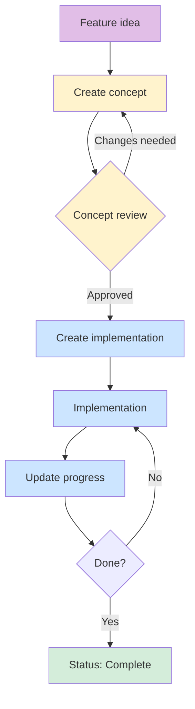

# How-To: Create and Manage Projects

This guide explains how development projects in LLARS are structured and documented.

---

## Why this structure?

Large features require careful planning. This structure ensures that:

- **Nothing is forgotten** - all aspects (DB, API, frontend, WebSocket) are considered
- **Clear requirements exist** - before coding, it is clear WHAT should be built
- **Progress is visible** - everyone can see the current status of a project
- **Knowledge is preserved** - decisions and designs are documented

---

## The three project files

### 1. Concept file (`*-konzept.md`)

!!! info "Purpose"
    Defines **WHAT** should be built - without code!

**Content:**

| Section | Description |
|---------|-------------|
| **Goal** | Short description of what should be achieved |
| **Requirements** | Functional and non-functional requirements |
| **Database Design** | Tables, relations, fields |
| **API Design** | Endpoints, request/response formats |
| **WebSocket Design** | Events, payloads, rooms |
| **Frontend Design** | Components, layout, UX flow |
| **Styling** | Colors, skeleton loading, design direction |

!!! warning "Important"
    The concept contains **no code**! It only describes requirements and design.

---

### 2. Implementation file (`*-umsetzung.md`)

!!! info "Purpose"
    Defines **HOW** the concept is implemented - with code!

**Content:**

| Section | Description |
|---------|-------------|
| **Dependencies** | Which packages/libraries are needed |
| **Database** | SQL/ORM code for migrations |
| **Backend** | Python code for routes, services, worker |
| **Frontend** | Vue components, composables |
| **Integration** | How parts work together |
| **Testing** | Test scenarios and commands |

!!! tip "Tip"
    The implementation file is only created once the concept is **fully approved**.

---

### 3. Progress file (`*-progress.md`)

!!! info "Purpose"
    Shows the **current status** of the implementation.

**Content:**

| Section | Description |
|---------|-------------|
| **Status Badge** | Current project status (Concept/Implementation/Complete) |
| **Phase Overview** | Checklists for completed milestones |
| **Git Commits** | References to relevant commits |
| **Open Items** | What still needs to be done |
| **Changelog** | Important changes with date |

---

## Workflow



### Step 1: Create the concept

1. Copy `templates/konzept-template.md`
2. Name it after your project: `my-feature-konzept.md`
3. Fill in **all sections**
4. Have the concept reviewed

### Step 2: Plan the implementation

1. Copy `templates/umsetzung-template.md`
2. Name it: `my-feature-umsetzung.md`
3. Write the concrete implementation plan
4. Reference the concept

### Step 3: Track progress

1. Copy `templates/progress-template.md`
2. Name it: `my-feature-progress.md`
3. Update it at each milestone
4. Add Git commit hashes

---

## Status badges

Use these badges at the top of each file:

### Concept phase
```markdown
!!! warning "📋 Status: Concept"
    This project is in the **concept phase**.
    The design is still being worked out.
```

### Implementation phase
```markdown
!!! info "🔧 Status: In Implementation"
    This project is currently **being implemented**.
    See [Progress](my-feature-progress.md) for details.
```

### Complete
```markdown
!!! success "✅ Status: Complete"
    This project is **fully implemented**.
    Last change: 2025-11-28
```

---

## Naming convention

| File | Format | Example |
|------|--------|---------|
| Concept | `{feature}-konzept.md` | `chatbot-rag-konzept.md` |
| Implementation | `{feature}-umsetzung.md` | `chatbot-rag-umsetzung.md` |
| Progress | `{feature}-progress.md` | `chatbot-rag-progress.md` |

!!! tip "Tip"
    Use short, descriptive names in lowercase with hyphens.

---

## Best practices

### Write the concept

- [ ] Define the goal in 2-3 sentences
- [ ] Identify all affected systems (DB, API, WS, UI)
- [ ] Define user stories or use cases
- [ ] Describe the data model completely
- [ ] Document API endpoints with request/response
- [ ] Add UI mockups or descriptions
- [ ] Consider edge cases and failure scenarios

### Write the implementation

- [ ] Reference the concept
- [ ] Provide code examples for each area
- [ ] Specify file paths where code belongs
- [ ] Show dependencies between components
- [ ] Document test commands

### Maintain progress

- [ ] Update after every commit
- [ ] Add Git hashes for traceability
- [ ] Document blockers immediately
- [ ] Estimate remaining work

---

## Integration with Claude Code

This project structure is optimized for working with Claude Code:

1. **Concept as context**: The concept can be provided to Claude as reference
2. **Implementation as guide**: Claude can follow the implementation plan
3. **Progress for continuity**: In new sessions, Claude can see the current status

### Example prompt

```
Read the concept in docs/docs/projekte/my-feature-konzept.md and
the implementation in docs/docs/projekte/my-feature-umsetzung.md.
Then implement the next open item from
docs/docs/projekte/my-feature-progress.md.
```
