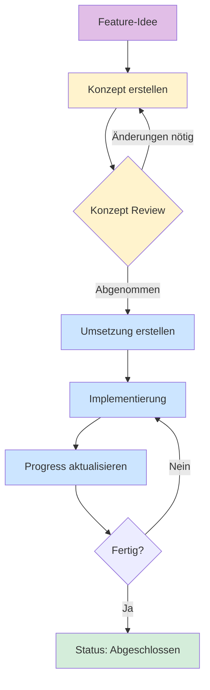

# How-To: Projekte anlegen und verwalten

Diese Anleitung erklärt, wie Entwicklungsprojekte in LLARS strukturiert und dokumentiert werden.

---

## Warum diese Struktur?

Große Features erfordern sorgfältige Planung. Diese Struktur stellt sicher, dass:

- **Nichts vergessen wird** - Alle Aspekte (DB, API, Frontend, WebSocket) werden durchdacht
- **Klare Anforderungen existieren** - Bevor Code geschrieben wird, ist klar WAS gebaut werden soll
- **Fortschritt sichtbar ist** - Jeder kann den aktuellen Stand eines Projekts nachvollziehen
- **Wissen erhalten bleibt** - Entscheidungen und Designs sind dokumentiert

---

## Die drei Projekt-Dateien

### 1. Konzept-Datei (`*-konzept.md`)

!!! info "Zweck"
    Definiert **WAS** gebaut werden soll - ohne Code!

**Inhalt:**

| Abschnitt | Beschreibung |
|-----------|--------------|
| **Ziel** | Kurze Beschreibung was erreicht werden soll |
| **Anforderungen** | Funktionale und nicht-funktionale Requirements |
| **Datenbank-Design** | Tabellen, Relationen, Felder |
| **API-Design** | Endpoints, Request/Response Formate |
| **WebSocket-Design** | Events, Payloads, Rooms |
| **Frontend-Design** | Komponenten, Layout, UX-Flow |
| **Styling** | Farben, Skeleton Loading, Design-Linie |

!!! warning "Wichtig"
    Das Konzept enthält **keinen Code**! Es beschreibt nur die Anforderungen und das Design.

---

### 2. Umsetzungs-Datei (`*-umsetzung.md`)

!!! info "Zweck"
    Definiert **WIE** das Konzept implementiert wird - mit Code!

**Inhalt:**

| Abschnitt | Beschreibung |
|-----------|--------------|
| **Abhängigkeiten** | Welche Packages/Libraries werden benötigt |
| **Datenbank** | SQL/ORM Code für Migrationen |
| **Backend** | Python Code für Routes, Services, Worker |
| **Frontend** | Vue-Komponenten, Composables |
| **Integration** | Wie Teile zusammenspielen |
| **Testing** | Test-Szenarien und Commands |

!!! tip "Tipp"
    Die Umsetzungs-Datei wird erst erstellt, wenn das Konzept **vollständig abgenommen** ist.

---

### 3. Progress-Datei (`*-progress.md`)

!!! info "Zweck"
    Zeigt den **aktuellen Stand** der Implementierung.

**Inhalt:**

| Abschnitt | Beschreibung |
|-----------|--------------|
| **Status-Badge** | Aktueller Projektstatus (Konzept/Umsetzung/Fertig) |
| **Phasen-Übersicht** | Checkboxen für abgeschlossene Meilensteine |
| **Git-Commits** | Referenzen zu relevanten Commits |
| **Offene Punkte** | Was noch zu tun ist |
| **Changelog** | Wichtige Änderungen mit Datum |

---

## Workflow



### Schritt 1: Konzept erstellen

1. Kopiere `templates/konzept-template.md`
2. Benenne es nach deinem Projekt: `mein-feature-konzept.md`
3. Fülle **alle Abschnitte** aus
4. Lasse das Konzept reviewen

### Schritt 2: Umsetzung planen

1. Kopiere `templates/umsetzung-template.md`
2. Benenne es: `mein-feature-umsetzung.md`
3. Schreibe den konkreten Implementierungsplan
4. Referenziere das Konzept

### Schritt 3: Fortschritt tracken

1. Kopiere `templates/progress-template.md`
2. Benenne es: `mein-feature-progress.md`
3. Aktualisiere bei jedem Meilenstein
4. Füge Git-Commit-Hashes hinzu

---

## Status-Badges

Verwende diese Badges am Anfang jeder Datei:

### Konzept-Phase
```markdown
!!! warning "📋 Status: Konzept"
    Dieses Projekt befindet sich in der **Konzeptphase**.
    Das Design wird noch erarbeitet.
```

### Umsetzungs-Phase
```markdown
!!! info "🔧 Status: In Umsetzung"
    Dieses Projekt wird aktuell **implementiert**.
    Siehe [Progress](mein-feature-progress.md) für Details.
```

### Abgeschlossen
```markdown
!!! success "✅ Status: Abgeschlossen"
    Dieses Projekt ist **fertig implementiert**.
    Letzte Änderung: 2025-11-28
```

---

## Namenskonvention

| Datei | Format | Beispiel |
|-------|--------|----------|
| Konzept | `{feature}-konzept.md` | `chatbot-rag-konzept.md` |
| Umsetzung | `{feature}-umsetzung.md` | `chatbot-rag-umsetzung.md` |
| Progress | `{feature}-progress.md` | `chatbot-rag-progress.md` |

!!! tip "Tipp"
    Verwende kurze, beschreibende Namen in Kleinbuchstaben mit Bindestrichen.

---

## Best Practices

### Konzept schreiben

- [ ] Ziel in 2-3 Sätzen formulieren
- [ ] Alle betroffenen Systeme identifizieren (DB, API, WS, UI)
- [ ] User-Stories oder Use-Cases definieren
- [ ] Datenmodell vollständig beschreiben
- [ ] API-Endpoints mit Request/Response dokumentieren
- [ ] UI-Mockups oder Beschreibungen hinzufügen
- [ ] Edge-Cases und Fehlerszenarien bedenken

### Umsetzung schreiben

- [ ] Auf Konzept verweisen
- [ ] Code-Beispiele für jeden Bereich
- [ ] Dateipfade angeben wo Code hingehört
- [ ] Abhängigkeiten zwischen Komponenten zeigen
- [ ] Test-Befehle dokumentieren

### Progress pflegen

- [ ] Nach jedem Commit aktualisieren
- [ ] Git-Hashes für Nachvollziehbarkeit
- [ ] Blocker sofort dokumentieren
- [ ] Schätzungen für offene Punkte

---

## Integration mit Claude Code

Diese Projektstruktur ist optimiert für die Arbeit mit Claude Code:

1. **Konzept als Kontext**: Das Konzept kann Claude als Referenz gegeben werden
2. **Umsetzung als Anleitung**: Claude kann der Umsetzung folgen
3. **Progress für Kontinuität**: Bei neuen Sessions kann Claude den Stand sehen

### Beispiel-Prompt

```
Lies das Konzept in docs/docs/projekte/mein-feature-konzept.md und
die Umsetzung in docs/docs/projekte/mein-feature-umsetzung.md.
Dann implementiere den nächsten offenen Punkt aus
docs/docs/projekte/mein-feature-progress.md.
```
