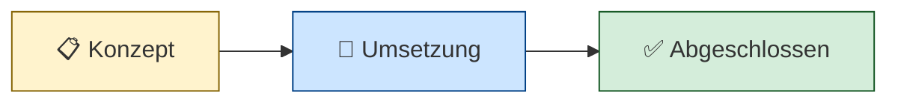

# Projekte

Dieser Bereich dokumentiert alle größeren Entwicklungsprojekte in LLARS. Jedes Projekt durchläuft einen strukturierten Prozess von der Konzeption bis zur Fertigstellung.

---

## Projekt-Übersicht

| Projekt | Status | Beschreibung |
|---------|--------|--------------|
| *Noch keine Projekte* | - | Projekte werden hier aufgelistet sobald sie erstellt werden |

---

## Projekt-Phasen



| Phase | Beschreibung |
|-------|--------------|
| 📋 **Konzept** | Anforderungen werden definiert, Design wird erarbeitet |
| 🔧 **Umsetzung** | Aktive Implementierung läuft |
| ✅ **Abgeschlossen** | Projekt ist fertig implementiert |

---

## Schnellstart

### Neues Projekt anlegen

1. Kopiere die Templates aus `projekte/templates/`
2. Benenne die Dateien nach deinem Projekt (z.B. `mein-feature-konzept.md`)
3. Fülle zuerst das **Konzept** vollständig aus
4. Erstelle dann die **Umsetzung** basierend auf dem Konzept
5. Tracke den Fortschritt in der **Progress**-Datei

### Projekt-Struktur

Jedes Projekt besteht aus drei Dateien:

```
projekte/
├── mein-projekt-konzept.md      # WAS soll gebaut werden
├── mein-projekt-umsetzung.md    # WIE wird es gebaut
└── mein-projekt-progress.md     # WO stehen wir
```

---

## Dokumentation

- [How-To: Projekte anlegen](how-to-project.md) - Ausführliche Anleitung
- [Template: Konzept](templates/konzept-template.md)
- [Template: Umsetzung](templates/umsetzung-template.md)
- [Template: Progress](templates/progress-template.md)
