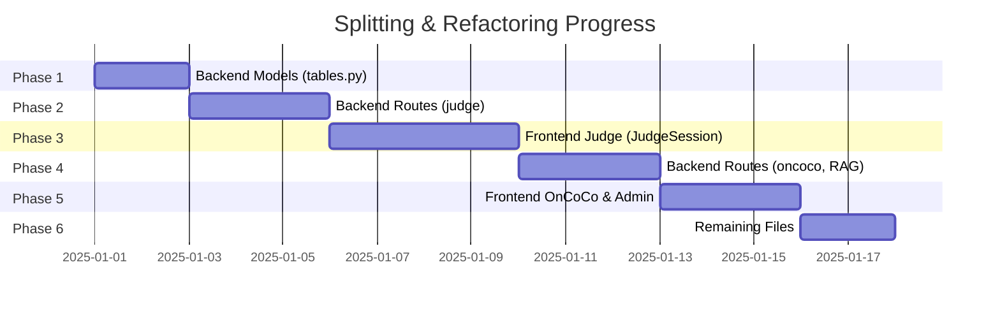

# Splitting & Refactoring - Progress

!!! warning "📋 Status: Concept"
    **Progress:** 0 / 6 phases completed (0%)

**Concept:** [Splitting & Refactoring Concept](konzept.md)  
**Implementation:** [Splitting & Refactoring Implementation](umsetzung.md)  
**Started:** -  
**Target:** -

---

## Progress Overview

---

## Phase Checklist

### Phase 1: Backend Models (`tables.py` → 8 files)
- [ ] Create folder structure `app/db/models/`
- [ ] Create `user.py`
- [ ] Create `permission.py`
- [ ] Create `judge.py`
- [ ] Create `rag.py`
- [ ] Create `chatbot.py`
- [ ] Create `oncoco.py`
- [ ] Create `pillar.py`
- [ ] Create `scenario.py`
- [ ] `__init__.py` with re-exports
- [ ] Mark `tables.py` as deprecated
- [ ] Tests green

### Phase 2: Backend Routes (`judge_routes.py` → 6 files)
- [ ] Create `session_routes.py`
- [ ] Create `comparison_routes.py`
- [ ] Create `evaluation_routes.py`
- [ ] Create `kia_sync_routes.py`
- [ ] Create `statistics_routes.py`
- [ ] Create `stream_routes.py`
- [ ] `__init__.py` with blueprint registration
- [ ] Mark old file as deprecated
- [ ] Tests green

### Phase 3: Frontend Judge (`JudgeSession.vue` → 8+ components)
- [ ] Create folder structure
- [ ] `useSessionSocket.js` composable
- [ ] `useSessionState.js` composable
- [ ] `SessionHeader.vue` component
- [ ] `SessionControls.vue` component
- [ ] `WorkerGrid.vue` component
- [ ] `ComparisonQueue.vue` component
- [ ] `StreamOutput.vue` component
- [ ] Refactor main component
- [ ] Hot reload works
- [ ] Functionality identical

### Phase 4: Backend Routes (oncoco, RAG)
- [ ] Split `oncoco_routes.py`
- [ ] Split `RAGRoutes.py`
- [ ] Tests green

### Phase 5: Frontend OnCoCo & Admin
- [ ] Split `OnCoCoResults.vue`
- [ ] Split `AdminRAGSection.vue`
- [ ] Split `WorkerLane.vue`
- [ ] Functionality identical

### Phase 6: Remaining Files
- [ ] Identify all files > 500 lines
- [ ] Split systematically
- [ ] Final validation

---

## Git Commits

| Date | Commit | Description | Phase |
|------|--------|-------------|-------|
| - | - | - | - |

---

## Statistics

### Baseline

| Category | File count | Total lines |
|----------|------------|-------------|
| > 1500 lines | 5 | ~12,000 |
| 1000-1500 lines | 8 | ~9,500 |
| 700-1000 lines | 15 | ~12,000 |
| 500-700 lines | 15 | ~8,500 |
| **Total** | **43** | **~42,000** |

### After Refactor (Target)

| Category | File count | Total lines |
|----------|------------|-------------|
| > 500 lines | 0 | 0 |
| 300-500 lines | ~30 | ~12,000 |
| < 300 lines | ~80 | ~30,000 |
| **Total** | **~110** | **~42,000** |

---

## Open Items

### Blockers

| Problem | Impact | Status |
|---------|--------|--------|
| - | - | - |

### To‑Do (Next Steps)

1. [ ] Get concept reviewed
2. [ ] Start Phase 1 (backend models)
3. [ ] After each phase: validate + commit

### Questions for Reviewer

- [ ] Should old import paths remain as re-exports permanently?
- [ ] Priority: backend-first or frontend-first?
- [ ] Separate feature branch or direct to main?

---

## Changelog

### 2025-11-28
- 📋 Concept created
- 📋 Implementation template created
- 📋 Progress tracking set up

---

## Notes

> Important decisions during implementation are documented here.

- **2025-11-28:** Project initialized. Waiting for concept review.
