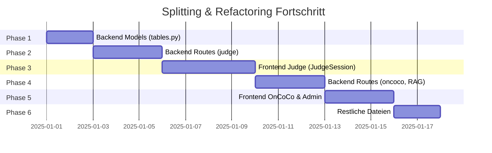

# Splitting & Refactoring - Progress

!!! warning "📋 Status: Konzept"
    **Fortschritt:** 0 / 6 Phasen abgeschlossen (0%)

**Konzept:** [Splitting & Refactoring Konzept](konzept.md)
**Umsetzung:** [Splitting & Refactoring Umsetzung](umsetzung.md)
**Gestartet:** -
**Ziel:** -

---

## Fortschritts-Übersicht

---

## Phasen-Checkliste

### Phase 1: Backend Models (`tables.py` → 8 Dateien)
- [ ] Ordnerstruktur `app/db/models/` erstellen
- [ ] `user.py` erstellen
- [ ] `permission.py` erstellen
- [ ] `judge.py` erstellen
- [ ] `rag.py` erstellen
- [ ] `chatbot.py` erstellen
- [ ] `oncoco.py` erstellen
- [ ] `pillar.py` erstellen
- [ ] `scenario.py` erstellen
- [ ] `__init__.py` mit Re-Exports
- [ ] `tables.py` deprecated markieren
- [ ] Tests grün

### Phase 2: Backend Routes (`judge_routes.py` → 6 Dateien)
- [ ] `session_routes.py` erstellen
- [ ] `comparison_routes.py` erstellen
- [ ] `evaluation_routes.py` erstellen
- [ ] `kia_sync_routes.py` erstellen
- [ ] `statistics_routes.py` erstellen
- [ ] `stream_routes.py` erstellen
- [ ] `__init__.py` mit Blueprint-Registrierung
- [ ] Alte Datei deprecated markieren
- [ ] Tests grün

### Phase 3: Frontend Judge (`JudgeSession.vue` → 8+ Komponenten)
- [ ] Ordnerstruktur erstellen
- [ ] `useSessionSocket.js` Composable
- [ ] `useSessionState.js` Composable
- [ ] `SessionHeader.vue` Komponente
- [ ] `SessionControls.vue` Komponente
- [ ] `WorkerGrid.vue` Komponente
- [ ] `ComparisonQueue.vue` Komponente
- [ ] `StreamOutput.vue` Komponente
- [ ] Haupt-Komponente refaktorieren
- [ ] Hot-Reload funktioniert
- [ ] Funktionalität identisch

### Phase 4: Backend Routes (oncoco, RAG)
- [ ] `oncoco_routes.py` aufteilen
- [ ] `RAGRoutes.py` aufteilen
- [ ] Tests grün

### Phase 5: Frontend OnCoCo & Admin
- [ ] `OnCoCoResults.vue` aufteilen
- [ ] `AdminRAGSection.vue` aufteilen
- [ ] `WorkerLane.vue` aufteilen
- [ ] Funktionalität identisch

### Phase 6: Restliche Dateien
- [ ] Alle Dateien > 500 Zeilen identifizieren
- [ ] Systematisch aufteilen
- [ ] Finale Validierung

---

## Git-Commits

| Datum | Commit | Beschreibung | Phase |
|-------|--------|--------------|-------|
| - | - | - | - |

---

## Statistiken

### Ausgangslage

| Kategorie | Anzahl Dateien | Gesamtzeilen |
|-----------|----------------|--------------|
| > 1500 Zeilen | 5 | ~12.000 |
| 1000-1500 Zeilen | 8 | ~9.500 |
| 700-1000 Zeilen | 15 | ~12.000 |
| 500-700 Zeilen | 15 | ~8.500 |
| **Gesamt** | **43** | **~42.000** |

### Nach Refactoring (Ziel)

| Kategorie | Anzahl Dateien | Gesamtzeilen |
|-----------|----------------|--------------|
| > 500 Zeilen | 0 | 0 |
| 300-500 Zeilen | ~30 | ~12.000 |
| < 300 Zeilen | ~80 | ~30.000 |
| **Gesamt** | **~110** | **~42.000** |

---

## Offene Punkte

### Blocker

| Problem | Auswirkung | Status |
|---------|------------|--------|
| - | - | - |

### To-Do (Nächste Schritte)

1. [ ] Konzept reviewen lassen
2. [ ] Phase 1 starten (Backend Models)
3. [ ] Nach jeder Phase: Validierung + Commit

### Fragen an Reviewer

- [ ] Sollen alte Import-Pfade dauerhaft als Re-Exports bestehen bleiben?
- [ ] Priorität: Backend-first oder Frontend-first?
- [ ] Soll es einen Feature-Branch geben oder direkt auf main?

---

## Changelog

### 2025-11-28
- 📋 Konzept erstellt
- 📋 Umsetzungs-Template erstellt
- 📋 Progress-Tracking eingerichtet

---

## Notizen

> Hier werden wichtige Entscheidungen während der Umsetzung dokumentiert.

- **2025-11-28:** Projekt initialisiert. Warten auf Review des Konzepts.
