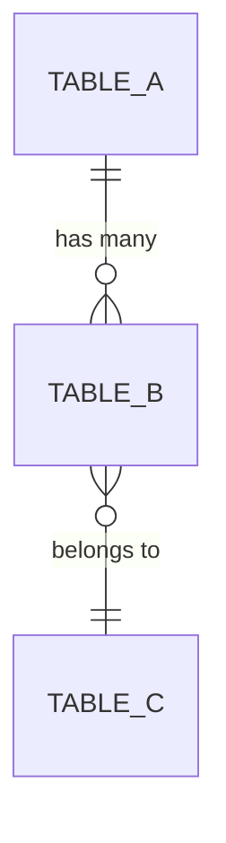
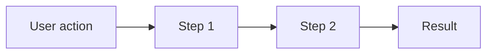

# [Project Name] - Concept

!!! warning "📋 Status: Concept"
    This project is in the **concept phase**.
    The design is still being worked out.

**Created:** YYYY-MM-DD  
**Author:** [Name]  
**Version:** 1.0

---

## Goal

> Describe in 2-3 sentences what this project should achieve.
> What is the user value?

[Describe the goal here]

---

## Requirements

### Functional requirements

| ID | Requirement | Priority |
|----|-------------|----------|
| F01 | [Description] | High/Medium/Low |
| F02 | [Description] | High/Medium/Low |
| F03 | [Description] | High/Medium/Low |

### Non-functional requirements

| ID | Requirement | Priority |
|----|-------------|----------|
| NF01 | Performance: [Description] | High/Medium/Low |
| NF02 | Security: [Description] | High/Medium/Low |
| NF03 | Usability: [Description] | High/Medium/Low |

---

## Database Design

### New tables

#### `table_name`

| Column | Type | Nullable | Description |
|--------|------|----------|-------------|
| id | INT (PK) | No | Auto-increment primary key |
| name | VARCHAR(255) | No | [Description] |
| created_at | DATETIME | No | Creation time |
| updated_at | DATETIME | Yes | Last update |

#### Relations



### Changes to existing tables

| Table | Change | Description |
|-------|--------|-------------|
| [Name] | New column: xyz | [Description] |

---

## API Design

### New endpoints

#### `GET /api/resource`

**Description:** [What does this endpoint do]

**Permission:** `feature:resource:view`

**Response:**
```json
{
  "items": [
    {
      "id": 1,
      "name": "Example"
    }
  ],
  "total": 1
}
```

---

#### `POST /api/resource`

**Description:** [What does this endpoint do]

**Permission:** `feature:resource:edit`

**Request:**
```json
{
  "name": "New item",
  "config": {}
}
```

**Response:**
```json
{
  "id": 1,
  "name": "New item",
  "created_at": "2025-01-01T00:00:00Z"
}
```

**Errors:**

| Code | Error | Description |
|------|-------|-------------|
| 400 | `INVALID_INPUT` | Invalid input data |
| 403 | `FORBIDDEN` | No permission |

---

## Frontend Design

### New components

- `[ComponentName].vue` - [Description]
- `[ComponentName].vue` - [Description]

### UI Flow



---

## Risks

| Risk | Impact | Mitigation |
|------|--------|------------|
| [Risk] | [High/Medium/Low] | [Mitigation] |

---

## Open Questions

- [Question 1]
- [Question 2]

---

## Changelog

| Version | Date | Changes |
|---------|------|---------|
| 1.0 | YYYY-MM-DD | Initial concept |
