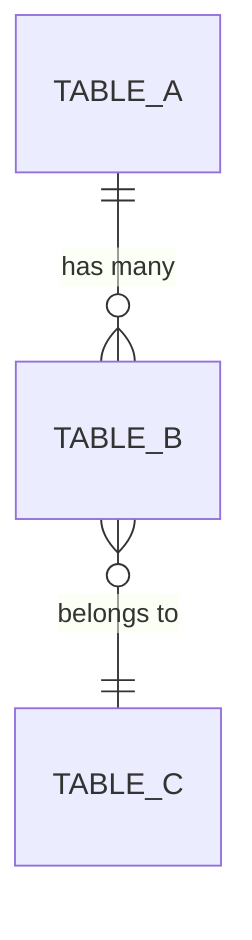

# [Project Name] - Concept

!!! warning "📋 Status: Concept"
    This project is in the **concept phase**.
    The design is still being worked out.

**Created:** YYYY-MM-DD
**Author:** [Name]
**Version:** 1.0

---

## Goal

> Describe in 2-3 sentences what this project should achieve.
> What is the user value?

[Describe the goal here]

---

## Requirements

### Functional requirements

| ID | Requirement | Priority |
|----|-------------|----------|
| F01 | [Description] | High/Medium/Low |
| F02 | [Description] | High/Medium/Low |
| F03 | [Description] | High/Medium/Low |

### Non-functional requirements

| ID | Requirement | Priority |
|----|-------------|----------|
| NF01 | Performance: [Description] | High/Medium/Low |
| NF02 | Security: [Description] | High/Medium/Low |
| NF03 | Usability: [Description] | High/Medium/Low |

---

## Database Design

### New tables

#### `table_name`

| Column | Type | Nullable | Description |
|--------|------|----------|-------------|
| id | INT (PK) | No | Auto-increment primary key |
| name | VARCHAR(255) | No | [Description] |
| created_at | DATETIME | No | Creation time |
| updated_at | DATETIME | Yes | Last update |

#### Relations


```mermaid
erDiagram
    TABLE_A ||--o{ TABLE_B : "has many"
    TABLE_B }o--|| TABLE_C : "belongs to"
```

### Changes to existing tables

| Table | Change | Description |
|-------|--------|-------------|
| [Name] | New column: xyz | [Description] |

---

## API Design

### New endpoints

#### `GET /api/resource`

**Description:** [What does this endpoint do]

**Permission:** `feature:resource:view`

**Response:**
```json
{
  "items": [
    {
      "id": 1,
      "name": "Example"
    }
  ],
  "total": 1
}
```

---

#### `POST /api/resource`

**Description:** [What does this endpoint do]

**Permission:** `feature:resource:edit`

**Request:**
```json
{
  "name": "New item",
  "config": {}
}
```

**Response:**
```json
{
  "id": 1,
  "name": "New item",
  "created_at": "2025-01-01T00:00:00Z"
}
```

**Errors:**

| Code | Description |
|------|-------------|
| 400 | Invalid input |
| 403 | No permission |
| 404 | Not found |

---

## WebSocket Design

### Namespace

`/resource` or default namespace with prefix

### Events

#### Client → Server

| Event | Payload | Description |
|-------|---------|-------------|
| `resource:join` | `{ resource_id: int }` | Join a room |
| `resource:action` | `{ data: any }` | Execute an action |

#### Server → Client

| Event | Payload | Description |
|-------|---------|-------------|
| `resource:update` | `{ resource_id, data }` | Data has changed |
| `resource:error` | `{ message: string }` | An error occurred |

### Rooms

| Room name | Format | Description |
|-----------|--------|-------------|
| resource-{id} | `resource-123` | Room for a single resource |

---

## Frontend Design

### New components

#### `ResourceOverview.vue`

**Path:** `llars-frontend/src/components/Resource/ResourceOverview.vue`

**Description:** Overview page listing all resources

**Layout:**
```
┌─────────────────────────────────────────────────┐
│ Header with title and "Create new" button       │
├─────────────────────────────────────────────────┤
│ ┌─────────┐ ┌─────────┐ ┌─────────┐ ┌─────────┐ │
│ │Stats 1  │ │Stats 2  │ │Stats 3  │ │Stats 4  │ │
│ └─────────┘ └─────────┘ └─────────┘ └─────────┘ │
├─────────────────────────────────────────────────┤
│                                                 │
│  Data table with filters and pagination         │
│                                                 │
└─────────────────────────────────────────────────┘
```

**Props:** None

**Emits:** None

---

#### `ResourceDetail.vue`

**Path:** `llars-frontend/src/components/Resource/ResourceDetail.vue`

**Description:** Detail view of a single resource

**Props:**

| Prop | Type | Required | Description |
|------|------|----------|-------------|
| resourceId | Number | Yes | ID of the resource |

---

### Routing

| Route | Component | Permission |
|-------|-----------|------------|
| `/resource` | ResourceOverview | `feature:resource:view` |
| `/resource/:id` | ResourceDetail | `feature:resource:view` |

---

## Styling & UX

### Color scheme

| Element | Light Mode | Dark Mode |
|---------|------------|-----------|
| Primary Action | `#b0ca97` | `#5d7a4a` |
| Background | Vuetify Default | Vuetify Default |
| Status: Active | `success` | `success` |
| Status: Error | `error` | `error` |

### Skeleton Loading

| Area | Skeleton type |
|------|---------------|
| Stats Cards | `type="card" height="100"` |
| Table | `type="table-heading, table-thead, table-tbody"` |
| Detail Card | `type="article"` |

### Interactions

| Action | Feedback |
|--------|----------|
| Save | Snackbar "Successfully saved" |
| Delete | Confirmation dialog before execution |
| Error | Snackbar with error message (red) |
| Loading | Skeleton Loader |

---

## Security

### Permissions

| Permission | Description |
|------------|-------------|
| `feature:resource:view` | View resources |
| `feature:resource:edit` | Create/edit resources |
| `feature:resource:delete` | Delete resources |

### Validation

| Field | Validation |
|-------|------------|
| name | Required, max 255 characters |
| config | JSON format |

---

## Risks

| Risk | Impact | Mitigation |
|------|--------|------------|
| [Risk] | [High/Medium/Low] | [Mitigation] |

---

## Open Questions

- [Question 1]
- [Question 2]

---

## Approval

| Reviewer | Date | Status |
|----------|------|--------|
| [Name] | YYYY-MM-DD | Pending/Approved |

---

## Changelog

| Version | Date | Changes |
|---------|------|---------|
| 1.0 | YYYY-MM-DD | Initial concept |
