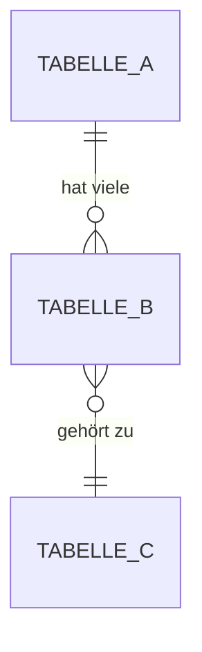

# [Projektname] - Konzept

!!! warning "📋 Status: Konzept"
    Dieses Projekt befindet sich in der **Konzeptphase**.
    Das Design wird noch erarbeitet.

**Erstellt:** YYYY-MM-DD
**Autor:** [Name]
**Version:** 1.0

---

## Ziel

> Beschreibe in 2-3 Sätzen was dieses Projekt erreichen soll.
> Was ist der Mehrwert für den Benutzer?

[Hier das Ziel beschreiben]

---

## Anforderungen

### Funktionale Anforderungen

| ID | Anforderung | Priorität |
|----|-------------|-----------|
| F01 | [Beschreibung] | Hoch/Mittel/Niedrig |
| F02 | [Beschreibung] | Hoch/Mittel/Niedrig |
| F03 | [Beschreibung] | Hoch/Mittel/Niedrig |

### Nicht-funktionale Anforderungen

| ID | Anforderung | Priorität |
|----|-------------|-----------|
| NF01 | Performance: [Beschreibung] | Hoch/Mittel/Niedrig |
| NF02 | Sicherheit: [Beschreibung] | Hoch/Mittel/Niedrig |
| NF03 | Usability: [Beschreibung] | Hoch/Mittel/Niedrig |

---

## Datenbank-Design

### Neue Tabellen

#### `tabellen_name`

| Spalte | Typ | Nullable | Beschreibung |
|--------|-----|----------|--------------|
| id | INT (PK) | Nein | Auto-Increment Primary Key |
| name | VARCHAR(255) | Nein | [Beschreibung] |
| created_at | DATETIME | Nein | Erstellungszeitpunkt |
| updated_at | DATETIME | Ja | Letzte Änderung |

#### Relationen



### Änderungen an bestehenden Tabellen

| Tabelle | Änderung | Beschreibung |
|---------|----------|--------------|
| [Name] | Neue Spalte: xyz | [Beschreibung] |

---

## API-Design

### Neue Endpoints

#### `GET /api/resource`

**Beschreibung:** [Was macht dieser Endpoint]

**Permission:** `feature:resource:view`

**Response:**
```json
{
  "items": [
    {
      "id": 1,
      "name": "Beispiel"
    }
  ],
  "total": 1
}
```

---

#### `POST /api/resource`

**Beschreibung:** [Was macht dieser Endpoint]

**Permission:** `feature:resource:edit`

**Request:**
```json
{
  "name": "Neuer Eintrag",
  "config": {}
}
```

**Response:**
```json
{
  "id": 1,
  "name": "Neuer Eintrag",
  "created_at": "2025-01-01T00:00:00Z"
}
```

**Fehler:**

| Code | Beschreibung |
|------|--------------|
| 400 | Ungültige Eingabe |
| 403 | Keine Berechtigung |
| 404 | Nicht gefunden |

---

## WebSocket-Design

### Namespace

`/resource` oder Standard-Namespace mit Prefix

### Events

#### Client → Server

| Event | Payload | Beschreibung |
|-------|---------|--------------|
| `resource:join` | `{ resource_id: int }` | Tritt einem Room bei |
| `resource:action` | `{ data: any }` | Führt Aktion aus |

#### Server → Client

| Event | Payload | Beschreibung |
|-------|---------|--------------|
| `resource:update` | `{ resource_id, data }` | Daten haben sich geändert |
| `resource:error` | `{ message: string }` | Fehler aufgetreten |

### Rooms

| Room-Name | Format | Beschreibung |
|-----------|--------|--------------|
| resource-{id} | `resource-123` | Room für einzelne Ressource |

---

## Frontend-Design

### Neue Komponenten

#### `ResourceOverview.vue`

**Pfad:** `llars-frontend/src/components/Resource/ResourceOverview.vue`

**Beschreibung:** Übersichtsseite mit Liste aller Ressourcen

**Layout:**
```
┌─────────────────────────────────────────────────┐
│ Header mit Titel und "Neu erstellen" Button     │
├─────────────────────────────────────────────────┤
│ ┌─────────┐ ┌─────────┐ ┌─────────┐ ┌─────────┐ │
│ │Stats 1  │ │Stats 2  │ │Stats 3  │ │Stats 4  │ │
│ └─────────┘ └─────────┘ └─────────┘ └─────────┘ │
├─────────────────────────────────────────────────┤
│                                                 │
│  Datentabelle mit Filtern und Pagination        │
│                                                 │
└─────────────────────────────────────────────────┘
```

**Props:** Keine

**Emits:** Keine

---

#### `ResourceDetail.vue`

**Pfad:** `llars-frontend/src/components/Resource/ResourceDetail.vue`

**Beschreibung:** Detailansicht einer einzelnen Ressource

**Props:**

| Prop | Typ | Required | Beschreibung |
|------|-----|----------|--------------|
| resourceId | Number | Ja | ID der Ressource |

---

### Routing

| Route | Komponente | Permission |
|-------|------------|------------|
| `/resource` | ResourceOverview | `feature:resource:view` |
| `/resource/:id` | ResourceDetail | `feature:resource:view` |

---

## Styling & UX

### Farbschema

| Element | Light Mode | Dark Mode |
|---------|------------|-----------|
| Primary Action | `#b0ca97` | `#5d7a4a` |
| Background | Vuetify Default | Vuetify Default |
| Status: Aktiv | `success` | `success` |
| Status: Fehler | `error` | `error` |

### Skeleton Loading

| Bereich | Skeleton-Typ |
|---------|--------------|
| Stats Cards | `type="card" height="100"` |
| Tabelle | `type="table-heading, table-thead, table-tbody"` |
| Detail-Card | `type="article"` |

### Interaktionen

| Aktion | Feedback |
|--------|----------|
| Speichern | Snackbar "Erfolgreich gespeichert" |
| Löschen | Bestätigungs-Dialog vor Ausführung |
| Fehler | Snackbar mit Fehlermeldung (rot) |
| Laden | Skeleton Loader |

---

## Sicherheit

### Berechtigungen

| Permission | Beschreibung |
|------------|--------------|
| `feature:resource:view` | Ressourcen anzeigen |
| `feature:resource:edit` | Ressourcen erstellen/bearbeiten |
| `feature:resource:delete` | Ressourcen löschen |

### Validierung

| Feld | Validierung |
|------|-------------|
| name | Required, max 255 Zeichen |
| config | JSON-Format |

---

## Offene Fragen

- [ ] Frage 1: [Beschreibung]
- [ ] Frage 2: [Beschreibung]

---

## Abnahme

| Reviewer | Datum | Status |
|----------|-------|--------|
| [Name] | YYYY-MM-DD | Ausstehend/Angenommen |
