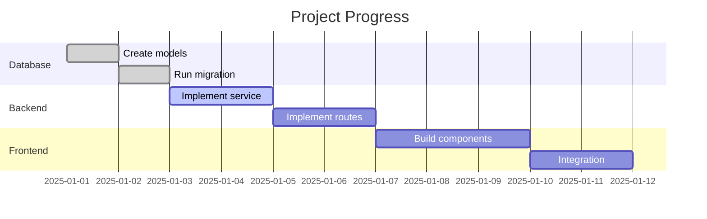

# [Project Name] - Progress

!!! info "🔧 Status: In Progress"
    **Progress:** 3 / 10 tasks completed (30%)

**Concept:** [Concept Template](konzept-template.md)  
**Implementation:** [Implementation Template](umsetzung-template.md)  
**Started:** YYYY-MM-DD  
**Target:** YYYY-MM-DD

---

## Progress Overview

---

## Phase Checklist

### Phase 1: Database
- [x] Models defined
- [x] Migration created
- [x] Migration executed
- [ ] Seed data created

### Phase 2: Backend
- [x] Service class created
- [ ] Routes implemented
- [ ] WebSocket events added
- [ ] Unit tests written

### Phase 3: Frontend
- [ ] API service created
- [ ] Overview component
- [ ] Detail component
- [ ] Routing configured

### Phase 4: Integration
- [ ] End-to-end test
- [ ] Performance check
- [ ] Code review
- [ ] Documentation updated

---

## Git Commits

| Date | Commit | Description |
|------|--------|-------------|
| 2025-01-01 | `abc1234` | feat(db): Add ResourceName model |
| 2025-01-02 | `def5678` | feat(backend): Add ResourceService |
| 2025-01-03 | `ghi9012` | feat(backend): Add resource routes |

---

## Open Items

### Blockers

| Problem | Impact | Owner |
|---------|--------|-------|
| - | - | - |

### To‑Do (Next Steps)

1. [ ] Finish route implementation
2. [ ] Add WebSocket events
3. [ ] Build frontend components

### Nice‑to‑Have (Later)

- [ ] Export feature
- [ ] Bulk operations
- [ ] Advanced filters

---

## Changelog

### YYYY-MM-DD
- ✅ Models created and migration executed
- ✅ Service class implemented
- 🔄 Routes in progress

### YYYY-MM-DD
- 🚀 Project started
- 📋 Concept approved

---

## Notes

> Document important decisions, findings, or notes here.

- **YYYY-MM-DD:** [Note]

---

## Metrics

| Metric | Value |
|--------|-------|
| Planned duration | X days |
| Current duration | Y days |
| Commit count | Z |
| Lines of code (est.) | ~N |
