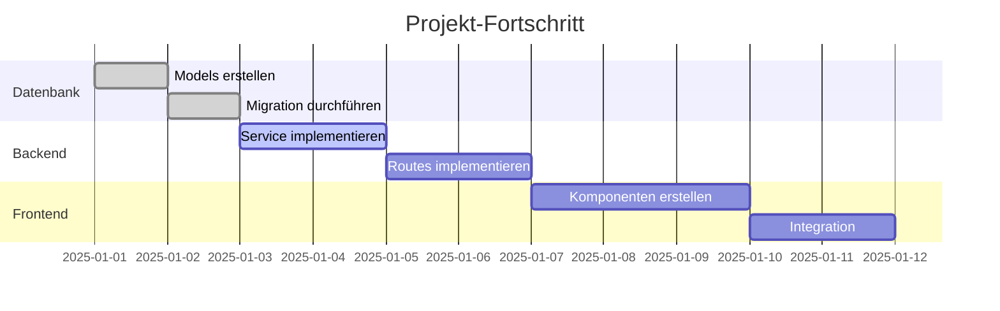

# [Projektname] - Progress

!!! info "🔧 Status: In Umsetzung"
    **Fortschritt:** 3 / 10 Aufgaben abgeschlossen (30%)

**Konzept:** [Konzept Template](konzept-template.md)
**Umsetzung:** [Umsetzung Template](umsetzung-template.md)
**Gestartet:** YYYY-MM-DD
**Ziel:** YYYY-MM-DD

---

## Fortschritts-Übersicht

---

## Phasen-Checkliste

### Phase 1: Datenbank
- [x] Models definiert
- [x] Migration erstellt
- [x] Migration ausgeführt
- [ ] Seed-Daten erstellt

### Phase 2: Backend
- [x] Service-Klasse erstellt
- [ ] Routes implementiert
- [ ] WebSocket-Events hinzugefügt
- [ ] Unit-Tests geschrieben

### Phase 3: Frontend
- [ ] API-Service erstellt
- [ ] Overview-Komponente
- [ ] Detail-Komponente
- [ ] Routing konfiguriert

### Phase 4: Integration
- [ ] End-to-End Test
- [ ] Performance-Check
- [ ] Code-Review
- [ ] Dokumentation aktualisiert

---

## Git-Commits

| Datum | Commit | Beschreibung |
|-------|--------|--------------|
| 2025-01-01 | `abc1234` | feat(db): Add ResourceName model |
| 2025-01-02 | `def5678` | feat(backend): Add ResourceService |
| 2025-01-03 | `ghi9012` | feat(backend): Add resource routes |

---

## Offene Punkte

### Blocker

| Problem | Auswirkung | Verantwortlich |
|---------|------------|----------------|
| - | - | - |

### To-Do (Nächste Schritte)

1. [ ] Routes fertig implementieren
2. [ ] WebSocket-Events hinzufügen
3. [ ] Frontend-Komponenten erstellen

### Nice-to-Have (Später)

- [ ] Export-Funktion
- [ ] Bulk-Operationen
- [ ] Erweiterte Filter

---

## Changelog

### YYYY-MM-DD
- ✅ Models erstellt und Migration durchgeführt
- ✅ Service-Klasse implementiert
- 🔄 Routes in Arbeit

### YYYY-MM-DD
- 🚀 Projekt gestartet
- 📋 Konzept abgenommen

---

## Notizen

> Hier können wichtige Entscheidungen, Erkenntnisse oder Hinweise dokumentiert werden.

- **YYYY-MM-DD:** [Notiz]

---

## Metriken

| Metrik | Wert |
|--------|------|
| Geplante Dauer | X Tage |
| Aktuelle Dauer | Y Tage |
| Anzahl Commits | Z |
| Code-Zeilen (geschätzt) | ~N |
